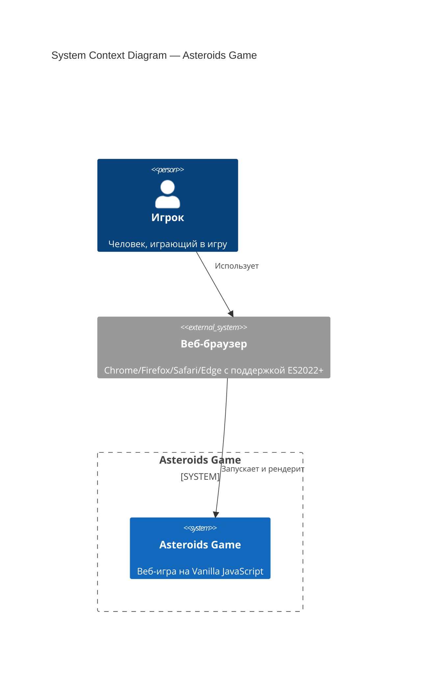
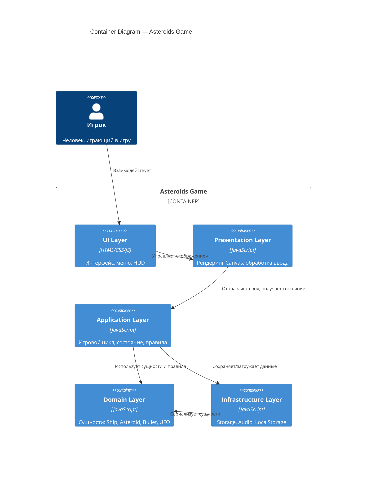
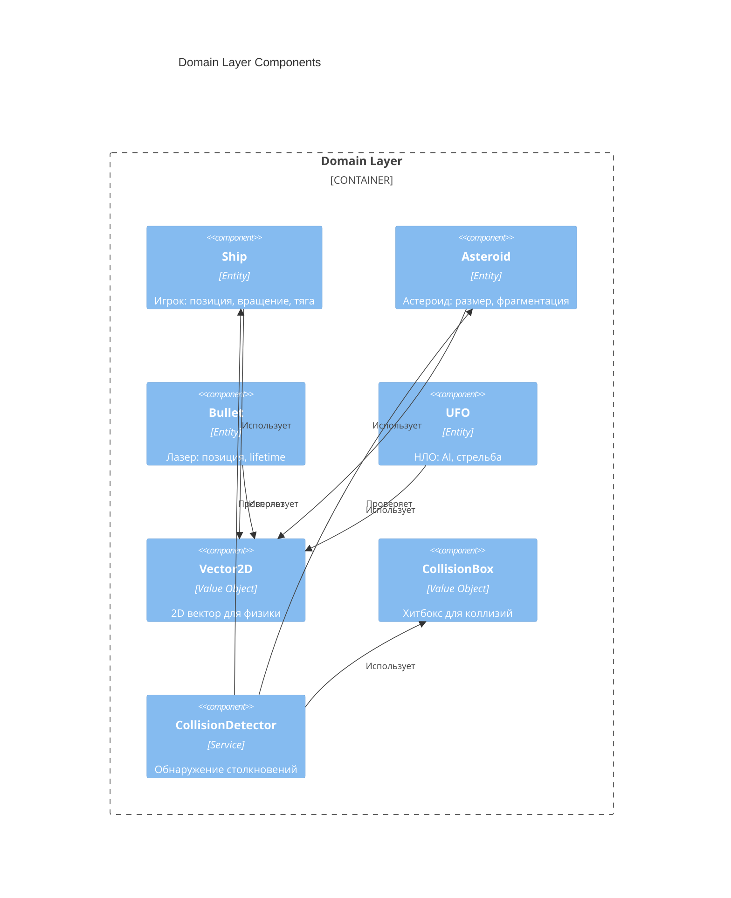
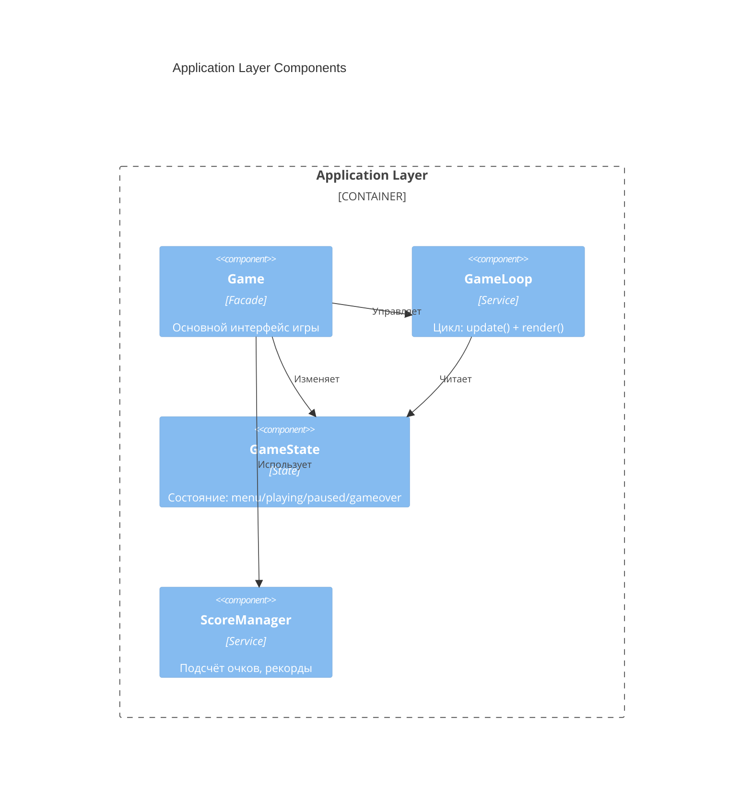
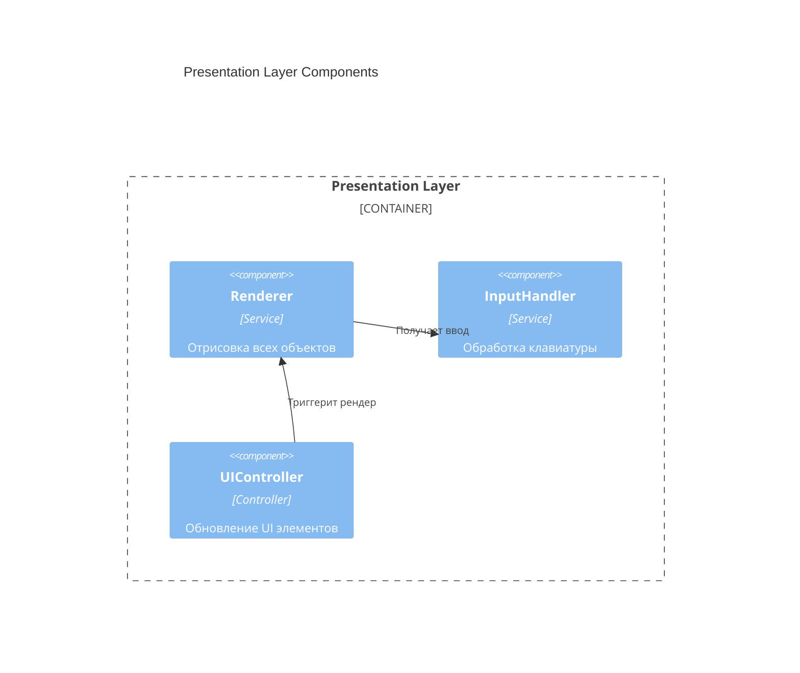
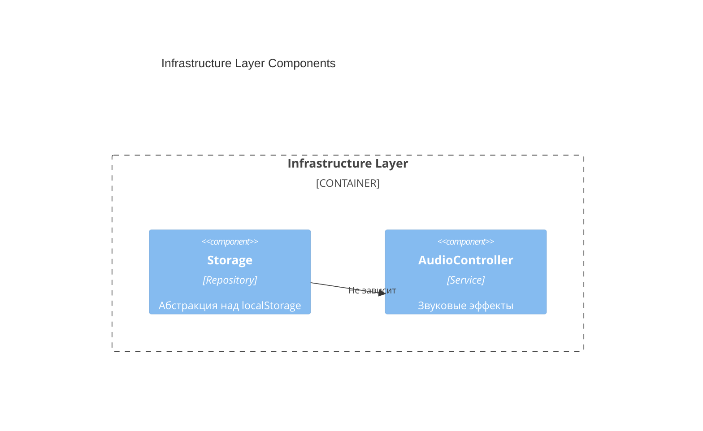
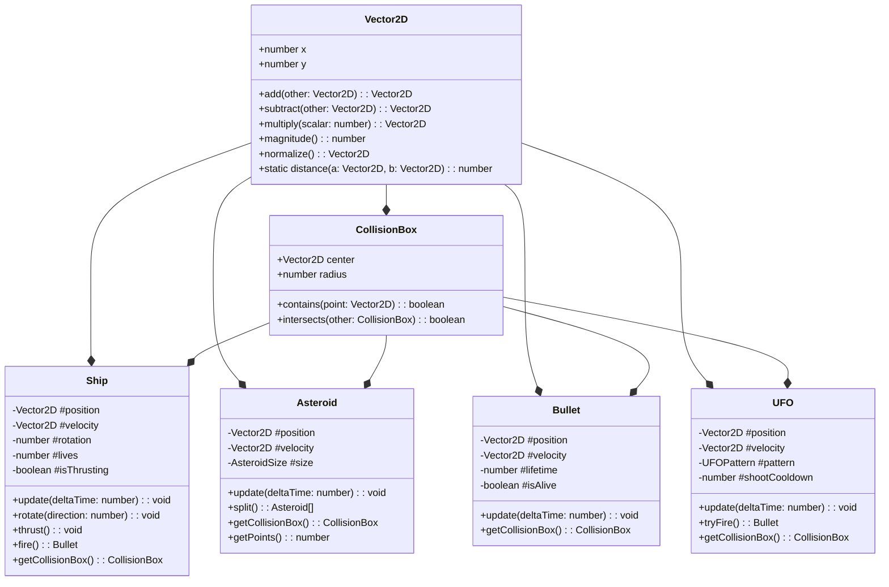
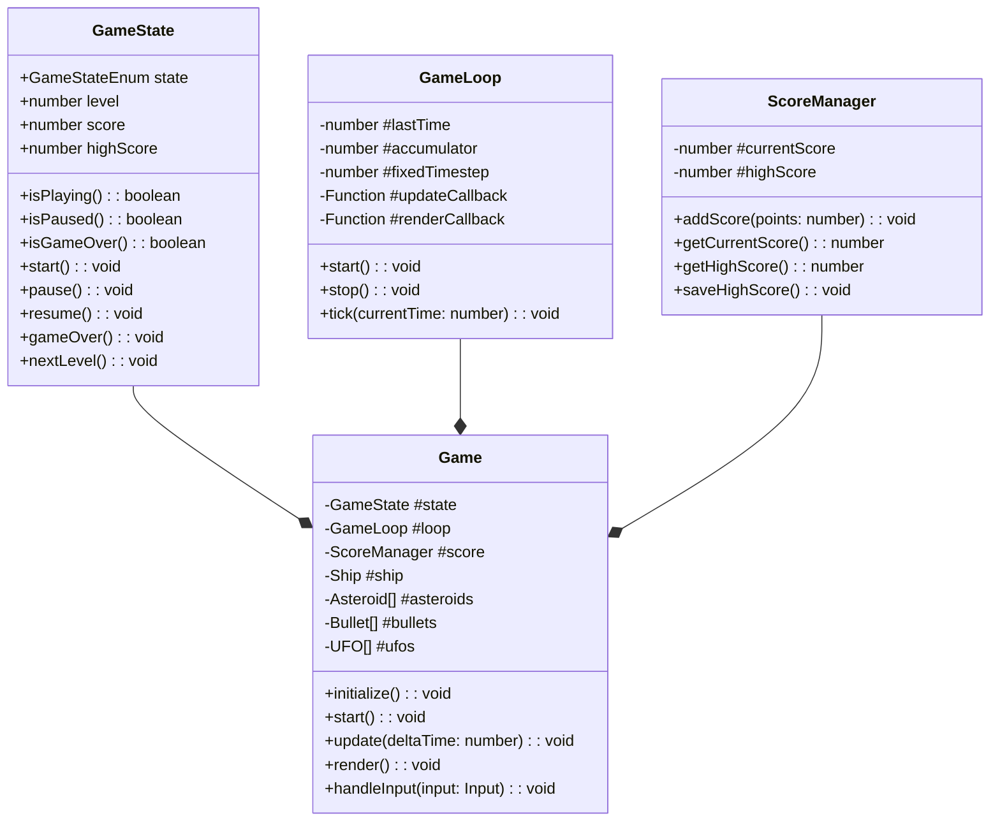
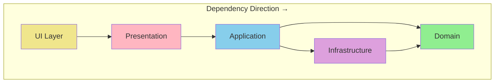

# Vibecraft — plan_skill / review_plans

---
## Your Role

# Agent: Plan Reviewer

## Role
You are a specialist agent in the **Research: Asteroids Game** project.
Stack: {"collectcoveragefrom": "[\u0027src/**/*.js\u0027]", "coveragedirectory": "\u0027coverage\u0027,", "modulefileextensions": "[\u0027js\u0027],", "npm_run_test": "coverage", "tech_stack": "Asteroids Game", "testenvironment": "\u0027jsdom\u0027,", "testmatch": "[\u0027**/test/**/*.test.js\u0027],", "\u043f\u0440\u0430\u0432\u0438\u043b\u0430_tdd": "**", "\u0440\u0430\u0437\u0434\u0435\u043b\u0435\u043d\u0438\u0435_\u043d\u0430_\u0441\u043b\u043e\u0438": "Domain \u2192 Application \u2192 Infrastructure \u2192 Presentation", "\u2502__(entities": "Ship, Asteroid, Bullet)     \u2502"}

## Responsibilities
- Fulfil your specific role as defined by the active skill
- Follow all architecture decisions in `docs/design/architecture.md`
- Adhere strictly to the stack defined in `docs/stack.md`
- Document your output clearly

## Constraints
- Stay within the scope assigned to you by the skill
- If something is outside your role, flag it — do not attempt it
- Always output structured, reviewable content

## Output Format
Produce clean, well-structured output.
Reference relevant files when making decisions.

---
## Project Context

# Project: Research: Asteroids Game
> Generated by Vibecraft | Phase: **plan** | 2026-02-25 20:32 UTC

---

## Stack Summary
- **tech_stack**: Asteroids Game
- **разделение_на_слои**: Domain → Application → Infrastructure → Presentation
- **правила_tdd**: **
- **│__(entities**: Ship, Asteroid, Bullet)     │
- **testenvironment**: 'jsdom',
- **modulefileextensions**: ['js'],
- **testmatch**: ['**/test/**/*.test.js'],
- **coveragedirectory**: 'coverage',
- **collectcoveragefrom**: ['src/**/*.js']
- **npm_run_test**: coverage

---

## Progress

- [x] research
- [x] design
- [ ] **plan** ← CURRENT
- [ ] implement
- [ ] review

---

## Agents Available

- `researcher`
- `architect`
- `planner`
- `plan_reviewer`
- `pre_checker`
- `tdd_writer`
- `implementer`
- `code_reviewer`
- `performance_optimizer`
- `game_designer`
- `security_auditor`
- `api_designer`

---


## Immutable Contracts

- Tests in `src/tests/` are **locked** after tdd_writer approval — implementer must never modify them
- ADR decisions are final unless a new ADR explicitly overrides
- Stack decisions from `docs/stack.md` apply to all agents

---

## How to Continue in a New Chat

**Option A — automatic:**
```bash
vibecraft context --skill <skill_name>
```
Copies this file + the skill prompt to clipboard. Paste at the start of your Qwen chat.

**Option B — manual, attach these files:**
1. `docs/context.md` ← this file
2. `.vibecraft/skills/<current_skill>.yaml`
3. `.vibecraft/agents/<relevant_agent>.md`

---
_Vibecraft v0.1 — https://github.com/you/vibecraft_

---
## Stack

# Tech Stack: Asteroids Game

## 🛠️ Технологический стек

### Язык и платформа

| Компонент | Технология | Версия |
|-----------|------------|--------|
| **Язык** | JavaScript (ECMAScript) | ES2022+ |
| **Платформа** | Веб-браузер | Современные браузеры |
| **Среда выполнения** | Vanilla JS (без фреймворков) | — |

---

## 📦 Архитектура

### Принципы

- **Чистая архитектура (Clean Architecture)**
  - Разделение на слои: Domain → Application → Infrastructure → Presentation
  - Зависимости направлены внутрь (к домену)
- **SOLID принципы**
  - Single Responsibility, Open/Closed, Liskov Substitution, Interface Segregation, Dependency Inversion
- **Компонентный подход**
  - Изолированные модули с чёткими интерфейсами
- **TDD (Test-Driven Development)**
  - Красный → Зелёный → Рефакторинг
  - Тесты пишутся ДО реализации функциональности
  - 100% покрытие критических модулей

### TDD процесс

```
┌─────────────┐     ┌─────────────┐     ┌─────────────┐
│   RED       │     │   GREEN     │     │  REFACTOR   │
│  Write test │ ──► │  Make it    │ ──► │  Clean up   │
│  (fails)    │     │  pass       │     │  code       │
└─────────────┘     └─────────────┘     └─────────────┘
       ▲                                       │
       └───────────────────────────────────────┘
```

**Правила TDD:**
1. Не писать продакшен-код без падающего теста
2. Писать минимальный код для прохождения теста
3. Рефакторить только после зелёного теста
4. Удалять дублирование на каждом шаге

### Слои архитектуры

```
┌─────────────────────────────────────────┐
│         Presentation Layer              │
│  (Canvas Renderer, Input Handler, UI)   │
├─────────────────────────────────────────┤
│         Application Layer               │
│  (Game Loop, State Management, Rules)   │
├─────────────────────────────────────────┤
│           Domain Layer                  │
│  (Entities: Ship, Asteroid, Bullet)     │
├─────────────────────────────────────────┤
│        Infrastructure Layer             │
│  (Storage, Audio, LocalStorage)         │
└─────────────────────────────────────────┘
```

---

## 🧪 Тестирование

| Инструмент | Назначение |
|------------|------------|
| **Jest** | Фреймворк для unit- и integration-тестов |
| **ES Modules** | Модульная структура для тестируемости |

### Структура тестов

```
test/
├── domain/
│   ├── ship.test.js
│   ├── asteroid.test.js
│   └── collision.test.js
├── application/
│   ├── game-loop.test.js
│   └── state.test.js
└── infrastructure/
    └── storage.test.js
```

### Конфигурация Jest

```javascript
// jest.config.js
export default {
  testEnvironment: 'jsdom',
  moduleFileExtensions: ['js'],
  testMatch: ['**/test/**/*.test.js'],
  coverageDirectory: 'coverage',
  collectCoverageFrom: ['src/**/*.js']
};
```

---

## 📁 Структура проекта

```
asteroids/
├── src/
│   ├── domain/
│   │   ├── entities/
│   │   │   ├── Ship.js
│   │   │   ├── Asteroid.js
│   │   │   ├── Bullet.js
│   │   │   └── UFO.js
│   │   ├── value-objects/
│   │   │   ├── Vector2D.js
│   │   │   └── CollisionBox.js
│   │   └── services/
│   │       └── CollisionDetector.js
│   ├── application/
│   │   ├── Game.js
│   │   ├── GameLoop.js
│   │   ├── GameState.js
│   │   └── ScoreManager.js
│   ├── infrastructure/
│   │   ├── Storage.js
│   │   └── AudioController.js
│   └── presentation/
│       ├── Renderer.js
│       ├── InputHandler.js
│       └── UIController.js
├── test/
│   ├── domain/
│   ├── application/
│   └── infrastructure/
├── public/
│   ├── index.html
│   └── styles.css
├── package.json
├── jest.config.js
└── README.md
```

---

## 🔧 Инструменты разработки

| Инструмент | Назначение |
|------------|------------|
| **npm** | Менеджер пакетов |
| **ESLint** | Линтинг кода |
| **Prettier** | Форматирование кода |
| **Vite** (опционально) | Dev-сервер и сборщик |

---

## 📋 Требования к коду

### Стиль кода

- **Модули ES6** — `import`/`export`
- **Классы** — для сущностей домена
- **Стрелочные функции** — для колбэков
- **Const/Let** — без `var`
- **Template literals** — для интерполяции строк

### Именование

- **Классы** — PascalCase (`Ship`, `Asteroid`)
- **Функции/переменные** — camelCase (`createAsteroid`, `gameState`)
- **Константы** — UPPER_CASE (`MAX_BULLETS`, `SHIP_SPEED`)
- **Приватные поля** — `#privateField`

### Документирование

- JSDoc комментарии для публичных методов
- README с описанием архитектуры

---

## 🚀 Запуск проекта

```bash
# Установка зависимостей
npm install

# Запуск тестов
npm test

# Запуск тестов с покрытием
npm run test:coverage

# Запуск dev-сервера (если используется Vite)
npm run dev

# Сборка продакшена
npm run build
```

---

## 📊 Метрики качества

| Метрика | Цель |
|---------|------|
| **Покрытие тестами** | > 80% |
| **ESLint ошибок** | 0 |
| **Размер бандла** | < 100 KB (minified) |
| **Производительность** | 60 FPS на целевых устройствах |

---

## 🎯 Критерии готовности

- [ ] Реализованы все базовые механики
- [ ] Покрытие тестами > 80%
- [ ] Нет ESLint ошибок
- [ ] Работает в современных браузерах
- [ ] Код структурирован по слоям чистой архитектуры


---
## Architecture

# Architecture: Asteroids Game

**Version:** 1.0  
**Status:** Accepted  
**Last Updated:** 2026-02-25  
**Phase:** Design

---

## 📋 Overview

Этот документ описывает архитектуру игры Asteroids, используя **C4 модель** (Context, Container, Component, Code) и **Architecture Decision Records (ADR)** для ключевых решений.

### Архитектурные принципы

1. **Clean Architecture** — зависимости направлены внутрь к домену
2. **SOLID** — каждый класс следует принципам SOLID
3. **Testability First** — архитектура поддерживает TDD
4. **Explicit Dependencies** — все зависимости явные
5. **Single Responsibility** — один класс = одна ответственность

---

## 🏗️ C4 Model

### Level 1: System Context Diagram



**Описание:**
- **Игрок** взаимодействует с **веб-браузером**
- **Браузер** загружает и выполняет код игры
- **Asteroids Game** — единая система без внешних зависимостей

---

### Level 2: Container Diagram



**Контейнеры:**

| Контейнер | Технология | Ответственность |
|-----------|------------|-----------------|
| **UI Layer** | HTML/CSS | Меню, HUD, экраны Game Over/Pause |
| **Presentation Layer** | JavaScript + Canvas 2D API | Рендеринг графики, обработка input |
| **Application Layer** | JavaScript | Game loop, GameState, ScoreManager |
| **Domain Layer** | JavaScript | Ship, Asteroid, Bullet, UFO, Vector2D |
| **Infrastructure Layer** | JavaScript + Web APIs | Storage, AudioController, LocalStorage |

---

### Level 3: Component Diagram

#### Domain Layer Components



#### Application Layer Components



#### Presentation Layer Components



#### Infrastructure Layer Components



---

### Level 4: Code Level (Key Classes)

#### Domain Entities



#### Application Services



---

## 📝 Architecture Decision Records (ADRs)

---

### ADR-001: Vanilla JavaScript Without Frameworks

**Status:** Accepted

**Context:**
Необходимо выбрать технологию для реализации игры. Современные фреймворки (React, Vue, Phaser) предоставляют готовые решения, но добавляют сложность и размер бандла.

**Decision:**
Использовать **Vanilla JavaScript (ES2022+)** без фреймворков.

**Consequences:**
- ✅ Минимальный размер бандла (<100 KB)
- ✅ Полный контроль над кодом
- ✅ Образовательная ценность (чистая архитектура)
- ❌ Больше кода для написания
- ❌ Нет готовых решений для常见 задач

---

### ADR-002: Clean Architecture with 4 Layers

**Status:** Accepted

**Context:**
Необходимо организовать код так, чтобы обеспечить тестируемость, поддерживаемость и соблюдение SOLID принципов.

**Decision:**
Использовать **Clean Architecture** с 4 слоями:
1. **Domain** — сущности и бизнес-правила
2. **Application** — игровой цикл, состояние
3. **Presentation** — рендеринг и ввод
4. **Infrastructure** — storage, audio

**Consequences:**
- ✅ Зависимости направлены внутрь (к домену)
- ✅ Domain слой не зависит от внешних библиотек
- ✅ Легко тестировать каждый слой изолированно
- ❌ Требует дисциплины от разработчиков
- ❌ Больше файлов и импортов

---

### ADR-003: TDD with Jest and jsdom

**Status:** Accepted

**Context:**
Необходимо обеспечить высокое качество кода и возможность рефакторинга без страха сломать функциональность.

**Decision:**
Использовать **TDD (Test-Driven Development)** с фреймворком **Jest** и средой **jsdom**.

**Consequences:**
- ✅ Покрытие тестами >80%
- ✅ Тесты пишутся ДО кода (RED→GREEN→REFACTOR)
- ✅ jsdom позволяет тестировать DOM-зависимости
- ❌ Замедляет начальную разработку
- ❌ Требует моков для Canvas API

---

### ADR-004: Fixed Timestep Game Loop

**Status:** Accepted

**Context:**
Игровой цикл должен обеспечивать стабильную физику независимо от частоты кадров рендеринга.

**Decision:**
Использовать **фиксированный timestep (1/60 сек)** для физики с накоплением времени (accumulator pattern).

```javascript
const FIXED_TIMESTEP = 1 / 60; // 16.67ms

update(accumulator) {
    while (accumulator >= FIXED_TIMESTEP) {
        this.physicsUpdate(FIXED_TIMESTEP);
        accumulator -= FIXED_TIMESTEP;
    }
}
```

**Consequences:**
- ✅ Детерминированная физика
- ✅ Стабильные коллизии
- ✅ 60 FPS на поддерживаемых устройствах
- ❌ Сложнее реализация чем requestAnimationFrame напрямую

---

### ADR-005: Canvas 2D API for Rendering

**Status:** Accepted

**Context:**
Необходимо выбрать способ рендеринга графики. WebGL мощнее, но сложнее. DOM-элементы медленнее.

**Decision:**
Использовать **Canvas 2D API** с геометрическими примитивами (линии, пути).

**Consequences:**
- ✅ Простой API
- ✅ Хорошая производительность для 2D
- ✅ Аутентичный векторный стиль
- ❌ Нет аппаратного ускорения как WebGL
- ❌ Нужно рисовать всё кодом (нет спрайтов)

---

### ADR-006: ES Modules for Code Organization

**Status:** Accepted

**Context:**
Необходимо организовать код в модули для тестируемости и поддерживаемости.

**Decision:**
Использовать **ES6 Modules** (`import`/`export`) для всех файлов.

**Consequences:**
- ✅ Нативная поддержка в браузерах
- ✅ Статический анализ импортов
- ✅ Tree-shaking для сборщиков
- ❌ Требует сборщик или современный браузер

---

### ADR-007: Object Pooling for Bullets and Asteroids

**Status:** Accepted

**Context:**
Частое создание/удаление объектов вызывает garbage collection паузы.

**Decision:**
Использовать **Object Pool pattern** для пуль и астероидов.

```javascript
class BulletPool {
    constructor(size = 50) {
        this.pool = Array(size).fill(null).map(() => new Bullet());
        this.available = new Set(range(size));
    }
    
    acquire() {
        const id = this.available.values().next().value;
        if (id !== undefined) {
            this.available.delete(id);
            return this.pool[id];
        }
        return null; // Pool exhausted
    }
    
    release(bullet) {
        this.available.add(bullet.id);
        bullet.reset();
    }
}
```

**Consequences:**
- ✅ Минимизация GC пауз
- ✅ Предсказуемая производительность
- ❌ Усложняет код
- ❌ Нужно управлять состоянием объектов

---

### ADR-008: localStorage for High Scores

**Status:** Accepted

**Context:**
Необходимо сохранять рекорды между сессиями. IndexedDB мощнее, но сложнее.

**Decision:**
Использовать **localStorage** для хранения топ-5 рекордов.

**Consequences:**
- ✅ Простой API
- ✅ Синхронное чтение/запись
- ✅ Достаточно для 5 записей
- ❌ Лимит 5-10 MB (не критично)
- ❌ Блокирует основной поток при записи

---

### ADR-009: Event-Based Input Handling

**Status:** Accepted

**Context:**
Необходимо обрабатывать ввод с клавиатуры. Polling проще, но event-based эффективнее.

**Decision:**
Использовать **event-based подход** с накоплением состояния.

```javascript
class InputHandler {
    constructor() {
        this.keys = new Set();
        window.addEventListener('keydown', (e) => this.keys.add(e.code));
        window.addEventListener('keyup', (e) => this.keys.delete(e.code));
    }
    
    isPressed(code) {
        return this.keys.has(code);
    }
    
    wasJustPressed(code) {
        // Track previous frame state for edge detection
    }
}
```

**Consequences:**
- ✅ Отзывчивое управление
- ✅ Поддержка мультитача (для future touch support)
- ❌ Нужно отслеживать состояние между кадрами

---

### ADR-010: Collision Detection with Circle Approximation

**Status:** Accepted

**Context:**
Точная коллизия для многоугольников сложна. Нужно простое и быстрое решение.

**Decision:**
Использовать **круговые хитбоксы (CollisionBox)** для всех объектов.

```javascript
class CollisionBox {
    constructor(center, radius) {
        this.center = center; // Vector2D
        this.radius = radius;
    }
    
    intersects(other) {
        const distance = Vector2D.distance(this.center, other.center);
        return distance < (this.radius + other.radius);
    }
}
```

**Consequences:**
- ✅ O(1) проверка столкновений
- ✅ Простая реализация
- ❌ Менее точно для треугольника корабля
- ✅ Достаточно для аркадной игры

---

## 🔒 Layer Boundaries

### Dependency Rules



### What Can Cross Boundaries

| From → To | Allowed | What Can Cross |
|-----------|---------|----------------|
| **Presentation → Domain** | ✅ | Читать сущности, вызывать методы |
| **Presentation → Application** | ✅ | Вызывать Game методы |
| **Application → Domain** | ✅ | Создавать/изменять сущности |
| **Application → Infrastructure** | ✅ | Сохранять/загружать данные |
| **Infrastructure → Domain** | ✅ | Сериализовать сущности |
| **Domain → Any** | ❌ | Никаких зависимостей наружу |
| **Infrastructure → Presentation** | ❌ | Никаких UI зависимостей |

### Interface Contracts

#### Domain → Application

```javascript
// Domain exports (pure, no dependencies)
export { Ship } from './entities/Ship.js';
export { Asteroid } from './entities/Asteroid.js';
export { Bullet } from './entities/Bullet.js';
export { UFO } from './entities/UFO.js';
export { Vector2D } from './value-objects/Vector2D.js';
export { CollisionBox } from './value-objects/CollisionBox.js';
export { CollisionDetector } from './services/CollisionDetector.js';
```

#### Application → Presentation

```javascript
// Application предоставляет интерфейс для Presentation
class Game {
    // Presentation вызывает эти методы
    handleInput(input) { }  // InputHandler → Game
    getState() { }          // Renderer читает состояние
    getScore() { }          // UIController читает счёт
}
```

#### Application → Infrastructure

```javascript
// Infrastructure реализует интерфейсы для Application
class Storage {
    saveHighScore(score) { }
    getHighScore() { }
}

class AudioController {
    playShoot() { }
    playExplosion() { }
}
```

---

## 📊 Quality Attributes

| Attribute | Strategy |
|-----------|----------|
| **Performance** | Fixed timestep, object pooling, requestAnimationFrame |
| **Testability** | Dependency injection, pure functions in domain |
| **Maintainability** | Clean Architecture, ES Modules, JSDoc |
| **Extensibility** | Open/Closed principle, component-based design |
| **Reliability** | TDD >80% coverage, error boundaries |

---

## 🗺️ File Structure

```
src/
├── domain/
│   ├── entities/
│   │   ├── Ship.js
│   │   ├── Asteroid.js
│   │   ├── Bullet.js
│   │   └── UFO.js
│   ├── value-objects/
│   │   ├── Vector2D.js
│   │   └── CollisionBox.js
│   └── services/
│       └── CollisionDetector.js
├── application/
│   ├── Game.js
│   ├── GameLoop.js
│   ├── GameState.js
│   └── ScoreManager.js
├── infrastructure/
│   ├── Storage.js
│   └── AudioController.js
├── presentation/
│   ├── Renderer.js
│   ├── InputHandler.js
│   └── UIController.js
└── index.js
```

---

**Architecture Status:** ✅ Accepted  
**Next Phase:** Plan (Implementation Planning)  
**Architect Agent:** Complete


---
## Constraints — strictly follow these

- Phases must be independently implementable
- Each phase must have a clear definition of done
- No phase should take longer than 3 days to implement

---
## Your Task
Review all phase plans for: completeness, correct ordering, no hidden dependencies, testability, and alignment with architecture. Approve or request changes.
