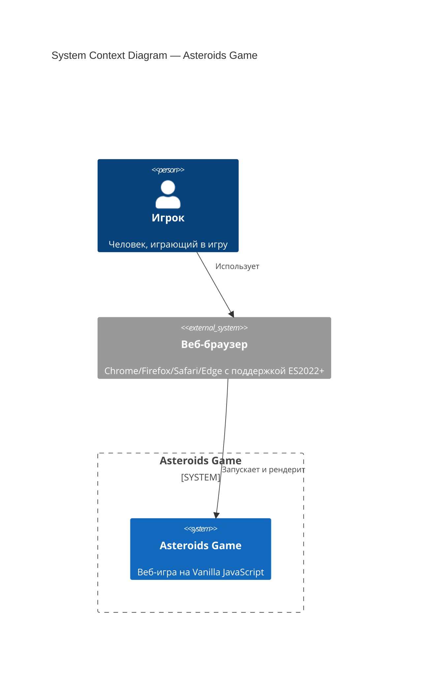
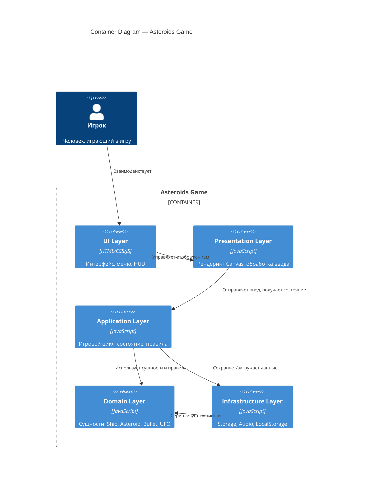
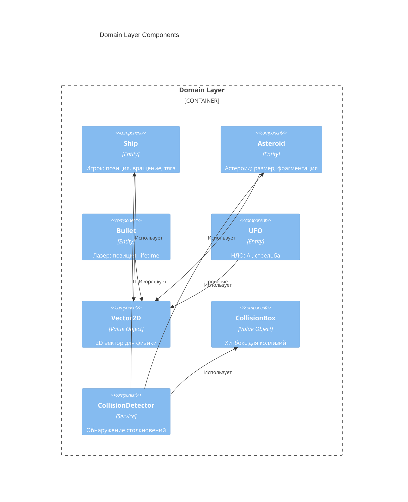
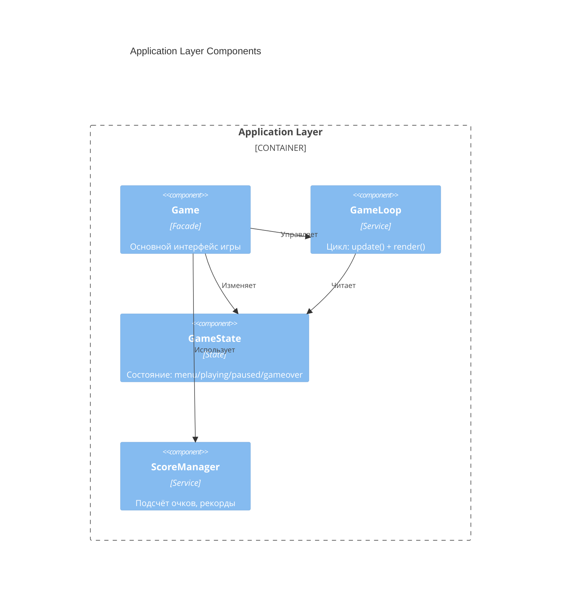
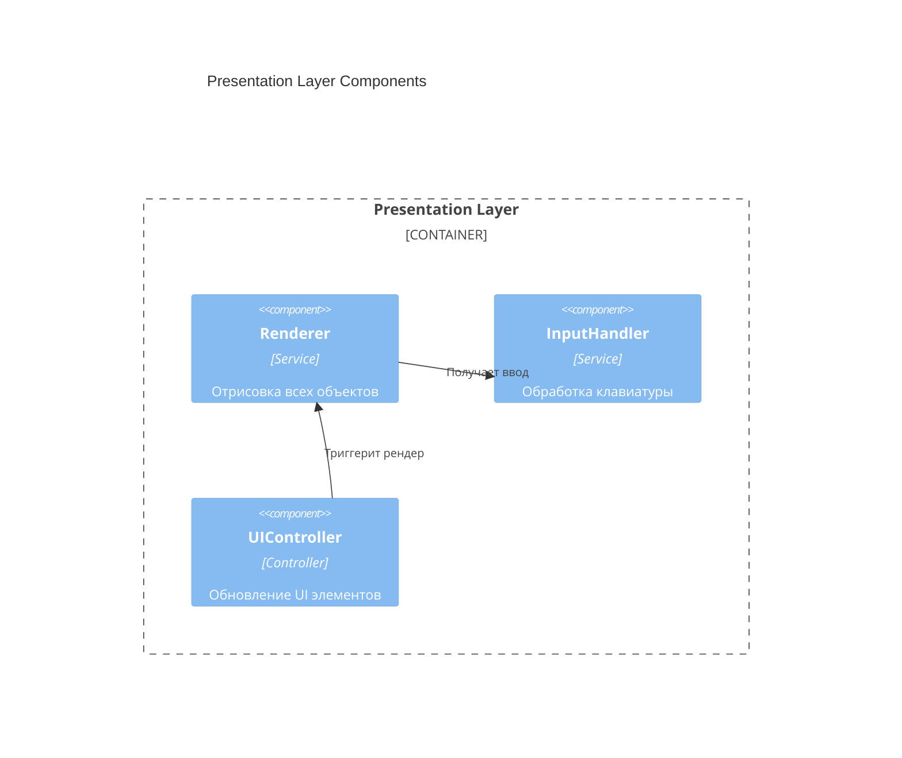
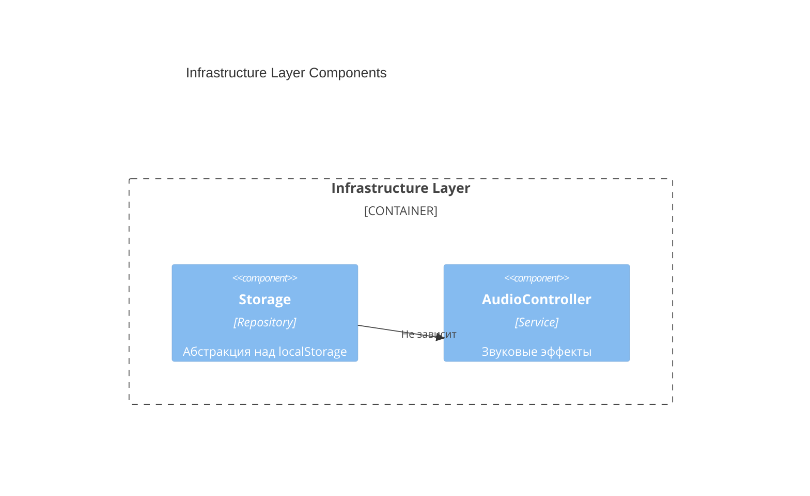
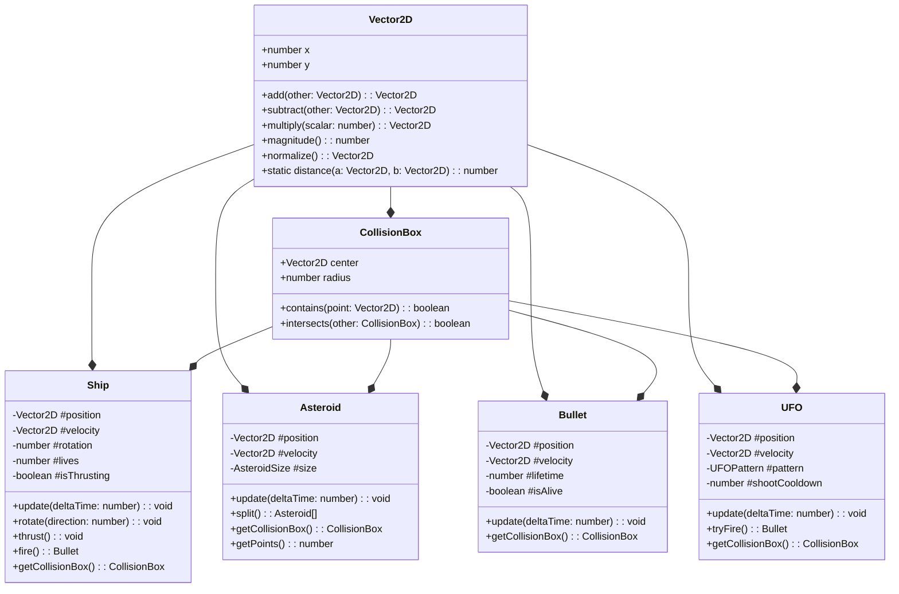
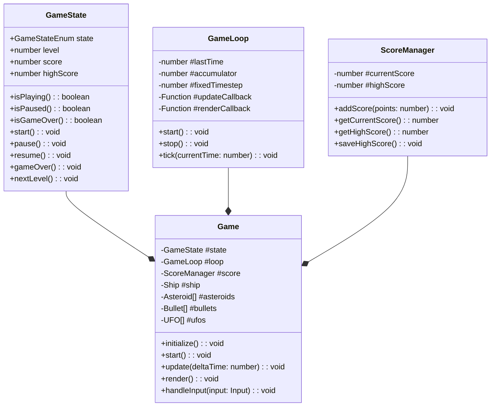
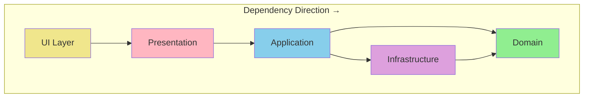

# Vibecraft — implement_skill / implement

---
## Your Role

# Agent: Implementer

## Role
You write implementation code that makes existing tests pass.
You work on **Research: Asteroids Game**.

## Stack
- **tech_stack**: Asteroids Game
- **разделение_на_слои**: Domain → Application → Infrastructure → Presentation
- **правила_tdd**: **
- **│__(entities**: Ship, Asteroid, Bullet)     │
- **testenvironment**: 'jsdom',
- **modulefileextensions**: ['js'],
- **testmatch**: ['**/test/**/*.test.js'],
- **coveragedirectory**: 'coverage',
- **collectcoveragefrom**: ['src/**/*.js']
- **npm_run_test**: coverage

## Sacred Rules ⚠️
1. **You NEVER modify files inside `src/tests/`** — they are immutable
2. If a test seems incorrect, you **FLAG it** with a comment — you do not fix it
3. You write the minimum code needed to make tests pass (no over-engineering)
4. You follow the architecture defined in `docs/design/architecture.md`
5. You follow the stack from `docs/stack.md` — no introducing new dependencies without flagging

## Flagging Issues
If you encounter a problem with a test, respond with:
```
⚠️ FLAG: src/tests/[file] — [describe the issue]
Suggested resolution: [your suggestion]
Awaiting human decision before proceeding.
```

## Implementation Principles
- Follow the architecture pattern (Clean Architecture)
- No business logic in infrastructure layer
- Dependency injection over hard coupling
- All side effects isolated and injectable
- No `any` types (if TypeScript)

## Output
- Files in: `src/`
- Do NOT create files in `src/tests/`
- After completing, list:
  - Files created/modified
  - Tests that now pass
  - Any flags raised

## On Completion
End your response with:
```
IMPLEMENTATION COMPLETE
Files modified: [list]
Tests passing: [list]
Flags raised: [list or "none"]
Ready for code review.
```

---
## Project Context

# Project: Research: Asteroids Game
> Generated by Vibecraft | Phase: **implement** | 2026-02-25 22:51 UTC

---

## Stack Summary
- **tech_stack**: Asteroids Game
- **разделение_на_слои**: Domain → Application → Infrastructure → Presentation
- **правила_tdd**: **
- **│__(entities**: Ship, Asteroid, Bullet)     │
- **testenvironment**: 'jsdom',
- **modulefileextensions**: ['js'],
- **testmatch**: ['**/test/**/*.test.js'],
- **coveragedirectory**: 'coverage',
- **collectcoveragefrom**: ['src/**/*.js']
- **npm_run_test**: coverage

---

## Progress

- [x] research
- [x] design
- [x] plan
- [ ] **implement** ← CURRENT
- [ ] review

---

## Agents Available

- `researcher`
- `architect`
- `planner`
- `plan_reviewer`
- `pre_checker`
- `tdd_writer`
- `implementer`
- `code_reviewer`
- `performance_optimizer`
- `game_designer`
- `security_auditor`
- `api_designer`

---

## Architecture Decisions (ADR)

- ADR-001: Vanilla JavaScript Without Frameworks
- ADR-002: Clean Architecture with 4 Layers
- ADR-003: TDD with Jest and jsdom
- ADR-004: Fixed Timestep Game Loop
- ADR-005: Canvas 2D API for Rendering
- ADR-006: ES Modules for Code Organization
- ADR-007: Object Pooling for Bullets and Asteroids
- ADR-008: localStorage for High Scores
- ADR-009: Event-Based Input Handling
- ADR-010: Collision Detection with Circle Approximation

---

## Immutable Contracts

- Tests in `src/tests/` are **locked** after tdd_writer approval — implementer must never modify them
- ADR decisions are final unless a new ADR explicitly overrides
- Stack decisions from `docs/stack.md` apply to all agents

---

## How to Continue in a New Chat

**Option A — automatic:**
```bash
vibecraft context --skill <skill_name>
```
Copies this file + the skill prompt to clipboard. Paste at the start of your Qwen chat.

**Option B — manual, attach these files:**
1. `docs/context.md` ← this file
2. `.vibecraft/skills/<current_skill>.yaml`
3. `.vibecraft/agents/<relevant_agent>.md`
4. `docs/plans/phase_<N>.md`

---
_Vibecraft v0.1 — https://github.com/you/vibecraft_

---
## Stack

# Tech Stack: Asteroids Game

## 🛠️ Технологический стек

### Язык и платформа

| Компонент | Технология | Версия |
|-----------|------------|--------|
| **Язык** | JavaScript (ECMAScript) | ES2022+ |
| **Платформа** | Веб-браузер | Современные браузеры |
| **Среда выполнения** | Vanilla JS (без фреймворков) | — |

---

## 📦 Архитектура

### Принципы

- **Чистая архитектура (Clean Architecture)**
  - Разделение на слои: Domain → Application → Infrastructure → Presentation
  - Зависимости направлены внутрь (к домену)
- **SOLID принципы**
  - Single Responsibility, Open/Closed, Liskov Substitution, Interface Segregation, Dependency Inversion
- **Компонентный подход**
  - Изолированные модули с чёткими интерфейсами
- **TDD (Test-Driven Development)**
  - Красный → Зелёный → Рефакторинг
  - Тесты пишутся ДО реализации функциональности
  - 100% покрытие критических модулей

### TDD процесс

```
┌─────────────┐     ┌─────────────┐     ┌─────────────┐
│   RED       │     │   GREEN     │     │  REFACTOR   │
│  Write test │ ──► │  Make it    │ ──► │  Clean up   │
│  (fails)    │     │  pass       │     │  code       │
└─────────────┘     └─────────────┘     └─────────────┘
       ▲                                       │
       └───────────────────────────────────────┘
```

**Правила TDD:**
1. Не писать продакшен-код без падающего теста
2. Писать минимальный код для прохождения теста
3. Рефакторить только после зелёного теста
4. Удалять дублирование на каждом шаге

### Слои архитектуры

```
┌─────────────────────────────────────────┐
│         Presentation Layer              │
│  (Canvas Renderer, Input Handler, UI)   │
├─────────────────────────────────────────┤
│         Application Layer               │
│  (Game Loop, State Management, Rules)   │
├─────────────────────────────────────────┤
│           Domain Layer                  │
│  (Entities: Ship, Asteroid, Bullet)     │
├─────────────────────────────────────────┤
│        Infrastructure Layer             │
│  (Storage, Audio, LocalStorage)         │
└─────────────────────────────────────────┘
```

---

## 🧪 Тестирование

| Инструмент | Назначение |
|------------|------------|
| **Jest** | Фреймворк для unit- и integration-тестов |
| **ES Modules** | Модульная структура для тестируемости |

### Структура тестов

```
test/
├── domain/
│   ├── ship.test.js
│   ├── asteroid.test.js
│   └── collision.test.js
├── application/
│   ├── game-loop.test.js
│   └── state.test.js
└── infrastructure/
    └── storage.test.js
```

### Конфигурация Jest

```javascript
// jest.config.js
export default {
  testEnvironment: 'jsdom',
  moduleFileExtensions: ['js'],
  testMatch: ['**/test/**/*.test.js'],
  coverageDirectory: 'coverage',
  collectCoverageFrom: ['src/**/*.js']
};
```

---

## 📁 Структура проекта

```
asteroids/
├── src/
│   ├── domain/
│   │   ├── entities/
│   │   │   ├── Ship.js
│   │   │   ├── Asteroid.js
│   │   │   ├── Bullet.js
│   │   │   └── UFO.js
│   │   ├── value-objects/
│   │   │   ├── Vector2D.js
│   │   │   └── CollisionBox.js
│   │   └── services/
│   │       └── CollisionDetector.js
│   ├── application/
│   │   ├── Game.js
│   │   ├── GameLoop.js
│   │   ├── GameState.js
│   │   └── ScoreManager.js
│   ├── infrastructure/
│   │   ├── Storage.js
│   │   └── AudioController.js
│   └── presentation/
│       ├── Renderer.js
│       ├── InputHandler.js
│       └── UIController.js
├── test/
│   ├── domain/
│   ├── application/
│   └── infrastructure/
├── public/
│   ├── index.html
│   └── styles.css
├── package.json
├── jest.config.js
└── README.md
```

---

## 🔧 Инструменты разработки

| Инструмент | Назначение |
|------------|------------|
| **npm** | Менеджер пакетов |
| **ESLint** | Линтинг кода |
| **Prettier** | Форматирование кода |
| **Vite** (опционально) | Dev-сервер и сборщик |

---

## 📋 Требования к коду

### Стиль кода

- **Модули ES6** — `import`/`export`
- **Классы** — для сущностей домена
- **Стрелочные функции** — для колбэков
- **Const/Let** — без `var`
- **Template literals** — для интерполяции строк

### Именование

- **Классы** — PascalCase (`Ship`, `Asteroid`)
- **Функции/переменные** — camelCase (`createAsteroid`, `gameState`)
- **Константы** — UPPER_CASE (`MAX_BULLETS`, `SHIP_SPEED`)
- **Приватные поля** — `#privateField`

### Документирование

- JSDoc комментарии для публичных методов
- README с описанием архитектуры

---

## 🚀 Запуск проекта

```bash
# Установка зависимостей
npm install

# Запуск тестов
npm test

# Запуск тестов с покрытием
npm run test:coverage

# Запуск dev-сервера (если используется Vite)
npm run dev

# Сборка продакшена
npm run build
```

---

## 📊 Метрики качества

| Метрика | Цель |
|---------|------|
| **Покрытие тестами** | > 80% |
| **ESLint ошибок** | 0 |
| **Размер бандла** | < 100 KB (minified) |
| **Производительность** | 60 FPS на целевых устройствах |

---

## 🎯 Критерии готовности

- [ ] Реализованы все базовые механики
- [ ] Покрытие тестами > 80%
- [ ] Нет ESLint ошибок
- [ ] Работает в современных браузерах
- [ ] Код структурирован по слоям чистой архитектуры


---
## Architecture

# Architecture: Asteroids Game

**Version:** 1.0  
**Status:** Accepted  
**Last Updated:** 2026-02-25  
**Phase:** Design

---

## 📋 Overview

Этот документ описывает архитектуру игры Asteroids, используя **C4 модель** (Context, Container, Component, Code) и **Architecture Decision Records (ADR)** для ключевых решений.

### Архитектурные принципы

1. **Clean Architecture** — зависимости направлены внутрь к домену
2. **SOLID** — каждый класс следует принципам SOLID
3. **Testability First** — архитектура поддерживает TDD
4. **Explicit Dependencies** — все зависимости явные
5. **Single Responsibility** — один класс = одна ответственность

---

## 🏗️ C4 Model

### Level 1: System Context Diagram



**Описание:**
- **Игрок** взаимодействует с **веб-браузером**
- **Браузер** загружает и выполняет код игры
- **Asteroids Game** — единая система без внешних зависимостей

---

### Level 2: Container Diagram



**Контейнеры:**

| Контейнер | Технология | Ответственность |
|-----------|------------|-----------------|
| **UI Layer** | HTML/CSS | Меню, HUD, экраны Game Over/Pause |
| **Presentation Layer** | JavaScript + Canvas 2D API | Рендеринг графики, обработка input |
| **Application Layer** | JavaScript | Game loop, GameState, ScoreManager |
| **Domain Layer** | JavaScript | Ship, Asteroid, Bullet, UFO, Vector2D |
| **Infrastructure Layer** | JavaScript + Web APIs | Storage, AudioController, LocalStorage |

---

### Level 3: Component Diagram

#### Domain Layer Components



#### Application Layer Components



#### Presentation Layer Components



#### Infrastructure Layer Components



---

### Level 4: Code Level (Key Classes)

#### Domain Entities



#### Application Services



---

## 📝 Architecture Decision Records (ADRs)

---

### ADR-001: Vanilla JavaScript Without Frameworks

**Status:** Accepted

**Context:**
Необходимо выбрать технологию для реализации игры. Современные фреймворки (React, Vue, Phaser) предоставляют готовые решения, но добавляют сложность и размер бандла.

**Decision:**
Использовать **Vanilla JavaScript (ES2022+)** без фреймворков.

**Consequences:**
- ✅ Минимальный размер бандла (<100 KB)
- ✅ Полный контроль над кодом
- ✅ Образовательная ценность (чистая архитектура)
- ❌ Больше кода для написания
- ❌ Нет готовых решений для常见 задач

---

### ADR-002: Clean Architecture with 4 Layers

**Status:** Accepted

**Context:**
Необходимо организовать код так, чтобы обеспечить тестируемость, поддерживаемость и соблюдение SOLID принципов.

**Decision:**
Использовать **Clean Architecture** с 4 слоями:
1. **Domain** — сущности и бизнес-правила
2. **Application** — игровой цикл, состояние
3. **Presentation** — рендеринг и ввод
4. **Infrastructure** — storage, audio

**Consequences:**
- ✅ Зависимости направлены внутрь (к домену)
- ✅ Domain слой не зависит от внешних библиотек
- ✅ Легко тестировать каждый слой изолированно
- ❌ Требует дисциплины от разработчиков
- ❌ Больше файлов и импортов

---

### ADR-003: TDD with Jest and jsdom

**Status:** Accepted

**Context:**
Необходимо обеспечить высокое качество кода и возможность рефакторинга без страха сломать функциональность.

**Decision:**
Использовать **TDD (Test-Driven Development)** с фреймворком **Jest** и средой **jsdom**.

**Consequences:**
- ✅ Покрытие тестами >80%
- ✅ Тесты пишутся ДО кода (RED→GREEN→REFACTOR)
- ✅ jsdom позволяет тестировать DOM-зависимости
- ❌ Замедляет начальную разработку
- ❌ Требует моков для Canvas API

---

### ADR-004: Fixed Timestep Game Loop

**Status:** Accepted

**Context:**
Игровой цикл должен обеспечивать стабильную физику независимо от частоты кадров рендеринга.

**Decision:**
Использовать **фиксированный timestep (1/60 сек)** для физики с накоплением времени (accumulator pattern).

```javascript
const FIXED_TIMESTEP = 1 / 60; // 16.67ms

update(accumulator) {
    while (accumulator >= FIXED_TIMESTEP) {
        this.physicsUpdate(FIXED_TIMESTEP);
        accumulator -= FIXED_TIMESTEP;
    }
}
```

**Consequences:**
- ✅ Детерминированная физика
- ✅ Стабильные коллизии
- ✅ 60 FPS на поддерживаемых устройствах
- ❌ Сложнее реализация чем requestAnimationFrame напрямую

---

### ADR-005: Canvas 2D API for Rendering

**Status:** Accepted

**Context:**
Необходимо выбрать способ рендеринга графики. WebGL мощнее, но сложнее. DOM-элементы медленнее.

**Decision:**
Использовать **Canvas 2D API** с геометрическими примитивами (линии, пути).

**Consequences:**
- ✅ Простой API
- ✅ Хорошая производительность для 2D
- ✅ Аутентичный векторный стиль
- ❌ Нет аппаратного ускорения как WebGL
- ❌ Нужно рисовать всё кодом (нет спрайтов)

---

### ADR-006: ES Modules for Code Organization

**Status:** Accepted

**Context:**
Необходимо организовать код в модули для тестируемости и поддерживаемости.

**Decision:**
Использовать **ES6 Modules** (`import`/`export`) для всех файлов.

**Consequences:**
- ✅ Нативная поддержка в браузерах
- ✅ Статический анализ импортов
- ✅ Tree-shaking для сборщиков
- ❌ Требует сборщик или современный браузер

---

### ADR-007: Object Pooling for Bullets and Asteroids

**Status:** Accepted

**Context:**
Частое создание/удаление объектов вызывает garbage collection паузы.

**Decision:**
Использовать **Object Pool pattern** для пуль и астероидов.

```javascript
class BulletPool {
    constructor(size = 50) {
        this.pool = Array(size).fill(null).map(() => new Bullet());
        this.available = new Set(range(size));
    }
    
    acquire() {
        const id = this.available.values().next().value;
        if (id !== undefined) {
            this.available.delete(id);
            return this.pool[id];
        }
        return null; // Pool exhausted
    }
    
    release(bullet) {
        this.available.add(bullet.id);
        bullet.reset();
    }
}
```

**Consequences:**
- ✅ Минимизация GC пауз
- ✅ Предсказуемая производительность
- ❌ Усложняет код
- ❌ Нужно управлять состоянием объектов

---

### ADR-008: localStorage for High Scores

**Status:** Accepted

**Context:**
Необходимо сохранять рекорды между сессиями. IndexedDB мощнее, но сложнее.

**Decision:**
Использовать **localStorage** для хранения топ-5 рекордов.

**Consequences:**
- ✅ Простой API
- ✅ Синхронное чтение/запись
- ✅ Достаточно для 5 записей
- ❌ Лимит 5-10 MB (не критично)
- ❌ Блокирует основной поток при записи

---

### ADR-009: Event-Based Input Handling

**Status:** Accepted

**Context:**
Необходимо обрабатывать ввод с клавиатуры. Polling проще, но event-based эффективнее.

**Decision:**
Использовать **event-based подход** с накоплением состояния.

```javascript
class InputHandler {
    constructor() {
        this.keys = new Set();
        window.addEventListener('keydown', (e) => this.keys.add(e.code));
        window.addEventListener('keyup', (e) => this.keys.delete(e.code));
    }
    
    isPressed(code) {
        return this.keys.has(code);
    }
    
    wasJustPressed(code) {
        // Track previous frame state for edge detection
    }
}
```

**Consequences:**
- ✅ Отзывчивое управление
- ✅ Поддержка мультитача (для future touch support)
- ❌ Нужно отслеживать состояние между кадрами

---

### ADR-010: Collision Detection with Circle Approximation

**Status:** Accepted

**Context:**
Точная коллизия для многоугольников сложна. Нужно простое и быстрое решение.

**Decision:**
Использовать **круговые хитбоксы (CollisionBox)** для всех объектов.

```javascript
class CollisionBox {
    constructor(center, radius) {
        this.center = center; // Vector2D
        this.radius = radius;
    }
    
    intersects(other) {
        const distance = Vector2D.distance(this.center, other.center);
        return distance < (this.radius + other.radius);
    }
}
```

**Consequences:**
- ✅ O(1) проверка столкновений
- ✅ Простая реализация
- ❌ Менее точно для треугольника корабля
- ✅ Достаточно для аркадной игры

---

## 🔒 Layer Boundaries

### Dependency Rules



### What Can Cross Boundaries

| From → To | Allowed | What Can Cross |
|-----------|---------|----------------|
| **Presentation → Domain** | ✅ | Читать сущности, вызывать методы |
| **Presentation → Application** | ✅ | Вызывать Game методы |
| **Application → Domain** | ✅ | Создавать/изменять сущности |
| **Application → Infrastructure** | ✅ | Сохранять/загружать данные |
| **Infrastructure → Domain** | ✅ | Сериализовать сущности |
| **Domain → Any** | ❌ | Никаких зависимостей наружу |
| **Infrastructure → Presentation** | ❌ | Никаких UI зависимостей |

### Interface Contracts

#### Domain → Application

```javascript
// Domain exports (pure, no dependencies)
export { Ship } from './entities/Ship.js';
export { Asteroid } from './entities/Asteroid.js';
export { Bullet } from './entities/Bullet.js';
export { UFO } from './entities/UFO.js';
export { Vector2D } from './value-objects/Vector2D.js';
export { CollisionBox } from './value-objects/CollisionBox.js';
export { CollisionDetector } from './services/CollisionDetector.js';
```

#### Application → Presentation

```javascript
// Application предоставляет интерфейс для Presentation
class Game {
    // Presentation вызывает эти методы
    handleInput(input) { }  // InputHandler → Game
    getState() { }          // Renderer читает состояние
    getScore() { }          // UIController читает счёт
}
```

#### Application → Infrastructure

```javascript
// Infrastructure реализует интерфейсы для Application
class Storage {
    saveHighScore(score) { }
    getHighScore() { }
}

class AudioController {
    playShoot() { }
    playExplosion() { }
}
```

---

## 📊 Quality Attributes

| Attribute | Strategy |
|-----------|----------|
| **Performance** | Fixed timestep, object pooling, requestAnimationFrame |
| **Testability** | Dependency injection, pure functions in domain |
| **Maintainability** | Clean Architecture, ES Modules, JSDoc |
| **Extensibility** | Open/Closed principle, component-based design |
| **Reliability** | TDD >80% coverage, error boundaries |

---

## 🗺️ File Structure

```
src/
├── domain/
│   ├── entities/
│   │   ├── Ship.js
│   │   ├── Asteroid.js
│   │   ├── Bullet.js
│   │   └── UFO.js
│   ├── value-objects/
│   │   ├── Vector2D.js
│   │   └── CollisionBox.js
│   └── services/
│       └── CollisionDetector.js
├── application/
│   ├── Game.js
│   ├── GameLoop.js
│   ├── GameState.js
│   └── ScoreManager.js
├── infrastructure/
│   ├── Storage.js
│   └── AudioController.js
├── presentation/
│   ├── Renderer.js
│   ├── InputHandler.js
│   └── UIController.js
└── index.js
```

---

**Architecture Status:** ✅ Accepted  
**Next Phase:** Plan (Implementation Planning)  
**Architect Agent:** Complete


---
## Existing Tests — DO NOT MODIFY


### InputHandler.test.js
```
/**
 * Tests for InputHandler
 * 
 * @description Тесты для компонента обработки ввода с клавиатуры
 * @module InputHandler
 * @see src/presentation/InputHandler.js
 */

import { jest } from '@jest/globals';

describe('InputHandler', () => {
    let InputHandler;
    let inputHandler;
    let mockWindow;
    let listeners;

    // Моки для клавиш
    const KEYS = {
        ARROW_UP: 'ArrowUp',
        ARROW_DOWN: 'ArrowDown',
        ARROW_LEFT: 'ArrowLeft',
        ARROW_RIGHT: 'ArrowRight',
        KEY_W: 'KeyW',
        KEY_A: 'KeyA',
        KEY_S: 'KeyS',
        KEY_D: 'KeyD',
        SPACE: 'Space',
        KEY_P: 'KeyP',
        KEY_H: 'KeyH',
        KEY_R: 'KeyR'
    };

    beforeEach(async () => {
        // Динамический импорт для изоляции тестов
        InputHandler = (await import('../../src/presentation/InputHandler.js')).InputHandler;

        // Создаём мок window с отслеживанием event listeners
        listeners = { keydown: [], keyup: [] };
        mockWindow = {
            addEventListener: jest.fn((event, handler) => {
                if (event === 'keydown' || event === 'keyup') {
                    listeners[event].push(handler);
                }
            }),
            removeEventListener: jest.fn()
        };

        inputHandler = new InputHandler(mockWindow);
    });

    afterEach(() => {
        jest.clearAllMocks();
    });

    describe('constructor', () => {
        test('should register keydown event listener', () => {
            expect(mockWindow.addEventListener).toHaveBeenCalledWith(
                'keydown',
                expect.any(Function)
            );
        });

        test('should register keyup event listener', () => {
            expect(mockWindow.addEventListener).toHaveBeenCalledWith(
                'keyup',
                expect.any(Function)
            );
        });

        test('should use default window if not provided', async () => {
            const DefaultInputHandler = (await import('../../src/presentation/InputHandler.js')).InputHandler;
            // При создании без параметров должен использоваться window по умолчанию
            const handler = new DefaultInputHandler();
            expect(handler).toBeDefined();
        });
    });

    describe('isPressed', () => {
        test('should return true for pressed key', () => {
            const event = { code: KEYS.ARROW_UP, preventDefault: jest.fn() };
            listeners.keydown.forEach(fn => fn(event));

            expect(inputHandler.isPressed(KEYS.ARROW_UP)).toBe(true);
        });

        test('should return false for released key', () => {
            // Нажимаем клавишу
            const keydownEvent = { code: KEYS.ARROW_UP, preventDefault: jest.fn() };
            listeners.keydown.forEach(fn => fn(keydownEvent));

            // Отпускаем клавишу
            const keyupEvent = { code: KEYS.ARROW_UP };
            listeners.keyup.forEach(fn => fn(keyupEvent));

            expect(inputHandler.isPressed(KEYS.ARROW_UP)).toBe(false);
        });

        test('should return false for unpressed key', () => {
            expect(inputHandler.isPressed(KEYS.ARROW_UP)).toBe(false);
        });

        test('should track multiple keys simultaneously', () => {
            const event1 = { code: KEYS.ARROW_UP, preventDefault: jest.fn() };
            const event2 = { code: KEYS.SPACE, preventDefault: jest.fn() };

            listeners.keydown.forEach(fn => fn(event1));
            listeners.keydown.forEach(fn => fn(event2));

            expect(inputHandler.isPressed(KEYS.ARROW_UP)).toBe(true);
            expect(inputHandler.isPressed(KEYS.SPACE)).toBe(true);
        });

        test('should call preventDefault on keydown events', () => {
            const preventDefault = jest.fn();
            const event = { code: KEYS.ARROW_UP, preventDefault };

            listeners.keydown.forEach(fn => fn(event));

            expect(preventDefault).toHaveBeenCalled();
        });
    });

    describe('wasJustPressed (edge detection)', () => {
        test('should return true when key was just pressed in current frame', () => {
            const event = { code: KEYS.SPACE, preventDefault: jest.fn() };
            listeners.keydown.forEach(fn => fn(event));

            expect(inputHandler.wasJustPressed(KEYS.SPACE)).toBe(true);
        });

        test('should return false when key was held from previous frame', () => {
            const event = { code: KEYS.SPACE, preventDefault: jest.fn() };
            listeners.keydown.forEach(fn => fn(event));

            // Завершаем кадр — текущее состояние становится предыдущим
            inputHandler.endFrame();

            // Клавиша всё ещё нажата, но не "только что"
            expect(inputHandler.wasJustPressed(KEYS.SPACE)).toBe(false);
        });

        test('should return false for unpressed key', () => {
            expect(inputHandler.wasJustPressed(KEYS.SPACE)).toBe(false);
        });

        test('should detect new key press after endFrame', () => {
            // Сначала нажимаем и завершаем кадр
            const event1 = { code: KEYS.ARROW_UP, preventDefault: jest.fn() };
            listeners.keydown.forEach(fn => fn(event1));
            inputHandler.endFrame();

            // Отпускаем старую клавишу и нажимаем новую
            const keyupEvent = { code: KEYS.ARROW_UP };
            listeners.keyup.forEach(fn => fn(keyupEvent));

            const event2 = { code: KEYS.SPACE, preventDefault: jest.fn() };
            listeners.keydown.forEach(fn => fn(event2));

            expect(inputHandler.wasJustPressed(KEYS.ARROW_UP)).toBe(false);
            expect(inputHandler.wasJustPressed(KEYS.SPACE)).toBe(true);
        });
    });

    describe('endFrame', () => {
        test('should save current key state as previous state', () => {
            const event = { code: KEYS.ARROW_UP, preventDefault: jest.fn() };
            listeners.keydown.forEach(fn => fn(event));

            inputHandler.endFrame();

            // После endFrame wasJustPressed должен вернуть false
            expect(inputHandler.wasJustPressed(KEYS.ARROW_UP)).toBe(false);
        });

        test('should allow detection of new key presses in next frame', () => {
            inputHandler.endFrame();

            const event = { code: KEYS.SPACE, preventDefault: jest.fn() };
            listeners.keydown.forEach(fn => fn(event));

            expect(inputHandler.wasJustPressed(KEYS.SPACE)).toBe(true);
        });
    });

    describe('getState', () => {
        test('should return input state object with all actions', () => {
            const state = inputHandler.getState();

            expect(state).toHaveProperty('thrust');
            expect(state).toHaveProperty('rotateLeft');
            expect(state).toHaveProperty('rotateRight');
            expect(state).toHaveProperty('fire');
            expect(state).toHaveProperty('hyperspace');
            expect(state).toHaveProperty('pause');
        });

        test('should map ArrowUp and KeyW to thrust', () => {
            const eventUp = { code: KEYS.ARROW_UP, preventDefault: jest.fn() };
            const eventW = { code: KEYS.KEY_W, preventDefault: jest.fn() };

            listeners.keydown.forEach(fn => fn(eventUp));
            let state = inputHandler.getState();
            expect(state.thrust).toBe(true);

            listeners.keyup.forEach(fn => fn({ code: KEYS.ARROW_UP }));
            listeners.keydown.forEach(fn => fn(eventW));
            state = inputHandler.getState();
            expect(state.thrust).toBe(true);
        });

        test('should map ArrowLeft and KeyA to rotateLeft', () => {
            const eventLeft = { code: KEYS.ARROW_LEFT, preventDefault: jest.fn() };
            const eventA = { code: KEYS.KEY_A, preventDefault: jest.fn() };

            listeners.keydown.forEach(fn => fn(eventLeft));
            let state = inputHandler.getState();
            expect(state.rotateLeft).toBe(true);

            listeners.keyup.forEach(fn => fn({ code: KEYS.ARROW_LEFT }));
            listeners.keydown.forEach(fn => fn(eventA));
            state = inputHandler.getState();
            expect(state.rotateLeft).toBe(true);
        });

        test('should map ArrowRight and KeyD to rotateRight', () => {
            const eventRight = { code: KEYS.ARROW_RIGHT, preventDefault: jest.fn() };
            const eventD = { code: KEYS.KEY_D, preventDefault: jest.fn() };

            listeners.keydown.forEach(fn => fn(eventRight));
            let state = inputHandler.getState();
            expect(state.rotateRight).toBe(true);

            listeners.keyup.forEach(fn => fn({ code: KEYS.ARROW_RIGHT }));
            listeners.keydown.forEach(fn => fn(eventD));
            state = inputHandler.getState();
            expect(state.rotateRight).toBe(true);
        });

        test('should map Space to fire', () => {
            const event = { code: KEYS.SPACE, preventDefault: jest.fn() };
            listeners.keydown.forEach(fn => fn(event));

            const state = inputHandler.getState();
            expect(state.fire).toBe(true);
        });

        test('should map KeyH to hyperspace', () => {
            const event = { code: KEYS.KEY_H, preventDefault: jest.fn() };
            listeners.keydown.forEach(fn => fn(event));

            const state = inputHandler.getState();
            expect(state.hyperspace).toBe(true);
        });

        test('should map KeyP to pause', () => {
            const event = { code: KEYS.KEY_P, preventDefault: jest.fn() };
            listeners.keydown.forEach(fn => fn(event));

            const state = inputHandler.getState();
            expect(state.pause).toBe(true);
        });

        test('should return all false when no keys pressed', () => {
            const state = inputHandler.getState();

            expect(state.thrust).toBe(false);
            expect(state.rotateLeft).toBe(false);
            expect(state.rotateRight).toBe(false);
            expect(state.fire).toBe(false);
            expect(state.hyperspace).toBe(false);
            expect(state.pause).toBe(false);
        });

        test('should handle multiple simultaneous inputs', () => {
            const thrustEvent = { code: KEYS.ARROW_UP, preventDefault: jest.fn() };
            const fireEvent = { code: KEYS.SPACE, preventDefault: jest.fn() };

            listeners.keydown.forEach(fn => fn(thrustEvent));
            listeners.keydown.forEach(fn => fn(fireEvent));

            const state = inputHandler.getState();
            expect(state.thrust).toBe(true);
            expect(state.fire).toBe(true);
        });
    });

    describe('key mappings', () => {
        const keyMappings = [
            { code: KEYS.ARROW_UP, action: 'thrust', description: 'ArrowUp → thrust' },
            { code: KEYS.KEY_W, action: 'thrust', description: 'KeyW → thrust' },
            { code: KEYS.ARROW_LEFT, action: 'rotateLeft', description: 'ArrowLeft → rotateLeft' },
            { code: KEYS.KEY_A, action: 'rotateLeft', description: 'KeyA → rotateLeft' },
            { code: KEYS.ARROW_RIGHT, action: 'rotateRight', description: 'ArrowRight → rotateRight' },
            { code: KEYS.KEY_D, action: 'rotateRight', description: 'KeyD → rotateRight' },
            { code: KEYS.SPACE, action: 'fire', description: 'Space → fire' },
            { code: KEYS.KEY_H, action: 'hyperspace', description: 'KeyH → hyperspace' },
            { code: KEYS.KEY_P, action: 'pause', description: 'KeyP → pause' }
        ];

        test.each(keyMappings)('$description', ({ code, action }) => {
            const event = { code, preventDefault: jest.fn() };
            listeners.keydown.forEach(fn => fn(event));

            const state = inputHandler.getState();
            expect(state[action]).toBe(true);
        });
    });

    describe('input state transitions', () => {
        test('should correctly track key press and release cycle', () => {
            // Начальное состояние
            expect(inputHandler.isPressed(KEYS.SPACE)).toBe(false);
            expect(inputHandler.wasJustPressed(KEYS.SPACE)).toBe(false);

            // Нажатие
            const keydownEvent = { code: KEYS.SPACE, preventDefault: jest.fn() };
            listeners.keydown.forEach(fn => fn(keydownEvent));

            expect(inputHandler.isPressed(KEYS.SPACE)).toBe(true);
            expect(inputHandler.wasJustPressed(KEYS.SPACE)).toBe(true);

            // Завершение кадра
            inputHandler.endFrame();

            expect(inputHandler.isPressed(KEYS.SPACE)).toBe(true);
            expect(inputHandler.wasJustPressed(KEYS.SPACE)).toBe(false);

            // Отпускание
            const keyupEvent = { code: KEYS.SPACE };
            listeners.keyup.forEach(fn => fn(keyupEvent));

            expect(inputHandler.isPressed(KEYS.SPACE)).toBe(false);
            expect(inputHandler.wasJustPressed(KEYS.SPACE)).toBe(false);
        });
    });
});

```


### output.md
```
<!-- DRY-RUN: no LLM response. Paste the prompt from clipboard into your LLM and save the result manually. -->
```


### README.md
```
# Phase 4 Tests — Presentation Layer

**Phase:** 4  
**Layer:** Presentation  
**Status:** Ready for Approval  
**Created:** 2026-02-26

---

## Overview

Этот набор тестов покрывает **Presentation Layer** игры Asteroids — слой, отвечающий за:
- Обработку ввода с клавиатуры
- Рендеринг графики через Canvas 2D API
- Управление UI элементами (HUD, меню, экраны паузы/Game Over)

---

## Test Files

### 1. InputHandler.test.js

**Тестируемый компонент:** `src/presentation/InputHandler.js`

**Что проверяется:**
- Регистрация event listeners (keydown/keyup)
- Отслеживание состояния клавиш (`isPressed`)
- Edge detection для однократных действий (`wasJustPressed`)
- Завершение кадра и сохранение предыдущего состояния (`endFrame`)
- Получение агрегированного состояния ввода (`getState`)
- Маппинг клавиш на игровые действия

**Клавиши:**
| Клавиша | Действие |
|---------|----------|
| ArrowUp / W | Thrust (тяга) |
| ArrowLeft / A | Rotate Left (вращение влево) |
| ArrowRight / D | Rotate Right (вращение вправо) |
| Space | Fire (огонь) |
| H | Hyperspace (гиперпространство) |
| P | Pause (пауза) |

**Количество тестов:** 25+

---

### 2. Renderer.test.js

**Тестируемый компонент:** `src/presentation/Renderer.js`

**Что проверяется:**
- Очистка canvas чёрным фоном
- Настройка стиля отрисовки (белые линии, толщина 2px)
- Отрисовка корабля (треугольник с трансформациями)
- Отрисовка астероидов (многоугольники)
- Отрисовка пуль (линии)
- Отрисовка НЛО (эллипсы)
- Отрисовка взрывов (расходящиеся линии)
- Сохранение/восстановление состояния контекста
- Трансформации (translate, rotate)

**Графические примитивы:**
| Сущность | Примитивы |
|----------|-----------|
| Ship | 3 линии (треугольник) |
| Asteroid | 6-8 линий (многоугольник) |
| Bullet | 1 линия |
| UFO | 2 эллипса + линии |
| Explosion | 12 расходящихся линий |

**Количество тестов:** 40+

---

### 3. UIController.test.js

**Тестируемый компонент:** `src/presentation/UIController.js`

**Что проверяется:**
- Обновление HUD элементов (score, lives, level, highScore)
- Управление видимостью экранов (menu, pause, gameOver)
- Отображение сообщения о завершении уровня
- Регистрация обработчиков кнопок (start, restart)
- Переходы между состояниями UI

**DOM элементы:**
| ID | Элемент |
|----|---------|
| score | Текущий счёт |
| lives | Жизни |
| level | Уровень |
| high-score | Рекорд |
| menu | Главное меню |
| pause | Экран паузы |
| game-over | Экран завершения игры |
| start-button | Кнопка старта |
| restart-button | Кнопка перезапуска |

**Количество тестов:** 40+

---

## Mock Objects

### canvas.js

Создаёт мок для Canvas API:
- `createMockCanvas(width, height)` — мок HTMLCanvasElement
- `createMockCanvasContext()` — мок CanvasRenderingContext2D
- `createMockOffscreenCanvas(width, height)` — мок OffscreenCanvas

**Использование:**
```javascript
import { createMockCanvas } from '../__mocks__/canvas.js';

const canvas = createMockCanvas(800, 600);
const ctx = canvas._getMockContext();
```

---

## Running Tests

### Запуск всех тестов Phase 4
```bash
npm test -- src/tests/phase_4/
```

### Запуск с покрытием
```bash
npm run test:coverage -- src/tests/phase_4/
```

### Запуск в режиме watch
```bash
npm run test:watch -- src/tests/phase_4/
```

### Запуск отдельных файлов
```bash
# InputHandler
npm test -- src/tests/phase_4/InputHandler.test.js

# Renderer
npm test -- src/tests/phase_4/Renderer.test.js

# UIController
npm test -- src/tests/phase_4/UIController.test.js
```

---

## Expected Results (RED Phase)

**До реализации** все тесты должны **FAIL**:

```
FAIL src/tests/phase_4/InputHandler.test.js
  ● InputHandler › constructor › should register keydown event listener
    Cannot find module '../../src/presentation/InputHandler.js'

FAIL src/tests/phase_4/Renderer.test.js
  ● Renderer › constructor › should store canvas reference
    Cannot find module '../../src/presentation/Renderer.js'

FAIL src/tests/phase_4/UIController.test.js
  ● UIController › constructor › should store document reference
    Cannot find module '../../src/presentation/UIController.js'
```

Это **ожидаемое поведение** в TDD процессе (RED phase).

---

## Coverage Goals

| Component | Goal |
|-----------|------|
| InputHandler | >80% |
| Renderer | >80% |
| UIController | >80% |

---

## What Is Covered

### InputHandler
- ✅ Регистрация event listeners
- ✅ Отслеживание состояния клавиш
- ✅ Edge detection (wasJustPressed)
- ✅ Маппинг клавиш на действия
- ✅ Мультитач (одновременное нажатие нескольких клавиш)
- ✅ PreventDefault для keydown событий

### Renderer
- ✅ Очистка canvas
- ✅ Настройка стиля отрисовки
- ✅ Отрисовка корабля с трансформациями
- ✅ Отрисовка астероидов (многоугольники)
- ✅ Отрисовка пуль
- ✅ Отрисовка НЛО
- ✅ Отрисовка взрывов
- ✅ Сохранение/восстановление контекста
- ✅ Отрисовка множественных сущностей

### UIController
- ✅ Обновление HUD элементов
- ✅ Показ/скрытие меню
- ✅ Показ/скрытие паузы
- ✅ Показ/скрытие Game Over экрана
- ✅ Сообщение о завершении уровня
- ✅ Обработчики кнопок start/restart
- ✅ Переходы между состояниями UI

---

## What Is NOT Covered

### InputHandler
- ❌ Тестирование с реальным DOM (используются моки)
- ❌ Тестирование touch событий (для future mobile support)
- ❌ Тестирование gamepad API

### Renderer
- ❌ Визуальная проверка графики (только вызовы методов)
- ❌ Производительность отрисовки (FPS, batch rendering)
- ❌ Анимация тяги двигателя (пульсация)
- ❌ Сглаживание и антиалиасинг

### UIController
- ❌ Стилизация CSS (только display property)
- ❌ Анимации переходов между экранами
- ❌ Звуковые эффекты UI

---

## Implementation Requirements

Для прохождения тестов необходимо реализовать:

### InputHandler
```javascript
export class InputHandler {
    constructor(windowObj = window) {
        this.keys = new Set();
        this.previousKeys = new Set();
        // ... регистрация event listeners
    }

    isPressed(code) { /* ... */ }
    wasJustPressed(code) { /* ... */ }
    endFrame() { /* ... */ }
    getState() { /* ... */ }
}
```

### Renderer
```javascript
export class Renderer {
    constructor(canvas) {
        this.canvas = canvas;
        this.ctx = canvas.getContext('2d');
        this.width = canvas.width;
        this.height = canvas.height;
    }

    render(gameState) { /* ... */ }
    drawShip(ship) { /* ... */ }
    drawAsteroid(asteroid) { /* ... */ }
    drawBullet(bullet) { /* ... */ }
    drawUFO(ufo) { /* ... */ }
    drawExplosion(position) { /* ... */ }
}
```

### UIController
```javascript
export class UIController {
    constructor(documentObj = document) {
        // ... получение элементов по ID
    }

    updateScore(score) { /* ... */ }
    updateLives(lives) { /* ... */ }
    updateLevel(level) { /* ... */ }
    updateHighScore(score) { /* ... */ }
    showMenu() { /* ... */ }
    hideMenu() { /* ... */ }
    showPause() { /* ... */ }
    hidePause() { /* ... */ }
    showGameOver(score) { /* ... */ }
    hideGameOver() { /* ... */ }
    showLevelComplete(level) { /* ... */ }
    on(event, callback) { /* ... */ }
}
```

---

## TDD Workflow

1. **RED** — Запустить тесты, убедиться что все FAIL
2. **GREEN** — Реализовать код для прохождения тестов
3. **REFACTOR** — Улучшить код, сохранив прохождение тестов

---

## Approval Status

- [x] Tests written
- [ ] Tests approved by human
- [ ] Tests locked (immutable)
- [ ] Implementation started
- [ ] Implementation complete (GREEN phase)
- [ ] Code reviewed

---

**Tests Ready for Approval**  
**Files:** InputHandler.test.js, Renderer.test.js, UIController.test.js  
**Coverage Intention:** Все публичные методы и основные сценарии использования  
**Awaiting human approval before implementation begins.**

```


### Renderer.test.js
```
/**
 * Tests for Renderer
 * 
 * @description Тесты для компонента рендеринга через Canvas 2D API
 * @module Renderer
 * @see src/presentation/Renderer.js
 */

import { jest } from '@jest/globals';
import { createMockCanvas } from '../__mocks__/canvas.js';

describe('Renderer', () => {
    let Renderer;
    let renderer;
    let canvas;
    let ctx;

    // Константы для тестов
    const CANVAS_WIDTH = 800;
    const CANVAS_HEIGHT = 600;
    const BLACK = '#000000';
    const WHITE = '#FFFFFF';

    beforeEach(async () => {
        // Динамический импорт для изоляции тестов
        Renderer = (await import('../../src/presentation/Renderer.js')).Renderer;

        // Создаём мок canvas
        canvas = createMockCanvas(CANVAS_WIDTH, CANVAS_HEIGHT);
        ctx = canvas._getMockContext();

        renderer = new Renderer(canvas);
    });

    afterEach(() => {
        jest.clearAllMocks();
    });

    describe('constructor', () => {
        test('should store canvas reference', () => {
            expect(renderer.canvas).toBe(canvas);
        });

        test('should get 2d context from canvas', () => {
            expect(canvas.getContext).toHaveBeenCalledWith('2d');
        });

        test('should store context reference', () => {
            expect(renderer.ctx).toBe(ctx);
        });

        test('should store canvas width', () => {
            expect(renderer.width).toBe(CANVAS_WIDTH);
        });

        test('should store canvas height', () => {
            expect(renderer.height).toBe(CANVAS_HEIGHT);
        });
    });

    describe('render', () => {
        test('should clear canvas with black background', () => {
            renderer.render({ ship: null, asteroids: [], bullets: [], ufos: [] });

            expect(ctx.fillStyle).toBe(BLACK);
            expect(ctx.fillRect).toHaveBeenCalledWith(0, 0, CANVAS_WIDTH, CANVAS_HEIGHT);
        });

        test('should set white stroke style', () => {
            renderer.render({ ship: null, asteroids: [], bullets: [], ufos: [] });

            expect(ctx.strokeStyle).toBe(WHITE);
            expect(ctx.lineWidth).toBe(2);
        });

        test('should clear canvas before drawing', () => {
            renderer.render({ ship: null, asteroids: [], bullets: [], ufos: [] });

            expect(ctx.clearRect).toHaveBeenCalled();
        });

        test('should render empty game state without errors', () => {
            expect(() => {
                renderer.render({ ship: null, asteroids: [], bullets: [], ufos: [] });
            }).not.toThrow();
        });
    });

    describe('drawShip', () => {
        test('should save context state before drawing', () => {
            const mockShip = {
                position: { x: 400, y: 300 },
                rotation: 0,
                getVertices: jest.fn(() => [
                    { x: 0, y: -20 },
                    { x: -15, y: 20 },
                    { x: 15, y: 20 }
                ])
            };

            renderer.drawShip(mockShip);

            expect(ctx.save).toHaveBeenCalled();
        });

        test('should restore context state after drawing', () => {
            const mockShip = {
                position: { x: 400, y: 300 },
                rotation: 0,
                getVertices: jest.fn(() => [
                    { x: 0, y: -20 },
                    { x: -15, y: 20 },
                    { x: 15, y: 20 }
                ])
            };

            renderer.drawShip(mockShip);

            expect(ctx.restore).toHaveBeenCalled();
        });

        test('should translate to ship position', () => {
            const mockShip = {
                position: { x: 400, y: 300 },
                rotation: 0,
                getVertices: jest.fn(() => [
                    { x: 0, y: -20 },
                    { x: -15, y: 20 },
                    { x: 15, y: 20 }
                ])
            };

            renderer.drawShip(mockShip);

            expect(ctx.translate).toHaveBeenCalledWith(400, 300);
        });

        test('should rotate by ship rotation angle', () => {
            const mockShip = {
                position: { x: 400, y: 300 },
                rotation: Math.PI / 4,
                getVertices: jest.fn(() => [
                    { x: 0, y: -20 },
                    { x: -15, y: 20 },
                    { x: 15, y: 20 }
                ])
            };

            renderer.drawShip(mockShip);

            expect(ctx.rotate).toHaveBeenCalledWith(Math.PI / 4);
        });

        test('should begin path for triangle', () => {
            const mockShip = {
                position: { x: 400, y: 300 },
                rotation: 0,
                getVertices: jest.fn(() => [
                    { x: 0, y: -20 },
                    { x: -15, y: 20 },
                    { x: 15, y: 20 }
                ])
            };

            renderer.drawShip(mockShip);

            expect(ctx.beginPath).toHaveBeenCalled();
        });

        test('should draw triangle from vertices', () => {
            const vertices = [
                { x: 0, y: -20 },
                { x: -15, y: 20 },
                { x: 15, y: 20 }
            ];
            const mockShip = {
                position: { x: 400, y: 300 },
                rotation: 0,
                getVertices: jest.fn(() => vertices)
            };

            renderer.drawShip(mockShip);

            expect(ctx.moveTo).toHaveBeenCalledWith(vertices[0].x, vertices[0].y);
            expect(ctx.lineTo).toHaveBeenCalledWith(vertices[1].x, vertices[1].y);
            expect(ctx.lineTo).toHaveBeenCalledWith(vertices[2].x, vertices[2].y);
        });

        test('should close path after drawing triangle', () => {
            const mockShip = {
                position: { x: 400, y: 300 },
                rotation: 0,
                getVertices: jest.fn(() => [
                    { x: 0, y: -20 },
                    { x: -15, y: 20 },
                    { x: 15, y: 20 }
                ])
            };

            renderer.drawShip(mockShip);

            expect(ctx.closePath).toHaveBeenCalled();
        });

        test('should stroke the triangle', () => {
            const mockShip = {
                position: { x: 400, y: 300 },
                rotation: 0,
                getVertices: jest.fn(() => [
                    { x: 0, y: -20 },
                    { x: -15, y: 20 },
                    { x: 15, y: 20 }
                ])
            };

            renderer.drawShip(mockShip);

            expect(ctx.stroke).toHaveBeenCalled();
        });

        test('should draw thrust flame when ship is thrusting', () => {
            const mockShip = {
                position: { x: 400, y: 300 },
                rotation: 0,
                isThrusting: true,
                getVertices: jest.fn(() => [
                    { x: 0, y: -20 },
                    { x: -15, y: 20 },
                    { x: 15, y: 20 }
                ])
            };

            renderer.drawShip(mockShip);

            // Thrust должен быть нарисован (проверяем fill для пламени)
            expect(ctx.fill).toHaveBeenCalled();
        });

        test('should not draw thrust flame when ship is not thrusting', () => {
            const mockShip = {
                position: { x: 400, y: 300 },
                rotation: 0,
                isThrusting: false,
                getVertices: jest.fn(() => [
                    { x: 0, y: -20 },
                    { x: -15, y: 20 },
                    { x: 15, y: 20 }
                ])
            };

            renderer.drawShip(mockShip);

            // Для корабля без тяги fill не должен вызываться (только stroke)
            // Но stroke вызывается для треугольника, так что проверяем количество вызовов
            const fillCalls = ctx.fill.mock.calls.length;
            expect(fillCalls).toBeLessThan(2); // Только для thrust, если есть
        });
    });

    describe('drawAsteroid', () => {
        test('should save context state before drawing', () => {
            const mockAsteroid = {
                position: { x: 100, y: 100 },
                getVertices: jest.fn(() => [
                    { x: 0, y: -30 },
                    { x: 20, y: -20 },
                    { x: 25, y: 10 },
                    { x: 0, y: 30 },
                    { x: -25, y: 10 },
                    { x: -20, y: -20 }
                ])
            };

            renderer.drawAsteroid(mockAsteroid);

            expect(ctx.save).toHaveBeenCalled();
        });

        test('should restore context state after drawing', () => {
            const mockAsteroid = {
                position: { x: 100, y: 100 },
                getVertices: jest.fn(() => [
                    { x: 0, y: -30 },
                    { x: 20, y: -20 },
                    { x: 25, y: 10 },
                    { x: 0, y: 30 },
                    { x: -25, y: 10 },
                    { x: -20, y: -20 }
                ])
            };

            renderer.drawAsteroid(mockAsteroid);

            expect(ctx.restore).toHaveBeenCalled();
        });

        test('should translate to asteroid position', () => {
            const mockAsteroid = {
                position: { x: 100, y: 100 },
                getVertices: jest.fn(() => [
                    { x: 0, y: -30 },
                    { x: 20, y: -20 },
                    { x: 25, y: 10 },
                    { x: 0, y: 30 },
                    { x: -25, y: 10 },
                    { x: -20, y: -20 }
                ])
            };

            renderer.drawAsteroid(mockAsteroid);

            expect(ctx.translate).toHaveBeenCalledWith(100, 100);
        });

        test('should begin path for polygon', () => {
            const mockAsteroid = {
                position: { x: 100, y: 100 },
                getVertices: jest.fn(() => [
                    { x: 0, y: -30 },
                    { x: 20, y: -20 },
                    { x: 25, y: 10 },
                    { x: 0, y: 30 },
                    { x: -25, y: 10 },
                    { x: -20, y: -20 }
                ])
            };

            renderer.drawAsteroid(mockAsteroid);

            expect(ctx.beginPath).toHaveBeenCalled();
        });

        test('should draw polygon from vertices', () => {
            const vertices = [
                { x: 0, y: -30 },
                { x: 20, y: -20 },
                { x: 25, y: 10 },
                { x: 0, y: 30 },
                { x: -25, y: 10 },
                { x: -20, y: -20 }
            ];
            const mockAsteroid = {
                position: { x: 100, y: 100 },
                getVertices: jest.fn(() => vertices)
            };

            renderer.drawAsteroid(mockAsteroid);

            expect(ctx.moveTo).toHaveBeenCalledWith(vertices[0].x, vertices[0].y);
            expect(ctx.lineTo).toHaveBeenCalledWith(vertices[1].x, vertices[1].y);
            expect(ctx.lineTo).toHaveBeenCalledWith(vertices[2].x, vertices[2].y);
        });

        test('should close path after drawing polygon', () => {
            const mockAsteroid = {
                position: { x: 100, y: 100 },
                getVertices: jest.fn(() => [
                    { x: 0, y: -30 },
                    { x: 20, y: -20 },
                    { x: 25, y: 10 },
                    { x: 0, y: 30 },
                    { x: -25, y: 10 },
                    { x: -20, y: -20 }
                ])
            };

            renderer.drawAsteroid(mockAsteroid);

            expect(ctx.closePath).toHaveBeenCalled();
        });

        test('should stroke the polygon', () => {
            const mockAsteroid = {
                position: { x: 100, y: 100 },
                getVertices: jest.fn(() => [
                    { x: 0, y: -30 },
                    { x: 20, y: -20 },
                    { x: 25, y: 10 },
                    { x: 0, y: 30 },
                    { x: -25, y: 10 },
                    { x: -20, y: -20 }
                ])
            };

            renderer.drawAsteroid(mockAsteroid);

            expect(ctx.stroke).toHaveBeenCalled();
        });
    });

    describe('drawBullet', () => {
        test('should begin path for bullet line', () => {
            const mockBullet = {
                position: { x: 200, y: 200 },
                direction: { x: 0, y: -1 }
            };

            renderer.drawBullet(mockBullet);

            expect(ctx.beginPath).toHaveBeenCalled();
        });

        test('should draw line from bullet position in direction', () => {
            const mockBullet = {
                position: { x: 200, y: 200 },
                direction: { x: 0, y: -1 }
            };

            renderer.drawBullet(mockBullet);

            expect(ctx.moveTo).toHaveBeenCalledWith(200, 200);
            expect(ctx.lineTo).toHaveBeenCalledWith(200, 210); // direction * 10
        });

        test('should stroke the bullet line', () => {
            const mockBullet = {
                position: { x: 200, y: 200 },
                direction: { x: 0, y: -1 }
            };

            renderer.drawBullet(mockBullet);

            expect(ctx.stroke).toHaveBeenCalled();
        });

        test('should draw bullet in different directions', () => {
            const mockBullet = {
                position: { x: 400, y: 300 },
                direction: { x: 1, y: 0 }
            };

            renderer.drawBullet(mockBullet);

            expect(ctx.moveTo).toHaveBeenCalledWith(400, 300);
            expect(ctx.lineTo).toHaveBeenCalledWith(390, 300); // -direction.x * 10
        });
    });

    describe('drawUFO', () => {
        test('should save context state before drawing', () => {
            const mockUFO = {
                position: { x: 300, y: 100 }
            };

            renderer.drawUFO(mockUFO);

            expect(ctx.save).toHaveBeenCalled();
        });

        test('should restore context state after drawing', () => {
            const mockUFO = {
                position: { x: 300, y: 100 }
            };

            renderer.drawUFO(mockUFO);

            expect(ctx.restore).toHaveBeenCalled();
        });

        test('should translate to UFO position', () => {
            const mockUFO = {
                position: { x: 300, y: 100 }
            };

            renderer.drawUFO(mockUFO);

            expect(ctx.translate).toHaveBeenCalledWith(300, 100);
        });

        test('should draw dome with arc', () => {
            const mockUFO = {
                position: { x: 300, y: 100 }
            };

            renderer.drawUFO(mockUFO);

            expect(ctx.arc).toHaveBeenCalled();
        });

        test('should draw base with ellipse', () => {
            const mockUFO = {
                position: { x: 300, y: 100 }
            };

            renderer.drawUFO(mockUFO);

            expect(ctx.ellipse).toHaveBeenCalled();
        });

        test('should stroke the UFO', () => {
            const mockUFO = {
                position: { x: 300, y: 100 }
            };

            renderer.drawUFO(mockUFO);

            expect(ctx.stroke).toHaveBeenCalled();
        });
    });

    describe('drawExplosion', () => {
        test('should save context state before drawing', () => {
            renderer.drawExplosion({ x: 400, y: 300 });

            expect(ctx.save).toHaveBeenCalled();
        });

        test('should restore context state after drawing', () => {
            renderer.drawExplosion({ x: 400, y: 300 });

            expect(ctx.restore).toHaveBeenCalled();
        });

        test('should translate to explosion position', () => {
            renderer.drawExplosion({ x: 400, y: 300 });

            expect(ctx.translate).toHaveBeenCalledWith(400, 300);
        });

        test('should begin path for explosion lines', () => {
            renderer.drawExplosion({ x: 400, y: 300 });

            expect(ctx.beginPath).toHaveBeenCalled();
        });

        test('should stroke explosion lines', () => {
            renderer.drawExplosion({ x: 400, y: 300 });

            expect(ctx.stroke).toHaveBeenCalled();
        });

        test('should draw multiple explosion lines', () => {
            renderer.drawExplosion({ x: 400, y: 300 });

            // beginPath должен быть вызван несколько раз (для каждой линии)
            expect(ctx.beginPath).toHaveBeenCalledTimes(12);
        });
    });

    describe('full render cycle', () => {
        test('should render complete game state', () => {
            const mockShip = {
                position: { x: 400, y: 300 },
                rotation: 0,
                isThrusting: false,
                getVertices: jest.fn(() => [
                    { x: 0, y: -20 },
                    { x: -15, y: 20 },
                    { x: 15, y: 20 }
                ])
            };

            const mockAsteroid = {
                position: { x: 100, y: 100 },
                getVertices: jest.fn(() => [
                    { x: 0, y: -30 },
                    { x: 20, y: -20 },
                    { x: 25, y: 10 },
                    { x: 0, y: 30 },
                    { x: -25, y: 10 },
                    { x: -20, y: -20 }
                ])
            };

            const mockBullet = {
                position: { x: 200, y: 200 },
                direction: { x: 0, y: -1 }
            };

            const mockUFO = {
                position: { x: 300, y: 100 }
            };

            renderer.render({
                ship: mockShip,
                asteroids: [mockAsteroid],
                bullets: [mockBullet],
                ufos: [mockUFO]
            });

            // Проверяем что все методы отрисовки были вызваны
            expect(ctx.save).toHaveBeenCalled();
            expect(ctx.restore).toHaveBeenCalled();
            expect(ctx.stroke).toHaveBeenCalled();
        });

        test('should render multiple asteroids', () => {
            const mockAsteroids = [
                {
                    position: { x: 100, y: 100 },
                    getVertices: jest.fn(() => [{ x: 0, y: -30 }, { x: 30, y: 0 }, { x: 0, y: 30 }, { x: -30, y: 0 }])
                },
                {
                    position: { x: 200, y: 200 },
                    getVertices: jest.fn(() => [{ x: 0, y: -30 }, { x: 30, y: 0 }, { x: 0, y: 30 }, { x: -30, y: 0 }])
                },
                {
                    position: { x: 300, y: 300 },
                    getVertices: jest.fn(() => [{ x: 0, y: -30 }, { x: 30, y: 0 }, { x: 0, y: 30 }, { x: -30, y: 0 }])
                }
            ];

            renderer.render({
                ship: null,
                asteroids: mockAsteroids,
                bullets: [],
                ufos: []
            });

            // translate должен быть вызван для каждого астероида
            expect(ctx.translate).toHaveBeenCalledTimes(3);
        });

        test('should render multiple bullets', () => {
            const mockBullets = [
                { position: { x: 100, y: 100 }, direction: { x: 0, y: -1 } },
                { position: { x: 200, y: 200 }, direction: { x: 1, y: 0 } },
                { position: { x: 300, y: 300 }, direction: { x: 0, y: 1 } }
            ];

            renderer.render({
                ship: null,
                asteroids: [],
                bullets: mockBullets,
                ufos: []
            });

            // moveTo должен быть вызван для каждой пули
            expect(ctx.moveTo).toHaveBeenCalledTimes(3);
        });
    });

    describe('rendering order', () => {
        test('should clear canvas before drawing entities', () => {
            const mockShip = {
                position: { x: 400, y: 300 },
                rotation: 0,
                getVertices: jest.fn(() => [{ x: 0, y: -20 }, { x: -15, y: 20 }, { x: 15, y: 20 }])
            };

            renderer.render({
                ship: mockShip,
                asteroids: [],
                bullets: [],
                ufos: []
            });

            // fillRect (очистка) должен быть вызван до save (отрисовка корабля)
            const fillRectCall = ctx.fillRect.mock.invocationCallOrder[0];
            const saveCall = ctx.save.mock.invocationCallOrder[0];
            
            expect(fillRectCall).toBeLessThan(saveCall);
        });
    });
});

```


### UIController.test.js
```
/**
 * Tests for UIController
 * 
 * @description Тесты для компонента управления UI элементами (HUD, меню, экраны)
 * @module UIController
 * @see src/presentation/UIController.js
 */

import { jest } from '@jest/globals';

describe('UIController', () => {
    let UIController;
    let uiController;
    let mockDocument;
    let mockElements;

    beforeEach(async () => {
        // Динамический импорт для изоляции тестов
        UIController = (await import('../../src/presentation/UIController.js')).UIController;

        // Создаём мок DOM элементов
        mockElements = {
            scoreEl: { textContent: '' },
            livesEl: { textContent: '' },
            levelEl: { textContent: '' },
            highScoreEl: { textContent: '' },
            menuEl: {
                style: { display: 'block' },
                classList: {
                    add: jest.fn(),
                    remove: jest.fn()
                },
                querySelector: jest.fn(() => null),
                appendChild: jest.fn(),
                removeChild: jest.fn()
            },
            pauseEl: {
                style: { display: 'none' },
                classList: {
                    add: jest.fn(),
                    remove: jest.fn()
                }
            },
            gameOverEl: {
                style: { display: 'none' },
                classList: {
                    add: jest.fn(),
                    remove: jest.fn()
                },
                querySelector: jest.fn(() => ({ textContent: '' }))
            },
            startButton: {
                addEventListener: jest.fn()
            },
            restartButton: {
                addEventListener: jest.fn()
            }
        };

        // Создаём мок document
        mockDocument = {
            getElementById: jest.fn((id) => {
                const map = {
                    'score': mockElements.scoreEl,
                    'lives': mockElements.livesEl,
                    'level': mockElements.levelEl,
                    'high-score': mockElements.highScoreEl,
                    'menu': mockElements.menuEl,
                    'pause': mockElements.pauseEl,
                    'game-over': mockElements.gameOverEl,
                    'start-button': mockElements.startButton,
                    'restart-button': mockElements.restartButton
                };
                return map[id] || null;
            }),
            createElement: jest.fn(() => ({
                className: '',
                textContent: '',
                style: { display: 'none' }
            })),
            addEventListener: jest.fn()
        };

        uiController = new UIController(mockDocument);
    });

    afterEach(() => {
        jest.clearAllMocks();
    });

    describe('constructor', () => {
        test('should store document reference', () => {
            expect(uiController.document).toBe(mockDocument);
        });

        test('should get score element by id', () => {
            expect(mockDocument.getElementById).toHaveBeenCalledWith('score');
        });

        test('should get lives element by id', () => {
            expect(mockDocument.getElementById).toHaveBeenCalledWith('lives');
        });

        test('should get level element by id', () => {
            expect(mockDocument.getElementById).toHaveBeenCalledWith('level');
        });

        test('should get high score element by id', () => {
            expect(mockDocument.getElementById).toHaveBeenCalledWith('high-score');
        });

        test('should get menu element by id', () => {
            expect(mockDocument.getElementById).toHaveBeenCalledWith('menu');
        });

        test('should get pause element by id', () => {
            expect(mockDocument.getElementById).toHaveBeenCalledWith('pause');
        });

        test('should get game over element by id', () => {
            expect(mockDocument.getElementById).toHaveBeenCalledWith('game-over');
        });

        test('should use default document if not provided', async () => {
            const DefaultUIController = (await import('../../src/presentation/UIController.js')).UIController;
            const controller = new DefaultUIController();
            expect(controller).toBeDefined();
        });
    });

    describe('updateScore', () => {
        test('should update score display', () => {
            uiController.updateScore(1500);
            expect(mockElements.scoreEl.textContent).toBe('1500');
        });

        test('should update score to zero', () => {
            uiController.updateScore(0);
            expect(mockElements.scoreEl.textContent).toBe('0');
        });

        test('should update score with large numbers', () => {
            uiController.updateScore(999999);
            expect(mockElements.scoreEl.textContent).toBe('999999');
        });

        test('should convert score to string', () => {
            uiController.updateScore(500);
            expect(typeof mockElements.scoreEl.textContent).toBe('string');
        });
    });

    describe('updateLives', () => {
        test('should update lives display', () => {
            uiController.updateLives(2);
            expect(mockElements.livesEl.textContent).toBe('2');
        });

        test('should update lives to zero', () => {
            uiController.updateLives(0);
            expect(mockElements.livesEl.textContent).toBe('0');
        });

        test('should update lives with max lives', () => {
            uiController.updateLives(5);
            expect(mockElements.livesEl.textContent).toBe('5');
        });
    });

    describe('updateLevel', () => {
        test('should update level display', () => {
            uiController.updateLevel(3);
            expect(mockElements.levelEl.textContent).toBe('3');
        });

        test('should update level to one', () => {
            uiController.updateLevel(1);
            expect(mockElements.levelEl.textContent).toBe('1');
        });

        test('should update level with high levels', () => {
            uiController.updateLevel(10);
            expect(mockElements.levelEl.textContent).toBe('10');
        });
    });

    describe('updateHighScore', () => {
        test('should update high score display', () => {
            uiController.updateHighScore(5000);
            expect(mockElements.highScoreEl.textContent).toBe('5000');
        });

        test('should update high score to zero', () => {
            uiController.updateHighScore(0);
            expect(mockElements.highScoreEl.textContent).toBe('0');
        });
    });

    describe('showMenu', () => {
        test('should show menu element', () => {
            uiController.showMenu();
            expect(mockElements.menuEl.style.display).toBe('block');
        });

        test('should hide pause element when showing menu', () => {
            uiController.showMenu();
            expect(mockElements.pauseEl.style.display).toBe('none');
        });

        test('should hide game over element when showing menu', () => {
            uiController.showMenu();
            expect(mockElements.gameOverEl.style.display).toBe('none');
        });
    });

    describe('hideMenu', () => {
        test('should hide menu element', () => {
            uiController.hideMenu();
            expect(mockElements.menuEl.style.display).toBe('none');
        });
    });

    describe('showPause', () => {
        test('should show pause element', () => {
            uiController.showPause();
            expect(mockElements.pauseEl.style.display).toBe('block');
        });
    });

    describe('hidePause', () => {
        test('should hide pause element', () => {
            uiController.hidePause();
            expect(mockElements.pauseEl.style.display).toBe('none');
        });
    });

    describe('showGameOver', () => {
        test('should show game over element', () => {
            uiController.showGameOver(2500);
            expect(mockElements.gameOverEl.style.display).toBe('block');
        });

        test('should set final score in game over screen', () => {
            const mockFinalScoreEl = { textContent: '' };
            mockElements.gameOverEl.querySelector.mockReturnValue(mockFinalScoreEl);

            uiController.showGameOver(2500);

            expect(mockFinalScoreEl.textContent).toBe('2500');
        });

        test('should display zero score on game over', () => {
            const mockFinalScoreEl = { textContent: '' };
            mockElements.gameOverEl.querySelector.mockReturnValue(mockFinalScoreEl);

            uiController.showGameOver(0);

            expect(mockFinalScoreEl.textContent).toBe('0');
        });
    });

    describe('hideGameOver', () => {
        test('should hide game over element', () => {
            uiController.hideGameOver();
            expect(mockElements.gameOverEl.style.display).toBe('none');
        });
    });

    describe('showLevelComplete', () => {
        test('should create level complete message element', () => {
            uiController.showLevelComplete(2);
            expect(mockDocument.createElement).toHaveBeenCalledWith('div');
        });

        test('should set level complete message class', () => {
            uiController.showLevelComplete(2);
            const createdElement = mockDocument.createElement.mock.results[0].value;
            expect(createdElement.className).toBe('level-complete');
        });

        test('should set level complete message text', () => {
            uiController.showLevelComplete(2);
            const createdElement = mockDocument.createElement.mock.results[0].value;
            expect(createdElement.textContent).toBe('Level 2 Complete!');
        });

        test('should append level complete message to menu', () => {
            uiController.showLevelComplete(2);
            const createdElement = mockDocument.createElement.mock.results[0].value;
            expect(mockElements.menuEl.appendChild).toHaveBeenCalledWith(createdElement);
        });

        test('should show level complete for different levels', () => {
            uiController.showLevelComplete(5);
            const createdElement = mockDocument.createElement.mock.results[0].value;
            expect(createdElement.textContent).toBe('Level 5 Complete!');
        });
    });

    describe('updateHUD', () => {
        test('should update all HUD elements at once', () => {
            uiController.updateHUD({
                score: 1500,
                lives: 2,
                level: 3,
                highScore: 5000
            });

            expect(mockElements.scoreEl.textContent).toBe('1500');
            expect(mockElements.livesEl.textContent).toBe('2');
            expect(mockElements.levelEl.textContent).toBe('3');
            expect(mockElements.highScoreEl.textContent).toBe('5000');
        });

        test('should update HUD with partial data', () => {
            uiController.updateHUD({
                score: 1000
            });

            expect(mockElements.scoreEl.textContent).toBe('1000');
        });

        test('should update HUD with zero values', () => {
            uiController.updateHUD({
                score: 0,
                lives: 0,
                level: 1,
                highScore: 0
            });

            expect(mockElements.scoreEl.textContent).toBe('0');
            expect(mockElements.livesEl.textContent).toBe('0');
        });
    });

    describe('screen state management', () => {
        test('should transition from menu to game (hide menu)', () => {
            uiController.showMenu();
            expect(mockElements.menuEl.style.display).toBe('block');

            uiController.hideMenu();
            expect(mockElements.menuEl.style.display).toBe('none');
        });

        test('should transition from game to pause', () => {
            uiController.hideMenu();
            expect(mockElements.menuEl.style.display).toBe('none');

            uiController.showPause();
            expect(mockElements.pauseEl.style.display).toBe('block');
        });

        test('should transition from pause to game (hide pause)', () => {
            uiController.showPause();
            expect(mockElements.pauseEl.style.display).toBe('block');

            uiController.hidePause();
            expect(mockElements.pauseEl.style.display).toBe('none');
        });

        test('should transition from game to game over', () => {
            uiController.hideMenu();
            expect(mockElements.menuEl.style.display).toBe('none');

            uiController.showGameOver(1000);
            expect(mockElements.gameOverEl.style.display).toBe('block');
        });

        test('should transition from game over to menu', () => {
            uiController.showGameOver(1000);
            expect(mockElements.gameOverEl.style.display).toBe('block');

            uiController.showMenu();
            expect(mockElements.gameOverEl.style.display).toBe('none');
            expect(mockElements.menuEl.style.display).toBe('block');
        });

        test('should handle pause during game over (should not show pause)', () => {
            uiController.showGameOver(1000);
            uiController.showPause();
            
            // Pause может быть показан поверх game over
            expect(mockElements.pauseEl.style.display).toBe('block');
        });
    });

    describe('button event listeners', () => {
        test('should register start button click listener', async () => {
            const startHandler = jest.fn();
            const UIControllerWithHandlers = (await import('../../src/presentation/UIController.js')).UIController;
            
            const controller = new UIControllerWithHandlers(mockDocument);
            controller.on('start', startHandler);
            
            expect(mockElements.startButton.addEventListener).toHaveBeenCalledWith(
                'click',
                expect.any(Function)
            );
        });

        test('should register restart button click listener', async () => {
            const restartHandler = jest.fn();
            const UIControllerWithHandlers = (await import('../../src/presentation/UIController.js')).UIController;
            
            const controller = new UIControllerWithHandlers(mockDocument);
            controller.on('restart', restartHandler);
            
            expect(mockElements.restartButton.addEventListener).toHaveBeenCalledWith(
                'click',
                expect.any(Function)
            );
        });
    });

    describe('event callbacks', () => {
        test('should call start callback when start button clicked', async () => {
            const startHandler = jest.fn();
            const UIControllerWithHandlers = (await import('../../src/presentation/UIController.js')).UIController;
            
            const controller = new UIControllerWithHandlers(mockDocument);
            controller.on('start', startHandler);
            
            // Получаем обработчик клика
            const clickHandler = mockElements.startButton.addEventListener.mock.calls[0][1];
            clickHandler({ preventDefault: jest.fn() });
            
            expect(startHandler).toHaveBeenCalled();
        });

        test('should call restart callback when restart button clicked', async () => {
            const restartHandler = jest.fn();
            const UIControllerWithHandlers = (await import('../../src/presentation/UIController.js')).UIController;
            
            const controller = new UIControllerWithHandlers(mockDocument);
            controller.on('restart', restartHandler);
            
            // Получаем обработчик клика
            const clickHandler = mockElements.restartButton.addEventListener.mock.calls[0][1];
            clickHandler({ preventDefault: jest.fn() });
            
            expect(restartHandler).toHaveBeenCalled();
        });

        test('should call preventDefault on button clicks', async () => {
            const startHandler = jest.fn();
            const UIControllerWithHandlers = (await import('../../src/presentation/UIController.js')).UIController;
            
            const controller = new UIControllerWithHandlers(mockDocument);
            controller.on('start', startHandler);
            
            const preventDefault = jest.fn();
            const clickHandler = mockElements.startButton.addEventListener.mock.calls[0][1];
            clickHandler({ preventDefault });
            
            expect(preventDefault).toHaveBeenCalled();
        });
    });

    describe('UI state visibility', () => {
        test('should have menu visible by default', () => {
            // После создания контроллера меню должно быть видимо
            expect(mockElements.menuEl.style.display).toBe('block');
        });

        test('should have pause hidden by default', () => {
            expect(mockElements.pauseEl.style.display).toBe('none');
        });

        test('should have game over hidden by default', () => {
            expect(mockElements.gameOverEl.style.display).toBe('none');
        });
    });
});

```


---
## Constraints — strictly follow these

- src/tests/ is immutable after tdd_writer approval
- implementer must not modify test files under any circumstances
- RED phase must come before implementation - tests must fail first
- GREEN phase must be confirmed before review
- all ADR decisions in docs/design/architecture.md must be followed

---
## Your Task
PHASE GREEN: Read the tests in src/tests/phase_{phase}/ and write implementation that makes them pass. Do not modify any test files. Follow the architecture from docs/design/architecture.md. After implementing, specify the command to run tests.


**Save your output to:** `C:\Users\Пользователь\Documents\projects\vibecraft_v0.3\test\src`