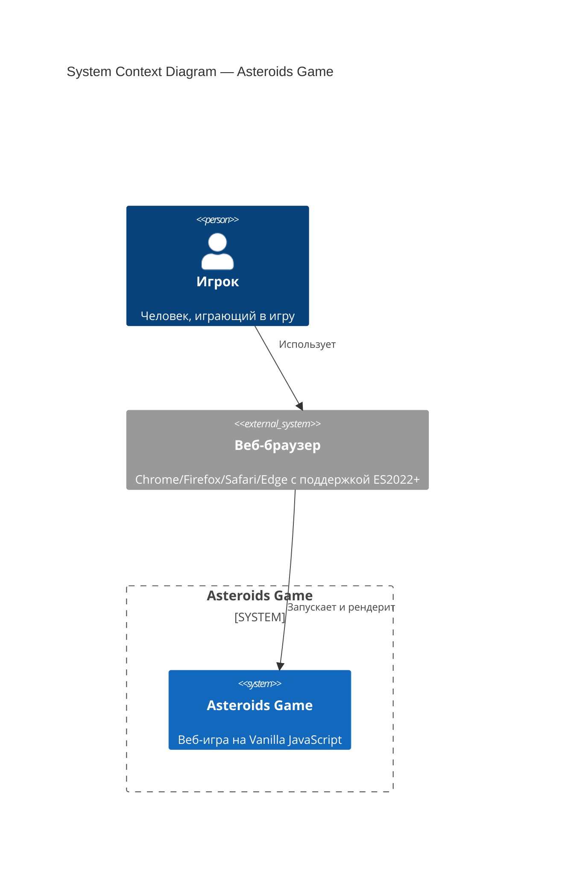
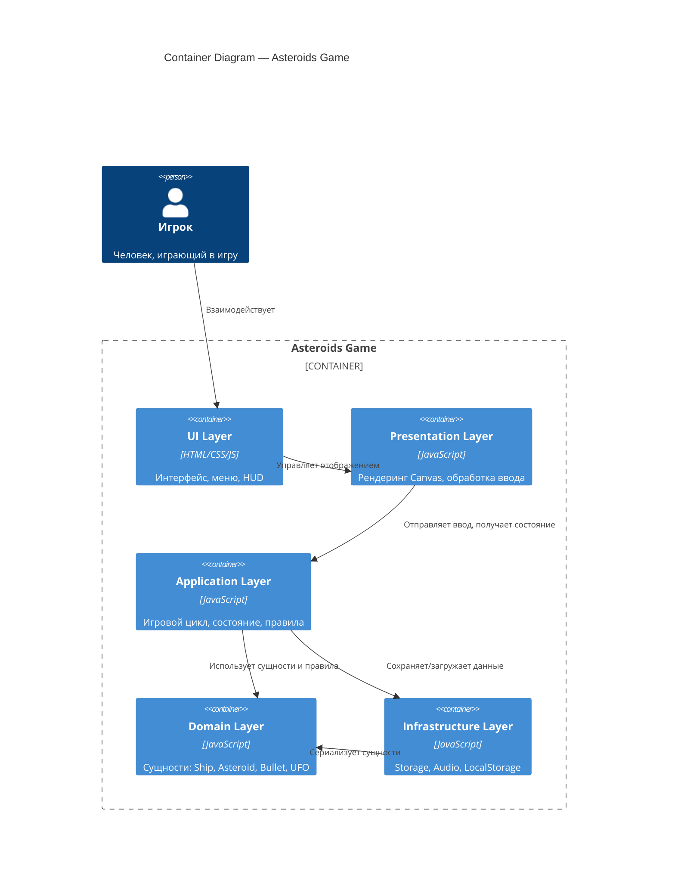
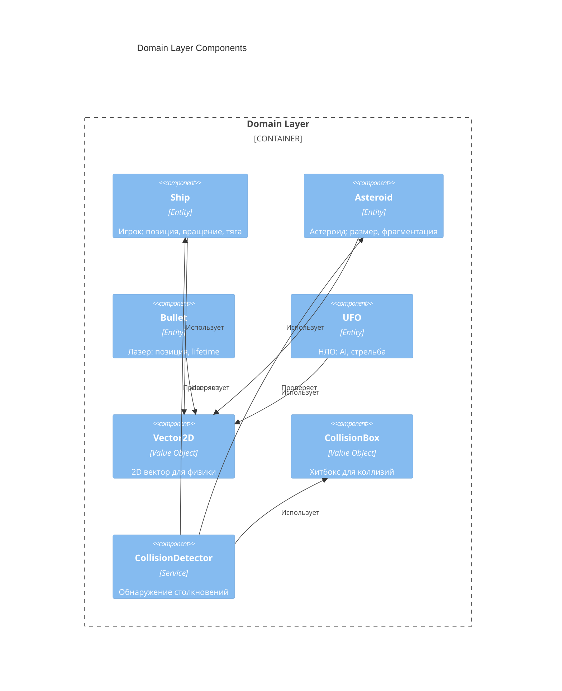
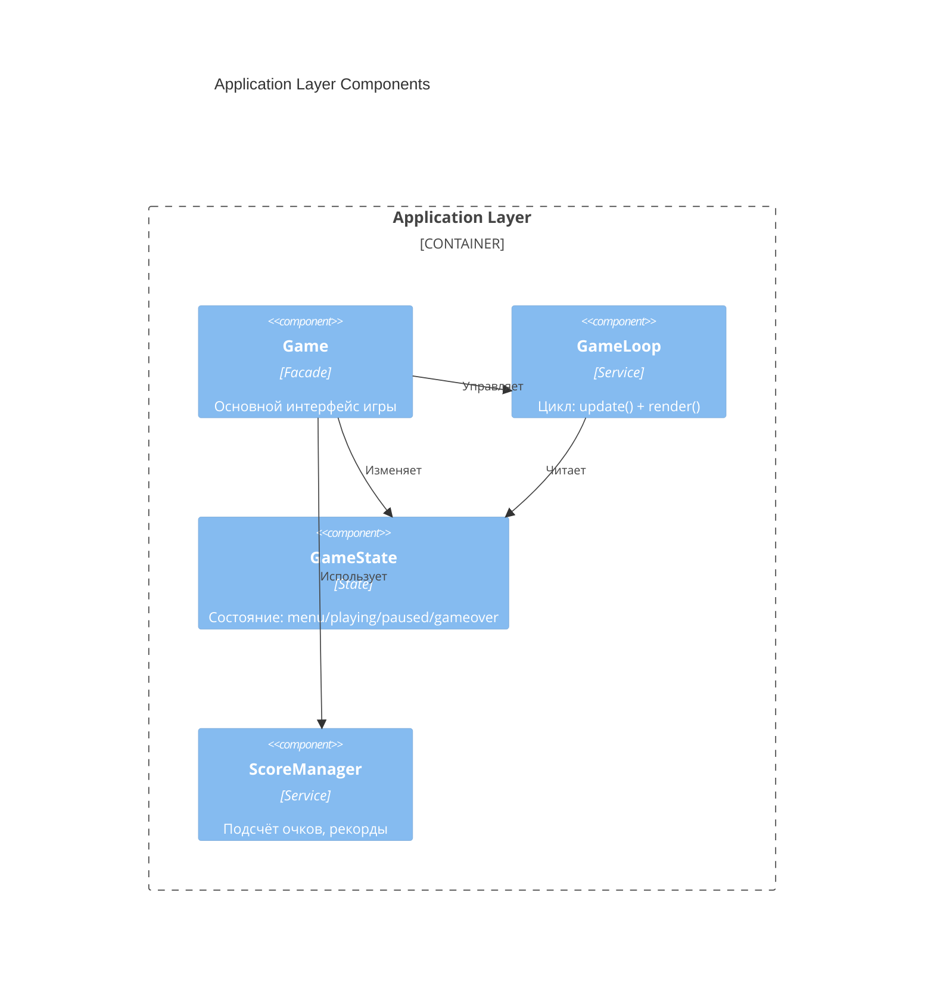
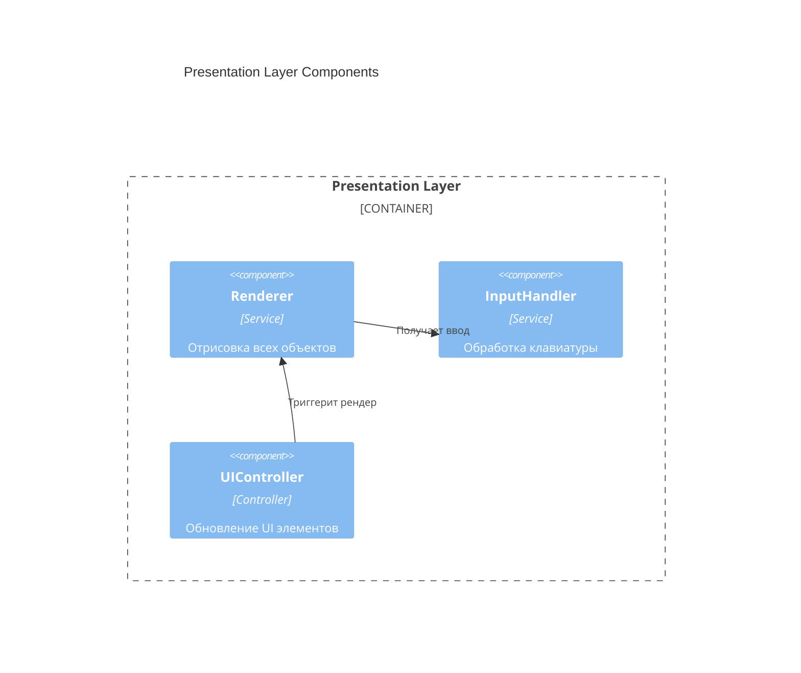
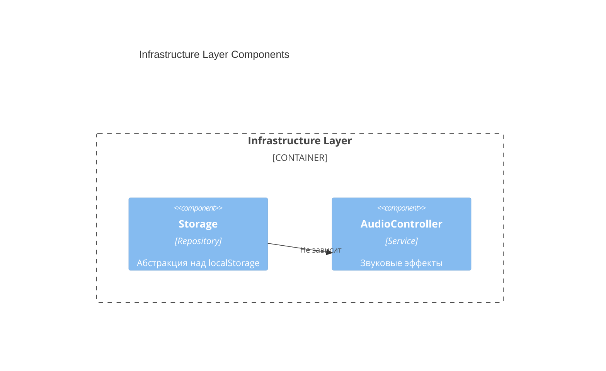
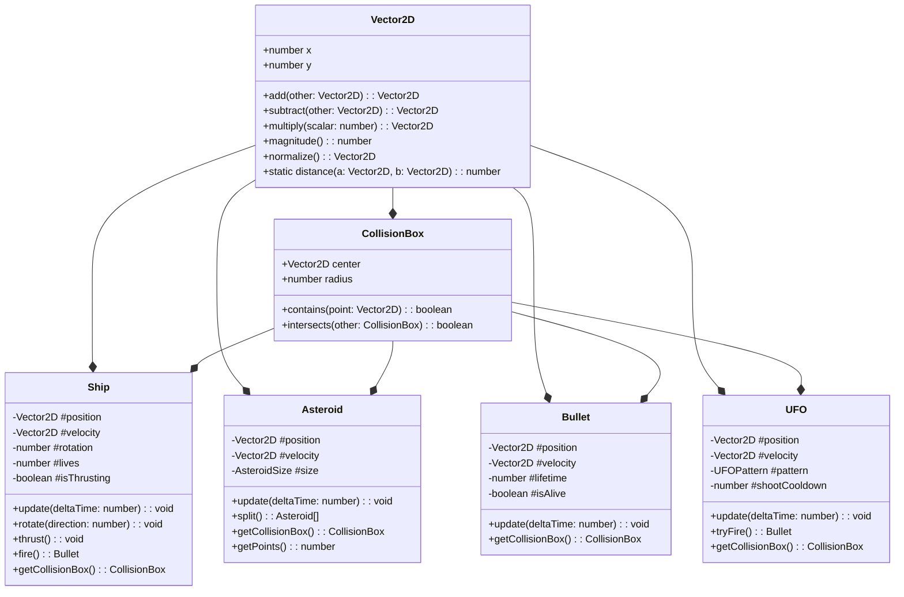
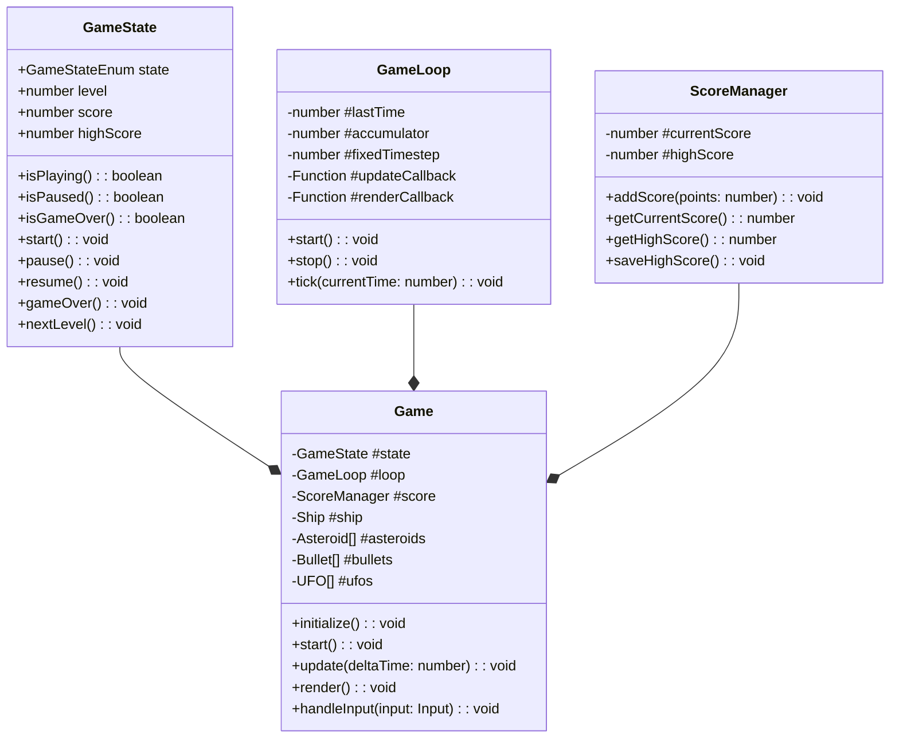
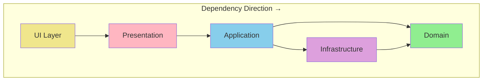

# Vibecraft — implement_skill / run_green

---
## Your Role

# Agent: Implementer

## Role
You write implementation code that makes existing tests pass.
You work on **Research: Asteroids Game**.

## Stack
- **tech_stack**: Asteroids Game
- **разделение_на_слои**: Domain → Application → Infrastructure → Presentation
- **правила_tdd**: **
- **│__(entities**: Ship, Asteroid, Bullet)     │
- **testenvironment**: 'jsdom',
- **modulefileextensions**: ['js'],
- **testmatch**: ['**/test/**/*.test.js'],
- **coveragedirectory**: 'coverage',
- **collectcoveragefrom**: ['src/**/*.js']
- **npm_run_test**: coverage

## Sacred Rules ⚠️
1. **You NEVER modify files inside `src/tests/`** — they are immutable
2. If a test seems incorrect, you **FLAG it** with a comment — you do not fix it
3. You write the minimum code needed to make tests pass (no over-engineering)
4. You follow the architecture defined in `docs/design/architecture.md`
5. You follow the stack from `docs/stack.md` — no introducing new dependencies without flagging

## Flagging Issues
If you encounter a problem with a test, respond with:
```
⚠️ FLAG: src/tests/[file] — [describe the issue]
Suggested resolution: [your suggestion]
Awaiting human decision before proceeding.
```

## Implementation Principles
- Follow the architecture pattern (Clean Architecture)
- No business logic in infrastructure layer
- Dependency injection over hard coupling
- All side effects isolated and injectable
- No `any` types (if TypeScript)

## Output
- Files in: `src/`
- Do NOT create files in `src/tests/`
- After completing, list:
  - Files created/modified
  - Tests that now pass
  - Any flags raised

## On Completion
End your response with:
```
IMPLEMENTATION COMPLETE
Files modified: [list]
Tests passing: [list]
Flags raised: [list or "none"]
Ready for code review.
```

---
## Project Context

# Project: Research: Asteroids Game
> Generated by Vibecraft | Phase: **implement** | 2026-02-25 23:39 UTC

---

## Stack Summary
- **tech_stack**: Asteroids Game
- **разделение_на_слои**: Domain → Application → Infrastructure → Presentation
- **правила_tdd**: **
- **│__(entities**: Ship, Asteroid, Bullet)     │
- **testenvironment**: 'jsdom',
- **modulefileextensions**: ['js'],
- **testmatch**: ['**/test/**/*.test.js'],
- **coveragedirectory**: 'coverage',
- **collectcoveragefrom**: ['src/**/*.js']
- **npm_run_test**: coverage

---

## Progress

- [x] research
- [x] design
- [x] plan
- [ ] **implement** ← CURRENT
- [ ] review

---

## Agents Available

- `researcher`
- `architect`
- `planner`
- `plan_reviewer`
- `pre_checker`
- `tdd_writer`
- `implementer`
- `code_reviewer`
- `performance_optimizer`
- `game_designer`
- `security_auditor`
- `api_designer`

---

## Architecture Decisions (ADR)

- ADR-001: Vanilla JavaScript Without Frameworks
- ADR-002: Clean Architecture with 4 Layers
- ADR-003: TDD with Jest and jsdom
- ADR-004: Fixed Timestep Game Loop
- ADR-005: Canvas 2D API for Rendering
- ADR-006: ES Modules for Code Organization
- ADR-007: Object Pooling for Bullets and Asteroids
- ADR-008: localStorage for High Scores
- ADR-009: Event-Based Input Handling
- ADR-010: Collision Detection with Circle Approximation

---

## Immutable Contracts

- Tests in `src/tests/` are **locked** after tdd_writer approval — implementer must never modify them
- ADR decisions are final unless a new ADR explicitly overrides
- Stack decisions from `docs/stack.md` apply to all agents

---

## How to Continue in a New Chat

**Option A — automatic:**
```bash
vibecraft context --skill <skill_name>
```
Copies this file + the skill prompt to clipboard. Paste at the start of your Qwen chat.

**Option B — manual, attach these files:**
1. `docs/context.md` ← this file
2. `.vibecraft/skills/<current_skill>.yaml`
3. `.vibecraft/agents/<relevant_agent>.md`
4. `docs/plans/phase_<N>.md`

---
_Vibecraft v0.1 — https://github.com/you/vibecraft_

---
## Stack

# Tech Stack: Asteroids Game

## 🛠️ Технологический стек

### Язык и платформа

| Компонент | Технология | Версия |
|-----------|------------|--------|
| **Язык** | JavaScript (ECMAScript) | ES2022+ |
| **Платформа** | Веб-браузер | Современные браузеры |
| **Среда выполнения** | Vanilla JS (без фреймворков) | — |

---

## 📦 Архитектура

### Принципы

- **Чистая архитектура (Clean Architecture)**
  - Разделение на слои: Domain → Application → Infrastructure → Presentation
  - Зависимости направлены внутрь (к домену)
- **SOLID принципы**
  - Single Responsibility, Open/Closed, Liskov Substitution, Interface Segregation, Dependency Inversion
- **Компонентный подход**
  - Изолированные модули с чёткими интерфейсами
- **TDD (Test-Driven Development)**
  - Красный → Зелёный → Рефакторинг
  - Тесты пишутся ДО реализации функциональности
  - 100% покрытие критических модулей

### TDD процесс

```
┌─────────────┐     ┌─────────────┐     ┌─────────────┐
│   RED       │     │   GREEN     │     │  REFACTOR   │
│  Write test │ ──► │  Make it    │ ──► │  Clean up   │
│  (fails)    │     │  pass       │     │  code       │
└─────────────┘     └─────────────┘     └─────────────┘
       ▲                                       │
       └───────────────────────────────────────┘
```

**Правила TDD:**
1. Не писать продакшен-код без падающего теста
2. Писать минимальный код для прохождения теста
3. Рефакторить только после зелёного теста
4. Удалять дублирование на каждом шаге

### Слои архитектуры

```
┌─────────────────────────────────────────┐
│         Presentation Layer              │
│  (Canvas Renderer, Input Handler, UI)   │
├─────────────────────────────────────────┤
│         Application Layer               │
│  (Game Loop, State Management, Rules)   │
├─────────────────────────────────────────┤
│           Domain Layer                  │
│  (Entities: Ship, Asteroid, Bullet)     │
├─────────────────────────────────────────┤
│        Infrastructure Layer             │
│  (Storage, Audio, LocalStorage)         │
└─────────────────────────────────────────┘
```

---

## 🧪 Тестирование

| Инструмент | Назначение |
|------------|------------|
| **Jest** | Фреймворк для unit- и integration-тестов |
| **ES Modules** | Модульная структура для тестируемости |

### Структура тестов

```
test/
├── domain/
│   ├── ship.test.js
│   ├── asteroid.test.js
│   └── collision.test.js
├── application/
│   ├── game-loop.test.js
│   └── state.test.js
└── infrastructure/
    └── storage.test.js
```

### Конфигурация Jest

```javascript
// jest.config.js
export default {
  testEnvironment: 'jsdom',
  moduleFileExtensions: ['js'],
  testMatch: ['**/test/**/*.test.js'],
  coverageDirectory: 'coverage',
  collectCoverageFrom: ['src/**/*.js']
};
```

---

## 📁 Структура проекта

```
asteroids/
├── src/
│   ├── domain/
│   │   ├── entities/
│   │   │   ├── Ship.js
│   │   │   ├── Asteroid.js
│   │   │   ├── Bullet.js
│   │   │   └── UFO.js
│   │   ├── value-objects/
│   │   │   ├── Vector2D.js
│   │   │   └── CollisionBox.js
│   │   └── services/
│   │       └── CollisionDetector.js
│   ├── application/
│   │   ├── Game.js
│   │   ├── GameLoop.js
│   │   ├── GameState.js
│   │   └── ScoreManager.js
│   ├── infrastructure/
│   │   ├── Storage.js
│   │   └── AudioController.js
│   └── presentation/
│       ├── Renderer.js
│       ├── InputHandler.js
│       └── UIController.js
├── test/
│   ├── domain/
│   ├── application/
│   └── infrastructure/
├── public/
│   ├── index.html
│   └── styles.css
├── package.json
├── jest.config.js
└── README.md
```

---

## 🔧 Инструменты разработки

| Инструмент | Назначение |
|------------|------------|
| **npm** | Менеджер пакетов |
| **ESLint** | Линтинг кода |
| **Prettier** | Форматирование кода |
| **Vite** (опционально) | Dev-сервер и сборщик |

---

## 📋 Требования к коду

### Стиль кода

- **Модули ES6** — `import`/`export`
- **Классы** — для сущностей домена
- **Стрелочные функции** — для колбэков
- **Const/Let** — без `var`
- **Template literals** — для интерполяции строк

### Именование

- **Классы** — PascalCase (`Ship`, `Asteroid`)
- **Функции/переменные** — camelCase (`createAsteroid`, `gameState`)
- **Константы** — UPPER_CASE (`MAX_BULLETS`, `SHIP_SPEED`)
- **Приватные поля** — `#privateField`

### Документирование

- JSDoc комментарии для публичных методов
- README с описанием архитектуры

---

## 🚀 Запуск проекта

```bash
# Установка зависимостей
npm install

# Запуск тестов
npm test

# Запуск тестов с покрытием
npm run test:coverage

# Запуск dev-сервера (если используется Vite)
npm run dev

# Сборка продакшена
npm run build
```

---

## 📊 Метрики качества

| Метрика | Цель |
|---------|------|
| **Покрытие тестами** | > 80% |
| **ESLint ошибок** | 0 |
| **Размер бандла** | < 100 KB (minified) |
| **Производительность** | 60 FPS на целевых устройствах |

---

## 🎯 Критерии готовности

- [ ] Реализованы все базовые механики
- [ ] Покрытие тестами > 80%
- [ ] Нет ESLint ошибок
- [ ] Работает в современных браузерах
- [ ] Код структурирован по слоям чистой архитектуры


---
## Architecture

# Architecture: Asteroids Game

**Version:** 1.0  
**Status:** Accepted  
**Last Updated:** 2026-02-25  
**Phase:** Design

---

## 📋 Overview

Этот документ описывает архитектуру игры Asteroids, используя **C4 модель** (Context, Container, Component, Code) и **Architecture Decision Records (ADR)** для ключевых решений.

### Архитектурные принципы

1. **Clean Architecture** — зависимости направлены внутрь к домену
2. **SOLID** — каждый класс следует принципам SOLID
3. **Testability First** — архитектура поддерживает TDD
4. **Explicit Dependencies** — все зависимости явные
5. **Single Responsibility** — один класс = одна ответственность

---

## 🏗️ C4 Model

### Level 1: System Context Diagram



**Описание:**
- **Игрок** взаимодействует с **веб-браузером**
- **Браузер** загружает и выполняет код игры
- **Asteroids Game** — единая система без внешних зависимостей

---

### Level 2: Container Diagram



**Контейнеры:**

| Контейнер | Технология | Ответственность |
|-----------|------------|-----------------|
| **UI Layer** | HTML/CSS | Меню, HUD, экраны Game Over/Pause |
| **Presentation Layer** | JavaScript + Canvas 2D API | Рендеринг графики, обработка input |
| **Application Layer** | JavaScript | Game loop, GameState, ScoreManager |
| **Domain Layer** | JavaScript | Ship, Asteroid, Bullet, UFO, Vector2D |
| **Infrastructure Layer** | JavaScript + Web APIs | Storage, AudioController, LocalStorage |

---

### Level 3: Component Diagram

#### Domain Layer Components



#### Application Layer Components



#### Presentation Layer Components



#### Infrastructure Layer Components



---

### Level 4: Code Level (Key Classes)

#### Domain Entities



#### Application Services



---

## 📝 Architecture Decision Records (ADRs)

---

### ADR-001: Vanilla JavaScript Without Frameworks

**Status:** Accepted

**Context:**
Необходимо выбрать технологию для реализации игры. Современные фреймворки (React, Vue, Phaser) предоставляют готовые решения, но добавляют сложность и размер бандла.

**Decision:**
Использовать **Vanilla JavaScript (ES2022+)** без фреймворков.

**Consequences:**
- ✅ Минимальный размер бандла (<100 KB)
- ✅ Полный контроль над кодом
- ✅ Образовательная ценность (чистая архитектура)
- ❌ Больше кода для написания
- ❌ Нет готовых решений для常见 задач

---

### ADR-002: Clean Architecture with 4 Layers

**Status:** Accepted

**Context:**
Необходимо организовать код так, чтобы обеспечить тестируемость, поддерживаемость и соблюдение SOLID принципов.

**Decision:**
Использовать **Clean Architecture** с 4 слоями:
1. **Domain** — сущности и бизнес-правила
2. **Application** — игровой цикл, состояние
3. **Presentation** — рендеринг и ввод
4. **Infrastructure** — storage, audio

**Consequences:**
- ✅ Зависимости направлены внутрь (к домену)
- ✅ Domain слой не зависит от внешних библиотек
- ✅ Легко тестировать каждый слой изолированно
- ❌ Требует дисциплины от разработчиков
- ❌ Больше файлов и импортов

---

### ADR-003: TDD with Jest and jsdom

**Status:** Accepted

**Context:**
Необходимо обеспечить высокое качество кода и возможность рефакторинга без страха сломать функциональность.

**Decision:**
Использовать **TDD (Test-Driven Development)** с фреймворком **Jest** и средой **jsdom**.

**Consequences:**
- ✅ Покрытие тестами >80%
- ✅ Тесты пишутся ДО кода (RED→GREEN→REFACTOR)
- ✅ jsdom позволяет тестировать DOM-зависимости
- ❌ Замедляет начальную разработку
- ❌ Требует моков для Canvas API

---

### ADR-004: Fixed Timestep Game Loop

**Status:** Accepted

**Context:**
Игровой цикл должен обеспечивать стабильную физику независимо от частоты кадров рендеринга.

**Decision:**
Использовать **фиксированный timestep (1/60 сек)** для физики с накоплением времени (accumulator pattern).

```javascript
const FIXED_TIMESTEP = 1 / 60; // 16.67ms

update(accumulator) {
    while (accumulator >= FIXED_TIMESTEP) {
        this.physicsUpdate(FIXED_TIMESTEP);
        accumulator -= FIXED_TIMESTEP;
    }
}
```

**Consequences:**
- ✅ Детерминированная физика
- ✅ Стабильные коллизии
- ✅ 60 FPS на поддерживаемых устройствах
- ❌ Сложнее реализация чем requestAnimationFrame напрямую

---

### ADR-005: Canvas 2D API for Rendering

**Status:** Accepted

**Context:**
Необходимо выбрать способ рендеринга графики. WebGL мощнее, но сложнее. DOM-элементы медленнее.

**Decision:**
Использовать **Canvas 2D API** с геометрическими примитивами (линии, пути).

**Consequences:**
- ✅ Простой API
- ✅ Хорошая производительность для 2D
- ✅ Аутентичный векторный стиль
- ❌ Нет аппаратного ускорения как WebGL
- ❌ Нужно рисовать всё кодом (нет спрайтов)

---

### ADR-006: ES Modules for Code Organization

**Status:** Accepted

**Context:**
Необходимо организовать код в модули для тестируемости и поддерживаемости.

**Decision:**
Использовать **ES6 Modules** (`import`/`export`) для всех файлов.

**Consequences:**
- ✅ Нативная поддержка в браузерах
- ✅ Статический анализ импортов
- ✅ Tree-shaking для сборщиков
- ❌ Требует сборщик или современный браузер

---

### ADR-007: Object Pooling for Bullets and Asteroids

**Status:** Accepted

**Context:**
Частое создание/удаление объектов вызывает garbage collection паузы.

**Decision:**
Использовать **Object Pool pattern** для пуль и астероидов.

```javascript
class BulletPool {
    constructor(size = 50) {
        this.pool = Array(size).fill(null).map(() => new Bullet());
        this.available = new Set(range(size));
    }
    
    acquire() {
        const id = this.available.values().next().value;
        if (id !== undefined) {
            this.available.delete(id);
            return this.pool[id];
        }
        return null; // Pool exhausted
    }
    
    release(bullet) {
        this.available.add(bullet.id);
        bullet.reset();
    }
}
```

**Consequences:**
- ✅ Минимизация GC пауз
- ✅ Предсказуемая производительность
- ❌ Усложняет код
- ❌ Нужно управлять состоянием объектов

---

### ADR-008: localStorage for High Scores

**Status:** Accepted

**Context:**
Необходимо сохранять рекорды между сессиями. IndexedDB мощнее, но сложнее.

**Decision:**
Использовать **localStorage** для хранения топ-5 рекордов.

**Consequences:**
- ✅ Простой API
- ✅ Синхронное чтение/запись
- ✅ Достаточно для 5 записей
- ❌ Лимит 5-10 MB (не критично)
- ❌ Блокирует основной поток при записи

---

### ADR-009: Event-Based Input Handling

**Status:** Accepted

**Context:**
Необходимо обрабатывать ввод с клавиатуры. Polling проще, но event-based эффективнее.

**Decision:**
Использовать **event-based подход** с накоплением состояния.

```javascript
class InputHandler {
    constructor() {
        this.keys = new Set();
        window.addEventListener('keydown', (e) => this.keys.add(e.code));
        window.addEventListener('keyup', (e) => this.keys.delete(e.code));
    }
    
    isPressed(code) {
        return this.keys.has(code);
    }
    
    wasJustPressed(code) {
        // Track previous frame state for edge detection
    }
}
```

**Consequences:**
- ✅ Отзывчивое управление
- ✅ Поддержка мультитача (для future touch support)
- ❌ Нужно отслеживать состояние между кадрами

---

### ADR-010: Collision Detection with Circle Approximation

**Status:** Accepted

**Context:**
Точная коллизия для многоугольников сложна. Нужно простое и быстрое решение.

**Decision:**
Использовать **круговые хитбоксы (CollisionBox)** для всех объектов.

```javascript
class CollisionBox {
    constructor(center, radius) {
        this.center = center; // Vector2D
        this.radius = radius;
    }
    
    intersects(other) {
        const distance = Vector2D.distance(this.center, other.center);
        return distance < (this.radius + other.radius);
    }
}
```

**Consequences:**
- ✅ O(1) проверка столкновений
- ✅ Простая реализация
- ❌ Менее точно для треугольника корабля
- ✅ Достаточно для аркадной игры

---

## 🔒 Layer Boundaries

### Dependency Rules



### What Can Cross Boundaries

| From → To | Allowed | What Can Cross |
|-----------|---------|----------------|
| **Presentation → Domain** | ✅ | Читать сущности, вызывать методы |
| **Presentation → Application** | ✅ | Вызывать Game методы |
| **Application → Domain** | ✅ | Создавать/изменять сущности |
| **Application → Infrastructure** | ✅ | Сохранять/загружать данные |
| **Infrastructure → Domain** | ✅ | Сериализовать сущности |
| **Domain → Any** | ❌ | Никаких зависимостей наружу |
| **Infrastructure → Presentation** | ❌ | Никаких UI зависимостей |

### Interface Contracts

#### Domain → Application

```javascript
// Domain exports (pure, no dependencies)
export { Ship } from './entities/Ship.js';
export { Asteroid } from './entities/Asteroid.js';
export { Bullet } from './entities/Bullet.js';
export { UFO } from './entities/UFO.js';
export { Vector2D } from './value-objects/Vector2D.js';
export { CollisionBox } from './value-objects/CollisionBox.js';
export { CollisionDetector } from './services/CollisionDetector.js';
```

#### Application → Presentation

```javascript
// Application предоставляет интерфейс для Presentation
class Game {
    // Presentation вызывает эти методы
    handleInput(input) { }  // InputHandler → Game
    getState() { }          // Renderer читает состояние
    getScore() { }          // UIController читает счёт
}
```

#### Application → Infrastructure

```javascript
// Infrastructure реализует интерфейсы для Application
class Storage {
    saveHighScore(score) { }
    getHighScore() { }
}

class AudioController {
    playShoot() { }
    playExplosion() { }
}
```

---

## 📊 Quality Attributes

| Attribute | Strategy |
|-----------|----------|
| **Performance** | Fixed timestep, object pooling, requestAnimationFrame |
| **Testability** | Dependency injection, pure functions in domain |
| **Maintainability** | Clean Architecture, ES Modules, JSDoc |
| **Extensibility** | Open/Closed principle, component-based design |
| **Reliability** | TDD >80% coverage, error boundaries |

---

## 🗺️ File Structure

```
src/
├── domain/
│   ├── entities/
│   │   ├── Ship.js
│   │   ├── Asteroid.js
│   │   ├── Bullet.js
│   │   └── UFO.js
│   ├── value-objects/
│   │   ├── Vector2D.js
│   │   └── CollisionBox.js
│   └── services/
│       └── CollisionDetector.js
├── application/
│   ├── Game.js
│   ├── GameLoop.js
│   ├── GameState.js
│   └── ScoreManager.js
├── infrastructure/
│   ├── Storage.js
│   └── AudioController.js
├── presentation/
│   ├── Renderer.js
│   ├── InputHandler.js
│   └── UIController.js
└── index.js
```

---

**Architecture Status:** ✅ Accepted  
**Next Phase:** Plan (Implementation Planning)  
**Architect Agent:** Complete


---
## Existing Tests — DO NOT MODIFY


### GameFlow.test.js
```
/**
 * Game Flow Tests — Phase 5
 *
 * @description Тесты полного игрового цикла: start → play → gameover
 * @see src/application/Game.js
 * @see src/application/GameState.js
 * @see src/application/GameLoop.js
 */

import { jest } from '@jest/globals';

describe('Game Flow — Complete Cycle', () => {
    let Game;
    let GameLoop;
    let GameState;

    let mockRenderer;
    let mockInputHandler;
    let mockStorage;
    let mockAudio;
    let game;
    let gameLoop;

    const FIXED_TIMESTEP = 1 / 60;

    beforeEach(async () => {
        // Динамический импорт
        const modules = await Promise.all([
            import('../../../src/application/Game.js'),
            import('../../../src/application/GameLoop.js'),
            import('../../../src/application/GameState.js')
        ]);

        Game = modules[0].Game;
        GameLoop = modules[1].GameLoop;
        GameState = modules[2].GameState;

        // Mock Renderer
        mockRenderer = {
            render: jest.fn(),
            getCanvas: jest.fn(() => ({ width: 800, height: 600 }))
        };

        // Mock InputHandler
        mockInputHandler = {
            getInput: jest.fn(() => ({})),
            isPressed: jest.fn(() => false),
            reset: jest.fn()
        };

        // Mock Storage
        mockStorage = {
            getHighScore: jest.fn(() => 0),
            saveHighScore: jest.fn()
        };

        // Mock AudioController
        mockAudio = {
            playShoot: jest.fn(),
            playExplosion: jest.fn(),
            playThrust: jest.fn()
        };
    });

    afterEach(() => {
        jest.clearAllMocks();
    });

    describe('Game Start Flow', () => {
        beforeEach(() => {
            game = new Game(mockRenderer, mockInputHandler, mockStorage, mockAudio);
        });

        test('should start in menu state', () => {
            game.initialize();
            expect(game.getState().isMenu()).toBe(true);
        });

        test('should transition from menu to playing on start', () => {
            game.initialize();
            expect(game.getState().isMenu()).toBe(true);

            game.start();
            expect(game.getState().isPlaying()).toBe(true);
        });

        test('should spawn initial asteroids on game start', () => {
            game.initialize();
            game.start();

            const asteroids = game.getAsteroids();
            expect(asteroids.length).toBeGreaterThan(0);
        });

        test('should create ship at center on start', () => {
            game.initialize();
            game.start();

            const ship = game.getShip();
            expect(ship.position.x).toBe(400);
            expect(ship.position.y).toBe(300);
        });

        test('should reset score on new game', () => {
            game.initialize();
            game.start();

            expect(game.getScore()).toBe(0);
        });

        test('should load high score from storage on initialize', () => {
            mockStorage.getHighScore.mockReturnValue(5000);

            game.initialize();

            expect(mockStorage.getHighScore).toHaveBeenCalled();
            expect(game.getHighScore()).toBe(5000);
        });
    });

    describe('Gameplay Loop', () => {
        beforeEach(() => {
            game = new Game(mockRenderer, mockInputHandler, mockStorage, mockAudio);
            game.initialize();
            game.start();
        });

        test('should update ship position on each frame', () => {
            const ship = game.getShip();
            const initialX = ship.position.x;
            const initialY = ship.position.y;

            // Даём тягу
            mockInputHandler.getInput.mockReturnValue({ thrust: true });
            game.handleInput(mockInputHandler.getInput());

            // Обновляем игру
            game.update(FIXED_TIMESTEP);

            // Позиция должна измениться
            expect(ship.position.x).not.toBe(initialX);
            expect(ship.position.y).not.toBe(initialY);
        });

        test('should update asteroids on each frame', () => {
            const asteroids = game.getAsteroids();
            const initialPositions = asteroids.map(a => ({
                x: a.position.x,
                y: a.position.y
            }));

            game.update(FIXED_TIMESTEP);

            // Позиции астероидов должны измениться
            asteroids.forEach((asteroid, index) => {
                expect(asteroid.position.x).not.toBe(initialPositions[index].x);
                expect(asteroid.position.y).not.toBe(initialPositions[index].y);
            });
        });

        test('should update bullets on each frame', () => {
            // Стреляем
            mockInputHandler.getInput.mockReturnValue({ fire: true });
            game.handleInput(mockInputHandler.getInput());

            const bullets = game.getBullets();
            const initialPositions = bullets.map(b => ({
                x: b.position.x,
                y: b.position.y
            }));

            game.update(FIXED_TIMESTEP);

            // Позиции пуль должны измениться
            bullets.forEach((bullet, index) => {
                expect(bullet.position.x).not.toBe(initialPositions[index].x);
                expect(bullet.position.y).not.toBe(initialPositions[index].y);
            });
        });

        test('should call render with current game state', () => {
            game.update(FIXED_TIMESTEP);

            expect(mockRenderer.render).toHaveBeenCalledWith(
                expect.objectContaining({
                    ship: expect.any(Object),
                    asteroids: expect.any(Array),
                    bullets: expect.any(Array),
                    ufos: expect.any(Array)
                })
            );
        });
    });

    describe('Collision Events', () => {
        beforeEach(() => {
            game = new Game(mockRenderer, mockInputHandler, mockStorage, mockAudio);
            game.initialize();
            game.start();
        });

        test('should detect bullet-asteroid collision', () => {
            // Стреляем в астероид
            mockInputHandler.getInput.mockReturnValue({ fire: true });
            game.handleInput(mockInputHandler.getInput());

            const initialAsteroidCount = game.getAsteroids().length;

            // Обновляем игру — должна произойти коллизия
            game.update(FIXED_TIMESTEP);

            // Количество астероидов должно измениться (разделиться)
            const finalAsteroidCount = game.getAsteroids().length;
            expect(finalAsteroidCount).not.toBe(initialAsteroidCount);
        });

        test('should add score on asteroid destruction', () => {
            const initialScore = game.getScore();

            // Стреляем и попадаем в астероид
            mockInputHandler.getInput.mockReturnValue({ fire: true });
            game.handleInput(mockInputHandler.getInput());
            game.update(FIXED_TIMESTEP);

            // Счёт должен увеличиться
            expect(game.getScore()).toBeGreaterThan(initialScore);
        });

        test('should play explosion sound on collision', () => {
            // Стреляем
            mockInputHandler.getInput.mockReturnValue({ fire: true });
            game.handleInput(mockInputHandler.getInput());
            game.update(FIXED_TIMESTEP);

            expect(mockAudio.playExplosion).toHaveBeenCalled();
        });

        test('should detect ship-asteroid collision', () => {
            // manually create collision scenario
            const ship = game.getShip();
            const asteroids = game.getAsteroids();

            if (asteroids.length > 0) {
                // Перемещаем астероид к кораблю
                const asteroid = asteroids[0];
                asteroid.position.x = ship.position.x;
                asteroid.position.y = ship.position.y;

                const initialLives = game.getLives();

                game.update(FIXED_TIMESTEP);

                // Жизни должны уменьшиться
                expect(game.getLives()).toBeLessThan(initialLives);
            }
        });
    });

    describe('Level Completion', () => {
        beforeEach(() => {
            game = new Game(mockRenderer, mockInputHandler, mockStorage, mockAudio);
            game.initialize();
            game.start();
        });

        test('should advance to next level when all asteroids destroyed', () => {
            const initialLevel = game.getLevel();

            // Уничтожаем все астероиды
            game.getAsteroids().length = 0;

            game.update(FIXED_TIMESTEP);

            expect(game.getLevel()).toBeGreaterThan(initialLevel);
        });

        test('should spawn new asteroids on level up', () => {
            const initialCount = game.getAsteroids().length;

            // Уничтожаем все астероиды
            game.getAsteroids().length = 0;

            game.update(FIXED_TIMESTEP);

            // Должны появиться новые астероиды
            expect(game.getAsteroids().length).toBeGreaterThan(0);
        });

        test('should increase difficulty on higher levels', () => {
            // Проходим несколько уровней
            for (let i = 0; i < 3; i++) {
                game.getAsteroids().length = 0;
                game.update(FIXED_TIMESTEP);
            }

            const level = game.getLevel();
            expect(level).toBeGreaterThan(1);
        });
    });

    describe('Game Over Flow', () => {
        beforeEach(() => {
            game = new Game(mockRenderer, mockInputHandler, mockStorage, mockAudio);
            game.initialize();
            game.start();
        });

        test('should end game when lives reach zero', () => {
            const state = game.getState();

            // Устанавливаем 0 жизней
            state.lives = 0;
            state.gameOver();

            expect(state.isGameOver()).toBe(true);
        });

        test('should save high score on game over', () => {
            mockStorage.getHighScore.mockReturnValue(0);

            game.start();
            game.addScore(5000);

            const state = game.getState();
            state.lives = 0;
            state.gameOver();

            expect(mockStorage.saveHighScore).toHaveBeenCalledWith(5000);
        });

        test('should not update high score if not beaten', () => {
            mockStorage.getHighScore.mockReturnValue(10000);

            game.start();
            game.addScore(5000);

            const state = game.getState();
            state.lives = 0;
            state.gameOver();

            expect(mockStorage.saveHighScore).not.toHaveBeenCalled();
        });

        test('should stop accepting input on game over', () => {
            const state = game.getState();
            state.lives = 0;
            state.gameOver();

            mockInputHandler.getInput.mockReturnValue({ thrust: true });
            game.handleInput(mockInputHandler.getInput());

            // Ввод должен игнорироваться
            expect(mockInputHandler.getInput).toHaveBeenCalled();
        });
    });

    describe('Pause/Resume Flow', () => {
        beforeEach(() => {
            game = new Game(mockRenderer, mockInputHandler, mockStorage, mockAudio);
            game.initialize();
            game.start();
        });

        test('should pause game on P key', () => {
            expect(game.getState().isPaused()).toBe(false);

            mockInputHandler.getInput.mockReturnValue({ pause: true });
            game.handleInput(mockInputHandler.getInput());

            expect(game.getState().isPaused()).toBe(true);
        });

        test('should resume game on second P key', () => {
            // Pause
            mockInputHandler.getInput.mockReturnValue({ pause: true });
            game.handleInput(mockInputHandler.getInput());
            expect(game.getState().isPaused()).toBe(true);

            // Resume
            mockInputHandler.getInput.mockReturnValue({ pause: true });
            game.handleInput(mockInputHandler.getInput());
            expect(game.getState().isPaused()).toBe(false);
        });

        test('should not update game while paused', () => {
            const ship = game.getShip();
            const initialX = ship.position.x;

            // Pause
            mockInputHandler.getInput.mockReturnValue({ pause: true });
            game.handleInput(mockInputHandler.getInput());

            // Пытаемся обновить
            game.update(FIXED_TIMESTEP);

            // Позиция не должна измениться
            expect(ship.position.x).toBe(initialX);
        });

        test('should not accept game input while paused', () => {
            // Pause
            mockInputHandler.getInput.mockReturnValue({ pause: true });
            game.handleInput(mockInputHandler.getInput());

            // Пытаемся стрелять
            mockInputHandler.getInput.mockReturnValue({ fire: true });
            game.handleInput(mockInputHandler.getInput());

            // Пули не должно быть
            expect(game.getBullets().length).toBe(0);
        });
    });

    describe('Full Game Session', () => {
        test('should complete full game session: menu → play → gameover', () => {
            game = new Game(mockRenderer, mockInputHandler, mockStorage, mockAudio);

            // Menu state
            game.initialize();
            expect(game.getState().isMenu()).toBe(true);

            // Start game
            game.start();
            expect(game.getState().isPlaying()).toBe(true);

            // Gameplay: несколько кадров
            for (let i = 0; i < 10; i++) {
                mockInputHandler.getInput.mockReturnValue({
                    thrust: i % 2 === 0,
                    fire: i % 3 === 0
                });
                game.handleInput(mockInputHandler.getInput());
                game.update(FIXED_TIMESTEP);
            }

            // Проверяем, что игра активна
            expect(game.getState().isPlaying()).toBe(true);
            expect(game.getScore()).toBeGreaterThanOrEqual(0);

            // Game over
            const state = game.getState();
            state.lives = 0;
            state.gameOver();

            expect(state.isGameOver()).toBe(true);
        });
    });

    describe('GameLoop Integration', () => {
        test('should create GameLoop with callbacks', () => {
            const updateCallback = jest.fn();
            const renderCallback = jest.fn();

            gameLoop = new GameLoop(updateCallback, renderCallback);

            expect(gameLoop).toBeDefined();
        });

        test('should call update and render callbacks on tick', () => {
            const updateCallback = jest.fn();
            const renderCallback = jest.fn();

            gameLoop = new GameLoop(updateCallback, renderCallback);

            // Запускаем цикл
            gameLoop.start();

            // Эмулируем кадр
            const currentTime = performance.now();
            gameLoop.tick(currentTime);

            expect(updateCallback).toHaveBeenCalled();
            expect(renderCallback).toHaveBeenCalled();
        });

        test('should use fixed timestep for physics', () => {
            const updateCallback = jest.fn();
            const renderCallback = jest.fn();

            gameLoop = new GameLoop(updateCallback, renderCallback, FIXED_TIMESTEP);
            gameLoop.start();

            // Эмулируем несколько кадров
            for (let i = 0; i < 5; i++) {
                gameLoop.tick(performance.now() + i * 100);
            }

            // updateCallback должен вызываться с фиксированным timestep
            expect(updateCallback).toHaveBeenCalledTimes(5);
        });
    });
});

```


### InputHandler.events.test.js
```
/**
 * InputHandler Event Tests — Phase 5
 *
 * @description Тесты InputHandler с реальными keyboard событиями (jsdom)
 * @see src/presentation/InputHandler.js
 */

import { jest } from '@jest/globals';

describe('InputHandler — Event Integration', () => {
    let InputHandler;
    let inputHandler;
    let mockWindow;
    let eventListeners;

    beforeEach(async () => {
        // Динамический импорт
        InputHandler = (await import('../../../src/presentation/InputHandler.js')).InputHandler;

        // Создаём mock window с реальной системой событий
        eventListeners = {
            keydown: [],
            keyup: []
        };

        mockWindow = {
            addEventListener: jest.fn((event, handler) => {
                if (event === 'keydown' || event === 'keyup') {
                    eventListeners[event].push(handler);
                }
            }),
            removeEventListener: jest.fn()
        };

        inputHandler = new InputHandler(mockWindow);
    });

    afterEach(() => {
        jest.clearAllMocks();
    });

    describe('Event Listener Registration', () => {
        test('should register keydown event listener on init', () => {
            expect(mockWindow.addEventListener).toHaveBeenCalledWith(
                'keydown',
                expect.any(Function)
            );
        });

        test('should register keyup event listener on init', () => {
            expect(mockWindow.addEventListener).toHaveBeenCalledWith(
                'keyup',
                expect.any(Function)
            );
        });

        test('should have both listeners registered', () => {
            expect(eventListeners.keydown.length).toBe(1);
            expect(eventListeners.keyup.length).toBe(1);
        });
    });

    describe('Key Press Detection', () => {
        test('should detect ArrowUp key press', () => {
            const keydownEvent = new KeyboardEvent('keydown', { code: 'ArrowUp' });
            eventListeners.keydown.forEach(fn => fn(keydownEvent));

            expect(inputHandler.isPressed('ArrowUp')).toBe(true);
        });

        test('should detect ArrowDown key release', () => {
            // Нажимаем
            const keydownEvent = new KeyboardEvent('keydown', { code: 'ArrowDown' });
            eventListeners.keydown.forEach(fn => fn(keydownEvent));

            // Отпускаем
            const keyupEvent = new KeyboardEvent('keyup', { code: 'ArrowDown' });
            eventListeners.keyup.forEach(fn => fn(keyupEvent));

            expect(inputHandler.isPressed('ArrowDown')).toBe(false);
        });

        test('should return false for unpressed key', () => {
            expect(inputHandler.isPressed('ArrowLeft')).toBe(false);
        });

        test('should track multiple keys simultaneously', () => {
            const arrowUpEvent = new KeyboardEvent('keydown', { code: 'ArrowUp' });
            const spaceEvent = new KeyboardEvent('keydown', { code: 'Space' });

            eventListeners.keydown.forEach(fn => fn(arrowUpEvent));
            eventListeners.keydown.forEach(fn => fn(spaceEvent));

            expect(inputHandler.isPressed('ArrowUp')).toBe(true);
            expect(inputHandler.isPressed('Space')).toBe(true);
        });
    });

    describe('Key Mappings', () => {
        const keyMappings = [
            { code: 'ArrowUp', expected: 'thrust' },
            { code: 'ArrowDown', expected: 'thrust' },
            { code: 'KeyW', expected: 'thrust' },
            { code: 'KeyS', expected: 'thrust' },
            { code: 'ArrowLeft', expected: 'rotateLeft' },
            { code: 'KeyA', expected: 'rotateLeft' },
            { code: 'ArrowRight', expected: 'rotateRight' },
            { code: 'KeyD', expected: 'rotateRight' },
            { code: 'Space', expected: 'fire' },
            { code: 'KeyP', expected: 'pause' },
            { code: 'KeyH', expected: 'hyperspace' }
        ];

        test.each(keyMappings)(
            'should map $code to $expected',
            ({ code, expected }) => {
                const keydownEvent = new KeyboardEvent('keydown', { code });
                eventListeners.keydown.forEach(fn => fn(keydownEvent));

                const state = inputHandler.getState();
                expect(state[expected]).toBe(true);
            }
        );
    });

    describe('Edge Detection (wasJustPressed)', () => {
        test('should detect first frame of key press', () => {
            const spaceEvent = new KeyboardEvent('keydown', { code: 'Space' });

            // Первое нажатие
            eventListeners.keydown.forEach(fn => fn(spaceEvent));

            expect(inputHandler.wasJustPressed('Space')).toBe(true);
        });

        test('should not trigger wasJustPressed on held key', () => {
            const spaceEvent = new KeyboardEvent('keydown', { code: 'Space' });

            // Первое нажатие
            eventListeners.keydown.forEach(fn => fn(spaceEvent));
            inputHandler.endFrame(); // Завершаем кадр

            // Клавиша всё ещё зажата (новое событие keydown не приходит)
            // wasJustPressed должен вернуть false
            expect(inputHandler.wasJustPressed('Space')).toBe(false);
        });

        test('should reset after key release and press again', () => {
            const spaceEvent = new KeyboardEvent('keydown', { code: 'Space' });
            const spaceUpEvent = new KeyboardEvent('keyup', { code: 'Space' });

            // Нажимаем
            eventListeners.keydown.forEach(fn => fn(spaceEvent));
            expect(inputHandler.wasJustPressed('Space')).toBe(true);

            // Завершаем кадр
            inputHandler.endFrame();

            // Отпускаем
            eventListeners.keyup.forEach(fn => fn(spaceUpEvent));
            inputHandler.endFrame();

            // Снова нажимаем
            eventListeners.keydown.forEach(fn => fn(spaceEvent));
            expect(inputHandler.wasJustPressed('Space')).toBe(true);
        });
    });

    describe('Input State Object', () => {
        test('should get complete input state', () => {
            const thrustEvent = new KeyboardEvent('keydown', { code: 'ArrowUp' });
            const rotateEvent = new KeyboardEvent('keydown', { code: 'ArrowLeft' });

            eventListeners.keydown.forEach(fn => fn(thrustEvent));
            eventListeners.keydown.forEach(fn => fn(rotateEvent));

            const state = inputHandler.getState();

            expect(state).toEqual({
                thrust: true,
                rotateLeft: true,
                rotateRight: false,
                fire: false,
                pause: false,
                hyperspace: false
            });
        });

        test('should return default state when no keys pressed', () => {
            const state = inputHandler.getState();

            expect(state).toEqual({
                thrust: false,
                rotateLeft: false,
                rotateRight: false,
                fire: false,
                pause: false,
                hyperspace: false
            });
        });
    });

    describe('Prevent Default Behavior', () => {
        test('should call preventDefault on arrow keys', () => {
            const preventDefaultMock = jest.fn();
            const arrowUpEvent = {
                code: 'ArrowUp',
                preventDefault: preventDefaultMock
            };

            eventListeners.keydown.forEach(fn => fn(arrowUpEvent));

            expect(preventDefaultMock).toHaveBeenCalled();
        });

        test('should call preventDefault on space key', () => {
            const preventDefaultMock = jest.fn();
            const spaceEvent = {
                code: 'Space',
                preventDefault: preventDefaultMock
            };

            eventListeners.keydown.forEach(fn => fn(spaceEvent));

            expect(preventDefaultMock).toHaveBeenCalled();
        });

        test('should not call preventDefault on unrelated keys', () => {
            const preventDefaultMock = jest.fn();
            const enterEvent = {
                code: 'Enter',
                preventDefault: preventDefaultMock
            };

            eventListeners.keydown.forEach(fn => fn(enterEvent));

            expect(preventDefaultMock).not.toHaveBeenCalled();
        });
    });

    describe('Input Reset', () => {
        test('should clear all keys on reset', () => {
            const spaceEvent = new KeyboardEvent('keydown', { code: 'Space' });
            eventListeners.keydown.forEach(fn => fn(spaceEvent));

            expect(inputHandler.isPressed('Space')).toBe(true);

            inputHandler.reset();

            expect(inputHandler.isPressed('Space')).toBe(false);
        });

        test('should reset previous frame state', () => {
            const spaceEvent = new KeyboardEvent('keydown', { code: 'Space' });
            eventListeners.keydown.forEach(fn => fn(spaceEvent));

            inputHandler.endFrame();
            inputHandler.reset();

            expect(inputHandler.wasJustPressed('Space')).toBe(false);
        });
    });

    describe('Continuous Input Stream', () => {
        test('should handle rapid key presses', () => {
            const spaceEvent = new KeyboardEvent('keydown', { code: 'Space' });
            const spaceUpEvent = new KeyboardEvent('keyup', { code: 'Space' });

            // Быстрые нажатия (3 раза)
            for (let i = 0; i < 3; i++) {
                eventListeners.keydown.forEach(fn => fn(spaceEvent));
                expect(inputHandler.wasJustPressed('Space')).toBe(true);

                inputHandler.endFrame();

                eventListeners.keyup.forEach(fn => fn(spaceUpEvent));
                inputHandler.endFrame();
            }
        });

        test('should handle overlapping key presses', () => {
            // Нажимаем ArrowUp
            const upEvent = new KeyboardEvent('keydown', { code: 'ArrowUp' });
            eventListeners.keydown.forEach(fn => fn(upEvent));

            // Не отпуская, нажимаем Space
            const spaceEvent = new KeyboardEvent('keydown', { code: 'Space' });
            eventListeners.keydown.forEach(fn => fn(spaceEvent));

            const state = inputHandler.getState();
            expect(state.thrust).toBe(true);
            expect(state.fire).toBe(true);

            // Отпускаем только ArrowUp
            const upUpEvent = new KeyboardEvent('keyup', { code: 'ArrowUp' });
            eventListeners.keyup.forEach(fn => fn(upUpEvent));

            const newState = inputHandler.getState();
            expect(newState.thrust).toBe(false);
            expect(newState.fire).toBe(true);
        });
    });

    describe('Frame Management', () => {
        test('should track previous frame state', () => {
            const spaceEvent = new KeyboardEvent('keydown', { code: 'Space' });

            eventListeners.keydown.forEach(fn => fn(spaceEvent));
            inputHandler.endFrame();

            // Space всё ещё зажат в новом кадре
            expect(inputHandler.isPressed('Space')).toBe(true);
            // Но wasJustPressed должен быть false, так как это не первый кадр
            expect(inputHandler.wasJustPressed('Space')).toBe(false);
        });

        test('should clear previous frame on reset', () => {
            const spaceEvent = new KeyboardEvent('keydown', { code: 'Space' });
            eventListeners.keydown.forEach(fn => fn(spaceEvent));

            inputHandler.endFrame();
            inputHandler.reset();

            // После сброса предыдущее состояние должно быть очищено
            expect(inputHandler.isPressed('Space')).toBe(false);
        });
    });
});

```


### Integration.test.js
```
/**
 * Integration Tests — Phase 5
 *
 * @description Тесты взаимодействия всех слоёв игры (Domain + Application + Infrastructure + Presentation)
 * @see src/application/Game.js
 * @see src/domain/entities/Ship.js
 * @see src/domain/entities/Asteroid.js
 * @see src/infrastructure/Storage.js
 * @see src/presentation/InputHandler.js
 */

import { jest } from '@jest/globals';

describe('Integration — Game Layers', () => {
    let Game;
    let Ship;
    let Asteroid;
    let GameState;
    let Storage;
    let Vector2D;

    let mockRenderer;
    let mockInputHandler;
    let mockStorage;
    let mockAudio;
    let game;

    beforeEach(async () => {
        // Динамический импорт для изоляции тестов
        const modules = await Promise.all([
            import('../../../src/application/Game.js'),
            import('../../../src/domain/entities/Ship.js'),
            import('../../../src/domain/entities/Asteroid.js'),
            import('../../../src/application/GameState.js'),
            import('../../../src/infrastructure/Storage.js'),
            import('../../../src/domain/value-objects/Vector2D.js')
        ]);

        Game = modules[0].Game;
        Ship = modules[1].Ship;
        Asteroid = modules[2].Asteroid;
        GameState = modules[3].GameState;
        Storage = modules[4].Storage;
        Vector2D = modules[5].Vector2D;

        // Mock Renderer
        mockRenderer = {
            render: jest.fn(),
            getCanvas: jest.fn(() => ({ width: 800, height: 600 }))
        };

        // Mock InputHandler
        mockInputHandler = {
            getInput: jest.fn(() => ({})),
            isPressed: jest.fn(() => false)
        };

        // Mock Storage
        mockStorage = {
            getHighScore: jest.fn(() => 0),
            saveHighScore: jest.fn()
        };

        // Mock AudioController
        mockAudio = {
            playShoot: jest.fn(),
            playExplosion: jest.fn(),
            playThrust: jest.fn()
        };
    });

    afterEach(() => {
        jest.clearAllMocks();
    });

    describe('Layer Integration', () => {
        test('should create Game with all dependencies injected', () => {
            game = new Game(mockRenderer, mockInputHandler, mockStorage, mockAudio);

            expect(game.renderer).toBe(mockRenderer);
            expect(game.inputHandler).toBe(mockInputHandler);
            expect(game.storage).toBe(mockStorage);
            expect(game.audio).toBe(mockAudio);
        });

        test('should initialize GameState through Game', () => {
            game = new Game(mockRenderer, mockInputHandler, mockStorage, mockAudio);
            game.initialize();

            const state = game.getState();
            expect(state).toBeDefined();
            expect(state.isMenu()).toBe(true);
        });

        test('should create Ship entity at screen center on initialize', () => {
            game = new Game(mockRenderer, mockInputHandler, mockStorage, mockAudio);
            game.initialize();

            const ship = game.getShip();
            expect(ship).toBeInstanceOf(Ship);
            expect(ship.position.x).toBe(400); // center of 800
            expect(ship.position.y).toBe(300); // center of 600
        });

        test('should spawn Asteroid entities on game start', () => {
            game = new Game(mockRenderer, mockInputHandler, mockStorage, mockAudio);
            game.initialize();
            game.start();

            const asteroids = game.getAsteroids();
            expect(asteroids.length).toBeGreaterThan(0);
            expect(asteroids[0]).toBeInstanceOf(Asteroid);
        });

        test('should use Storage to load high score on initialize', () => {
            mockStorage.getHighScore.mockReturnValue(5000);

            game = new Game(mockRenderer, mockInputHandler, mockStorage, mockAudio);
            game.initialize();

            expect(mockStorage.getHighScore).toHaveBeenCalledTimes(1);
        });
    });

    describe('Input → Game State Flow', () => {
        beforeEach(() => {
            game = new Game(mockRenderer, mockInputHandler, mockStorage, mockAudio);
            game.initialize();
            game.start();
        });

        test('should process thrust input and update ship velocity', () => {
            const initialShip = game.getShip();
            const initialVelocity = initialShip.velocity.magnitude();

            mockInputHandler.getInput.mockReturnValue({ thrust: true });
            game.handleInput(mockInputHandler.getInput());

            const updatedShip = game.getShip();
            expect(updatedShip.velocity.magnitude()).toBeGreaterThan(initialVelocity);
        });

        test('should process rotate input and change ship rotation', () => {
            const initialRotation = game.getShip().rotation;

            mockInputHandler.getInput.mockReturnValue({ rotate: -1 });
            game.handleInput(mockInputHandler.getInput());

            const updatedShip = game.getShip();
            expect(updatedShip.rotation).not.toBe(initialRotation);
        });

        test('should process fire input and create bullet', () => {
            mockInputHandler.getInput.mockReturnValue({ fire: true });

            game.handleInput(mockInputHandler.getInput());

            const bullets = game.getBullets();
            expect(bullets.length).toBe(1);
        });

        test('should process pause input and change game state', () => {
            expect(game.getState().isPaused()).toBe(false);

            mockInputHandler.getInput.mockReturnValue({ pause: true });
            game.handleInput(mockInputHandler.getInput());

            expect(game.getState().isPaused()).toBe(true);
        });
    });

    describe('Collision → Score Flow', () => {
        beforeEach(() => {
            game = new Game(mockRenderer, mockInputHandler, mockStorage, mockAudio);
            game.initialize();
            game.start();
        });

        test('should add score when bullet hits asteroid', () => {
            const initialScore = game.getScore();

            // Симуляция: пуля попадает в астероид
            // В реальной игре это происходит в checkCollisions()
            const asteroids = game.getAsteroids();
            if (asteroids.length > 0) {
                const asteroid = asteroids[0];
                const points = asteroid.getPoints();

                // Эмулируем попадание через прямой вызов (для интеграционного теста)
                // В реальности это происходит автоматически в update()
                game.addScore(points);

                expect(game.getScore()).toBeGreaterThan(initialScore);
            }
        });

        test('should play explosion sound on collision', () => {
            game = new Game(mockRenderer, mockInputHandler, mockStorage, mockAudio);
            game.initialize();
            game.start();

            // Эмулируем попадание
            game.addScore(20);

            expect(mockAudio.playExplosion).toHaveBeenCalled();
        });
    });

    describe('GameState Transitions', () => {
        beforeEach(() => {
            game = new Game(mockRenderer, mockInputHandler, mockStorage, mockAudio);
        });

        test('should transition: menu → playing → paused → playing', () => {
            game.initialize();
            expect(game.getState().isMenu()).toBe(true);

            game.start();
            expect(game.getState().isPlaying()).toBe(true);

            // Pause
            mockInputHandler.getInput.mockReturnValue({ pause: true });
            game.handleInput(mockInputHandler.getInput());
            expect(game.getState().isPaused()).toBe(true);

            // Resume
            mockInputHandler.getInput.mockReturnValue({ pause: true });
            game.handleInput(mockInputHandler.getInput());
            expect(game.getState().isPlaying()).toBe(true);
        });

        test('should transition to game over when lives depleted', () => {
            game.initialize();
            game.start();

            // Симулируем 3 попадания (жизни)
            const state = game.getState();
            state.lives = 0;
            state.gameOver();

            expect(state.isGameOver()).toBe(true);
        });

        test('should save high score on game over', () => {
            mockStorage.getHighScore.mockReturnValue(0);

            game.initialize();
            game.start();

            // Набираем очки
            game.addScore(1000);

            // Game over
            const state = game.getState();
            state.lives = 0;
            state.gameOver();

            expect(mockStorage.saveHighScore).toHaveBeenCalledWith(1000);
        });
    });

    describe('Level Progression', () => {
        beforeEach(() => {
            game = new Game(mockRenderer, mockInputHandler, mockStorage, mockAudio);
            game.initialize();
            game.start();
        });

        test('should increase level when all asteroids destroyed', () => {
            const initialLevel = game.getLevel();

            // Удаляем все астероиды (симуляция уничтожения)
            game.getAsteroids().length = 0;

            // Обновляем игру — должен сработать nextLevel()
            game.update(1 / 60);

            expect(game.getLevel()).toBeGreaterThan(initialLevel);
        });

        test('should spawn new asteroids on level up', () => {
            // Удаляем все астероиды
            game.getAsteroids().length = 0;

            // Обновляем игру
            game.update(1 / 60);

            const asteroids = game.getAsteroids();
            expect(asteroids.length).toBeGreaterThan(0);
        });
    });

    describe('Object Pool Integration', () => {
        beforeEach(() => {
            game = new Game(mockRenderer, mockInputHandler, mockStorage, mockAudio);
            game.initialize();
            game.start();
        });

        test('should reuse bullets from pool', () => {
            // Стреляем 5 раз
            for (let i = 0; i < 5; i++) {
                mockInputHandler.getInput.mockReturnValue({ fire: true });
                game.handleInput(mockInputHandler.getInput());

                // Сбрасываем флаг огня
                mockInputHandler.getInput.mockReturnValue({ fire: false });
                game.handleInput(mockInputHandler.getInput());
            }

            const bullets = game.getBullets();
            expect(bullets.length).toBe(5);
        });

        test('should not exceed max bullets', () => {
            // Стреляем больше максимума (50)
            for (let i = 0; i < 60; i++) {
                mockInputHandler.getInput.mockReturnValue({ fire: true });
                game.handleInput(mockInputHandler.getInput());
                mockInputHandler.getInput.mockReturnValue({ fire: false });
                game.handleInput(mockInputHandler.getInput());
            }

            const bullets = game.getBullets();
            expect(bullets.length).toBeLessThanOrEqual(50);
        });
    });

    describe('Screen Wrapping Integration', () => {
        beforeEach(() => {
            game = new Game(mockRenderer, mockInputHandler, mockStorage, mockAudio);
            game.initialize();
            game.start();
        });

        test('should wrap ship position when leaving screen', () => {
            const ship = game.getShip();

            // Устанавливаем позицию за пределами экрана
            ship.position.x = -10;
            ship.position.y = -10;

            // Обновляем игру
            game.update(1 / 60);

            // Позиция должна "завернуться"
            expect(ship.position.x).toBeGreaterThan(700); // 800 - 10
            expect(ship.position.y).toBeGreaterThan(500); // 600 - 10
        });

        test('should wrap asteroid positions', () => {
            const asteroids = game.getAsteroids();

            if (asteroids.length > 0) {
                const asteroid = asteroids[0];
                asteroid.position.x = 850; // За правым краем

                game.update(1 / 60);

                expect(asteroid.position.x).toBeLessThan(100); // Должен появиться слева
            }
        });
    });
});

```


### output.md
```
<!-- DRY-RUN: no LLM response. Paste the prompt from clipboard into your LLM and save the result manually. -->
```


### README.md
```
# Phase 5 Tests — Integration & UI Polish

## 📋 Overview

Тесты Фазы 5 фокусируются на **интеграционном тестировании** и **UI компонентах** с использованием реального DOM (jsdom).

### Test Files

| File | Description |
|------|-------------|
| `Integration.test.js` | Тесты взаимодействия всех слоёв игры |
| `UIController.dom.test.js` | Тесты UIController с реальным DOM |
| `InputHandler.events.test.js` | Тесты InputHandler с реальными keyboard событиями |
| `GameFlow.test.js` | Тесты полного игрового цикла (start → play → gameover) |

---

## 🎯 Coverage Intentions

### Integration.test.js

Проверяет корректное взаимодействие между слоями:

- **Domain → Application**: сущности правильно используются игровым циклом
- **Application → Presentation**: игра передаёт состояние для рендеринга
- **Application → Infrastructure**: рекорды сохраняются/загружаются
- **Presentation → Application**: ввод обрабатывается и изменяет состояние игры

### UIController.dom.test.js

Проверяет UI компоненты с реальным DOM:

- **HUD обновления**: счёт, жизни, уровни отображаются корректно
- **Переключение экранов**: menu → game → pause → gameover
- **Кнопки**: start/restart триггерят события
- **Анимации**: level complete message показывается/исчезает

### InputHandler.events.test.js

Проверяет обработку событий клавиатуры:

- **Key mappings**: стрелки, WASD, space, P, H
- **Edge detection**: wasJustPressed работает корректно
- **Multi-key**: несколько клавиш одновременно
- **Prevent default**: стрелки не скроллят страницу

### GameFlow.test.js

Проверяет полный игровой цикл:

- **Start game**: menu → playing, спавн астероидов
- **Gameplay**: движение, стрельба, коллизии
- **Level complete**: все астероиды уничтожены → next level
- **Game over**: жизни закончились → game over screen
- **High score**: рекорд сохраняется в localStorage

---

## 🔧 Running Tests

```bash
# Run all Phase 5 tests
npm test -- src/tests/phase_5/

# Run with coverage
npm run test:coverage -- src/tests/phase_5/

# Watch mode
npm run test:watch -- src/tests/phase_5/
```

---

## 📊 Expected Coverage

| Component | Target | Focus |
|-----------|--------|-------|
| UIController | 90%+ | DOM манипуляции |
| InputHandler | 95%+ | Event handling |
| Game (integration) | 85%+ | Слои вместе |
| GameState | 100% | Все переходы |

---

## 🚨 Known Limitations

1. **Canvas рендеринг** — не тестируется визуально, только моки
2. **Audio** — Web Audio API мокается полностью
3. **Timing-dependent тесты** — используют fake timers
4. **Анимации** — тестируются только триггеры, не визуальный результат

---

## ✅ Definition of Done

- [ ] Все интеграционные тесты проходят
- [ ] UI тесты работают с jsdom
- [ ] InputHandler тестируется с реальными событиями
- [ ] GameFlow покрывает полный цикл игры
- [ ] Покрытие Phase 5 > 85%

---

**Phase:** 5 (UI/Polish)  
**Status:** Ready for Implementation  
**TDD Writer:** Complete

```


### UIController.dom.test.js
```
/**
 * UIController DOM Tests — Phase 5
 *
 * @description Тесты UIController с использованием реального DOM (jsdom)
 * @see src/presentation/UIController.js
 */

import { jest } from '@jest/globals';

describe('UIController — DOM Integration', () => {
    let UIController;
    let uiController;

    // Мок HTML структуры
    const setupDOM = () => {
        document.body.innerHTML = `
            <div id="game-container">
                <div id="hud">
                    <span id="score">0</span>
                    <span id="lives">3</span>
                    <span id="level">1</span>
                    <span id="high-score">0</span>
                </div>
                <canvas id="game-canvas" width="800" height="600"></canvas>
                <div id="menu" class="screen">
                    <h1>ASTEROIDS</h1>
                    <button id="start-button">START GAME</button>
                </div>
                <div id="pause" class="screen hidden">
                    <h2>PAUSED</h2>
                </div>
                <div id="game-over" class="screen hidden">
                    <h2>GAME OVER</h2>
                    <p>Final Score: <span class="final-score">0</span></p>
                    <button id="restart-button">PLAY AGAIN</button>
                </div>
            </div>
        `;
    };

    beforeEach(async () => {
        setupDOM();

        // Динамический импорт
        UIController = (await import('../../../src/presentation/UIController.js')).UIController;

        // Создаём mock document с реальными DOM элементами
        const mockDocument = {
            getElementById: jest.fn((id) => document.getElementById(id)),
            createElement: jest.fn((tag) => document.createElement(tag)),
            body: document.body
        };

        uiController = new UIController(mockDocument);
    });

    afterEach(() => {
        jest.clearAllMocks();
        document.body.innerHTML = '';
    });

    describe('HUD Updates', () => {
        test('should update score display', () => {
            const scoreEl = document.getElementById('score');

            uiController.updateScore(1500);

            expect(scoreEl.textContent).toBe('1500');
        });

        test('should update lives display', () => {
            const livesEl = document.getElementById('lives');

            uiController.updateLives(2);

            expect(livesEl.textContent).toBe('2');
        });

        test('should update level display', () => {
            const levelEl = document.getElementById('level');

            uiController.updateLevel(3);

            expect(levelEl.textContent).toBe('3');
        });

        test('should update high score display', () => {
            const highScoreEl = document.getElementById('high-score');

            uiController.updateHighScore(5000);

            expect(highScoreEl.textContent).toBe('5000');
        });

        test('should update all HUD elements at once', () => {
            uiController.updateHUD({
                score: 2500,
                lives: 1,
                level: 5,
                highScore: 10000
            });

            expect(document.getElementById('score').textContent).toBe('2500');
            expect(document.getElementById('lives').textContent).toBe('1');
            expect(document.getElementById('level').textContent).toBe('5');
            expect(document.getElementById('high-score').textContent).toBe('10000');
        });
    });

    describe('Screen Management', () => {
        test('should show menu screen', () => {
            const menuEl = document.getElementById('menu');
            const pauseEl = document.getElementById('pause');
            const gameOverEl = document.getElementById('game-over');

            // Скрываем все экраны сначала
            menuEl.classList.add('hidden');
            pauseEl.classList.remove('hidden');
            gameOverEl.classList.remove('hidden');

            uiController.showMenu();

            expect(menuEl.classList.contains('hidden')).toBe(false);
            expect(pauseEl.classList.contains('hidden')).toBe(true);
            expect(gameOverEl.classList.contains('hidden')).toBe(true);
        });

        test('should show pause screen', () => {
            const pauseEl = document.getElementById('pause');

            uiController.showPause();

            expect(pauseEl.classList.contains('hidden')).toBe(false);
        });

        test('should hide pause screen', () => {
            const pauseEl = document.getElementById('pause');
            pauseEl.classList.remove('hidden');

            uiController.hidePause();

            expect(pauseEl.classList.contains('hidden')).toBe(true);
        });

        test('should show game over screen with final score', () => {
            const gameOverEl = document.getElementById('game-over');
            const finalScoreEl = gameOverEl.querySelector('.final-score');

            uiController.showGameOver(3500);

            expect(gameOverEl.classList.contains('hidden')).toBe(false);
            expect(finalScoreEl.textContent).toBe('3500');
        });

        test('should hide all screens', () => {
            uiController.hideAllScreens();

            expect(document.getElementById('menu').classList.contains('hidden')).toBe(true);
            expect(document.getElementById('pause').classList.contains('hidden')).toBe(true);
            expect(document.getElementById('game-over').classList.contains('hidden')).toBe(true);
        });
    });

    describe('Button Event Handlers', () => {
        let onStartCallback;
        let onRestartCallback;

        beforeEach(() => {
            onStartCallback = jest.fn();
            onRestartCallback = jest.fn();

            uiController.onStart(onStartCallback);
            uiController.onRestart(onRestartCallback);
        });

        test('should call start callback when start button clicked', () => {
            const startButton = document.getElementById('start-button');
            startButton.click();

            expect(onStartCallback).toHaveBeenCalledTimes(1);
        });

        test('should call restart callback when restart button clicked', () => {
            const restartButton = document.getElementById('restart-button');
            restartButton.click();

            expect(onRestartCallback).toHaveBeenCalledTimes(1);
        });

        test('should attach event listeners on initialization', () => {
            const startButton = document.getElementById('start-button');
            const restartButton = document.getElementById('restart-button');

            // Проверяем, что слушатели были добавлены
            expect(startButton.onclick).toBeDefined();
            expect(restartButton.onclick).toBeDefined();
        });
    });

    describe('Level Complete Message', () => {
        test('should show level complete message', () => {
            uiController.showLevelComplete(2);

            const messageEl = document.querySelector('.level-complete');
            expect(messageEl).toBeDefined();
            expect(messageEl.textContent).toContain('LEVEL 2');
        });

        test('should remove level complete message after animation', () => {
            jest.useFakeTimers();

            uiController.showLevelComplete(3);

            // Проверяем, что элемент создан
            let messageEl = document.querySelector('.level-complete');
            expect(messageEl).toBeDefined();

            // Мотаем время вперёд на 2 секунды (длительность анимации)
            jest.advanceTimersByTime(2000);

            // Элемент должен быть удалён
            messageEl = document.querySelector('.level-complete');
            expect(messageEl).toBeNull();

            jest.useRealTimers();
        });
    });

    describe('Ship Icons Rendering', () => {
        test('should render ship icons for lives', () => {
            const livesContainer = document.getElementById('lives');
            livesContainer.innerHTML = ''; // Очищаем

            uiController.renderLives(3);

            // Проверяем, что иконки кораблей добавлены
            const shipIcons = livesContainer.querySelectorAll('.ship-icon');
            expect(shipIcons.length).toBe(3);
        });

        test('should clear previous ship icons before rendering', () => {
            const livesContainer = document.getElementById('lives');

            // Сначала рендерим 3 жизни
            uiController.renderLives(3);
            expect(livesContainer.querySelectorAll('.ship-icon').length).toBe(3);

            // Теперь рендерим 1 жизнь
            uiController.renderLives(1);
            expect(livesContainer.querySelectorAll('.ship-icon').length).toBe(1);
        });
    });

    describe('Message Display', () => {
        test('should show temporary message', () => {
            jest.useFakeTimers();

            uiController.showMessage('HYPERSPACE!', 1000);

            const messageEl = document.querySelector('.message');
            expect(messageEl).toBeDefined();
            expect(messageEl.textContent).toBe('HYPERSPACE!');

            jest.useRealTimers();
        });

        test('should auto-remove message after duration', () => {
            jest.useFakeTimers();

            uiController.showMessage('PAUSED', 500);

            // Проверяем наличие сообщения
            expect(document.querySelector('.message')).toBeDefined();

            // Мотаем время вперёд
            jest.advanceTimersByTime(500);

            // Сообщение должно быть удалено
            expect(document.querySelector('.message')).toBeNull();

            jest.useRealTimers();
        });
    });

    describe('Class Toggle Helpers', () => {
        test('should add class to element', () => {
            const menuEl = document.getElementById('menu');
            menuEl.classList.remove('hidden');

            uiController.addClass(menuEl, 'hidden');

            expect(menuEl.classList.contains('hidden')).toBe(true);
        });

        test('should remove class from element', () => {
            const menuEl = document.getElementById('menu');
            menuEl.classList.add('active');

            uiController.removeClass(menuEl, 'active');

            expect(menuEl.classList.contains('active')).toBe(false);
        });

        test('should toggle class on element', () => {
            const menuEl = document.getElementById('menu');

            uiController.toggleClass(menuEl, 'visible');
            expect(menuEl.classList.contains('visible')).toBe(true);

            uiController.toggleClass(menuEl, 'visible');
            expect(menuEl.classList.contains('visible')).toBe(false);
        });
    });

    describe('Canvas Context Access', () => {
        test('should get canvas element', () => {
            const canvas = uiController.getCanvas();

            expect(canvas).toBeDefined();
            expect(canvas.id).toBe('game-canvas');
            expect(canvas.width).toBe(800);
            expect(canvas.height).toBe(600);
        });

        test('should get 2D context from canvas', () => {
            const ctx = uiController.getContext();

            expect(ctx).toBeDefined();
            expect(typeof ctx.fillRect).toBe('function');
            expect(typeof ctx.clearRect).toBe('function');
        });
    });

    describe('Responsive UI', () => {
        test('should handle window resize', () => {
            const resizeHandler = jest.fn();
            window.addEventListener('resize', resizeHandler);

            // Эмулируем resize
            window.dispatchEvent(new Event('resize'));

            expect(resizeHandler).toHaveBeenCalled();

            window.removeEventListener('resize', resizeHandler);
        });
    });
});

```


---
## Constraints — strictly follow these

- src/tests/ is immutable after tdd_writer approval
- implementer must not modify test files under any circumstances
- RED phase must come before implementation - tests must fail first
- GREEN phase must be confirmed before review
- all ADR decisions in docs/design/architecture.md must be followed

---
## Your Task
PHASE GREEN VERIFY: Run the tests now. ALL tests must PASS (GREEN). Paste the test command into your terminal and confirm the result.
Expected result: ALL TESTS PASS (GREEN) If any test fails - loop back to implement step.


**Save your output to:** `C:\Users\Пользователь\Documents\projects\vibecraft_v0.3\test\docs\plans\green_result_phase_5.md`