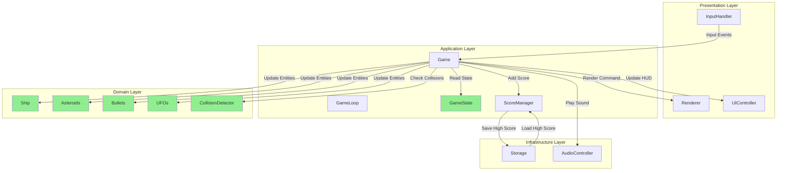
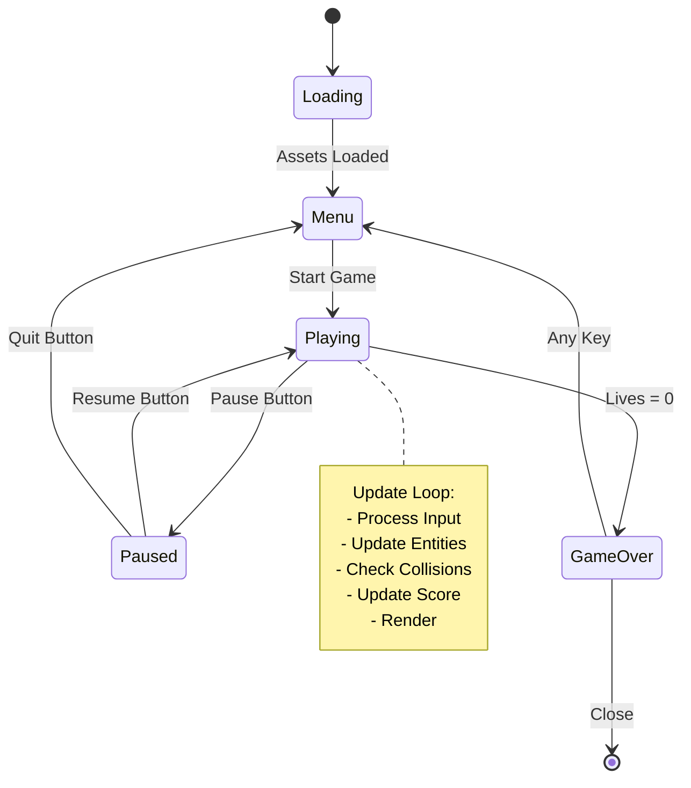
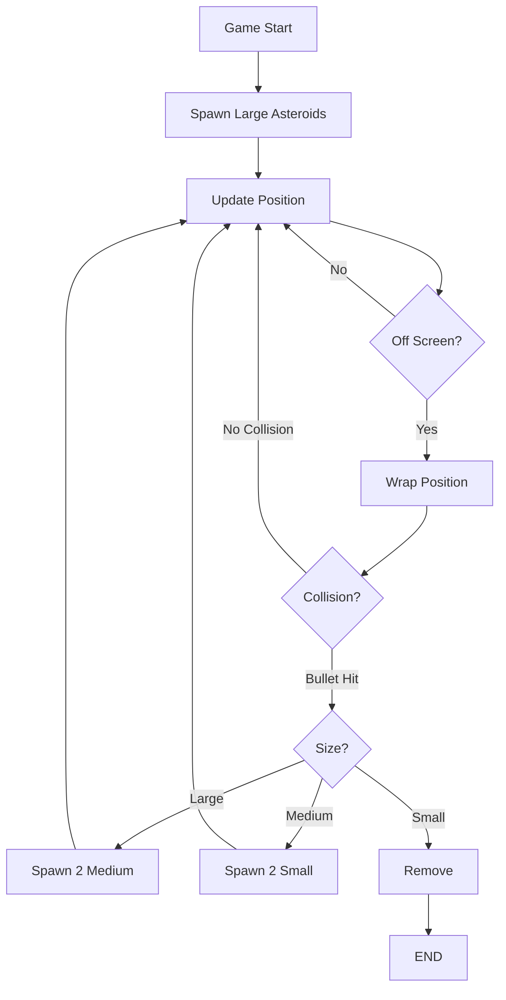
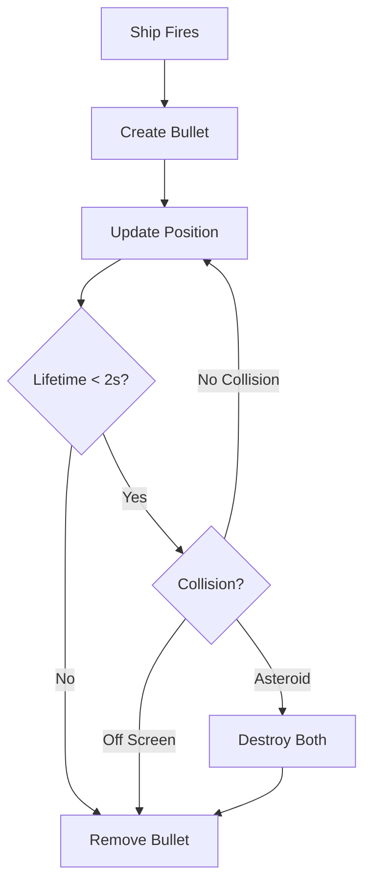
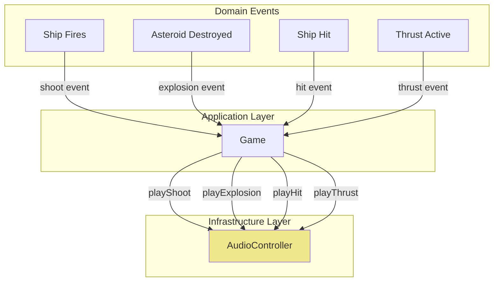

# Data Flow: Asteroids Game

**Version:** 1.0  
**Status:** Accepted  
**Last Updated:** 2026-02-25

---

## 📋 Overview

Этот документ описывает потоки данных между компонентами системы Asteroids Game.

---

## 🔄 Main Game Loop Data Flow



---

## 🎮 Input Data Flow

```mermaid
flowchart LR
    subgraph "User Input"
        KB[Keyboard Events]
    end
    
    subgraph "Presentation Layer"
        IH[InputHandler]
    end
    
    subgraph "Application Layer"
        G[Game]
    end
    
    subgraph "Domain Layer"
        SH[Ship]
    end

    KB -->|keydown/keyup| IH
    IH -->|Input State: {rotate, thrust, fire}| G
    G -->|rotate/direction| SH
    G -->|thrust| SH
    G -->|fire| SH

    style KB fill:#FFB6C1
    style IH fill:#87CEEB
    style G fill:#DDA0DD
    style SH fill:#90EE90
```

**Input Data Structure:**

```javascript
// InputHandler produces this state each frame
const InputState = {
    rotateLeft: boolean,   // ArrowLeft / KeyA
    rotateRight: boolean,  // ArrowRight / KeyD
    thrust: boolean,       // ArrowUp / KeyW
    fire: boolean,         // Space
    hyperspace: boolean,   // KeyH
    pause: boolean         // KeyP
};

// Game consumes input
game.handleInput(InputState);
```

---

## 💥 Collision Detection Data Flow

```mermaid
flowchart TD
    subgraph "Application Layer"
        G[Game]
    end
    
    subgraph "Domain Services"
        CD[CollisionDetector]
    end
    
    subgraph "Domain Entities"
        SH[Ship.getCollisionBox]
        AS[Asteroid.getCollisionBox]
        BU[Bullet.getCollisionBox]
        UF[UFO.getCollisionBox]
    end
    
    subgraph "Application Layer"
        SM[ScoreManager]
        GS[GameState]
    end

    G -->|Check: Ship vs Asteroids| CD
    G -->|Check: Bullets vs Asteroids| CD
    G -->|Check: Ship vs UFO| CD
    
    SH -->|CollisionBox| CD
    AS -->|CollisionBox| CD
    BU -->|CollisionBox| CD
    UF -->|CollisionBox| CD
    
    CD -->|CollisionResult[]| G
    G -->|shipHit| GS
    G -->|asteroidDestroyed| SM
    G -->|addScore| SM

    style CD fill:#90EE90
    style SM fill:#DDA0DD
    style GS fill:#DDA0DD
```

**Collision Detection Algorithm:**

```javascript
// CollisionDetector.checkAll(gameState)
class CollisionDetector {
    static checkAll(entities) {
        const collisions = [];
        
        // Ship vs Asteroids
        for (const asteroid of entities.asteroids) {
            if (entities.ship.getCollisionBox()
                .intersects(asteroid.getCollisionBox())) {
                collisions.push({
                    type: 'ship-asteroid',
                    ship: entities.ship,
                    asteroid: asteroid
                });
            }
        }
        
        // Bullets vs Asteroids
        for (const bullet of entities.bullets) {
            for (const asteroid of entities.asteroids) {
                if (bullet.getCollisionBox()
                    .intersects(asteroid.getCollisionBox())) {
                    collisions.push({
                        type: 'bullet-asteroid',
                        bullet: bullet,
                        asteroid: asteroid
                    });
                }
            }
        }
        
        return collisions;
    }
}
```

---

## 🏆 Score Management Data Flow

```mermaid
flowchart TD
    subgraph "Domain Layer"
        AS[Asteroid]
        UF[UFO]
    end
    
    subgraph "Application Layer"
        G[Game]
        SM[ScoreManager]
    end
    
    subgraph "Infrastructure Layer"
        ST[Storage]
    end
    
    subgraph "Presentation Layer"
        UI[UIController]
    end

    AS -->|getPoints: 20/50/100| G
    UF -->|getPoints: 200/1000| G
    G -->|addScore(points)| SM
    SM -->|getCurrentScore| UI
    SM -->|getHighScore| UI
    SM -->|isHighScore?| ST
    ST -->|saveHighScore| SM

    style SM fill:#DDA0DD
    style ST fill:#F0E68C
    style UI fill:#FFB6C1
```

**Score Data Structure:**

```javascript
// ScoreManager internal state
class ScoreManager {
    constructor() {
        this.currentScore = 0;
        this.highScore = Storage.getHighScore() || 0;
        this.levelScores = [];
    }
    
    addScore(points) {
        this.currentScore += points;
        if (this.currentScore > this.highScore) {
            this.highScore = this.currentScore;
            Storage.saveHighScore(this.highScore);
        }
    }
}
```

---

## 🎨 Rendering Data Flow

```mermaid
flowchart TD
    subgraph "Application Layer"
        G[Game]
    end
    
    subgraph "Domain Layer"
        SH[Ship]
        AS[Asteroids]
        BU[Bullets]
        UF[UFOs]
    end
    
    subgraph "Presentation Layer"
        R[Renderer]
        C[Canvas Context]
    end

    G -->|getEntities()| R
    R -->|clear()| C
    R -->|drawShip| C
    R -->|drawAsteroids| C
    R -->|drawBullets| C
    R -->|drawUFOs| C
    
    SH -->|position, rotation, vertices| R
    AS -->|position, vertices[]| R
    BU -->|position| R
    UF -->|position, vertices| R

    style R fill:#87CEEB
    style C fill:#87CEEB
```

**Render Pipeline:**

```javascript
// Renderer.render(gameState)
class Renderer {
    constructor(canvas) {
        this.ctx = canvas.getContext('2d');
    }
    
    render(gameState) {
        const { ctx } = this;
        const { ship, asteroids, bullets, ufos } = gameState;
        
        // Clear canvas
        ctx.fillStyle = '#000000';
        ctx.fillRect(0, 0, ctx.canvas.width, ctx.canvas.height);
        
        // Draw all entities
        ctx.strokeStyle = '#FFFFFF';
        ctx.lineWidth = 2;
        
        this.drawShip(ship);
        this.drawAsteroids(asteroids);
        this.drawBullets(bullets);
        this.drawUFOs(ufos);
    }
    
    drawShip(ship) {
        const { ctx } = this;
        const vertices = ship.getVertices();
        
        ctx.save();
        ctx.translate(ship.position.x, ship.position.y);
        ctx.rotate(ship.rotation);
        
        ctx.beginPath();
        ctx.moveTo(vertices[0].x, vertices[0].y);
        ctx.lineTo(vertices[1].x, vertices[1].y);
        ctx.lineTo(vertices[2].x, vertices[2].y);
        ctx.closePath();
        ctx.stroke();
        
        ctx.restore();
    }
}
```

---

## 💾 Persistence Data Flow

```mermaid
flowchart LR
    subgraph "Application Layer"
        SM[ScoreManager]
    end
    
    subgraph "Infrastructure Layer"
        ST[Storage]
        LS[localStorage]
    end

    SM -->|saveHighScore(score)| ST
    ST -->|setItem('highScore', JSON.stringify)| LS
    LS -->|getItem('highScore')| ST
    ST -->|parse(score)| SM

    style ST fill:#F0E68C
    style LS fill:#F0E68C
```

**Storage Implementation:**

```javascript
// Storage.js
class Storage {
    static saveHighScore(score) {
        try {
            localStorage.setItem('asteroids-highscore', JSON.stringify({
                score,
                date: new Date().toISOString()
            }));
        } catch (e) {
            // localStorage might be unavailable
            console.warn('Failed to save high score');
        }
    }
    
    static getHighScore() {
        try {
            const data = localStorage.getItem('asteroids-highscore');
            return data ? JSON.parse(data).score : 0;
        } catch (e) {
            return 0;
        }
    }
}
```

---

## 🎯 Game State Transitions Data Flow



---

## 📊 Entity Lifecycle Data Flow

### Asteroid Lifecycle



### Bullet Lifecycle



---

## 🔊 Audio Data Flow



---

**Data Flow Status:** ✅ Accepted  
**Next:** Sequence Diagrams  
**Architect Agent:** In Progress
