# Sequence Diagrams: Asteroids Game

**Version:** 1.0  
**Status:** Accepted  
**Last Updated:** 2026-02-25

---

## 📋 Overview

Этот документ описывает последовательности взаимодействий для критических сценариев игры.

---

## 🎮 Game Startup Sequence

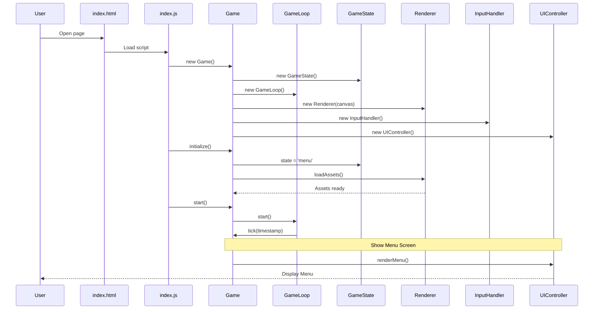

---

## 🚀 Game Loop Sequence (Per Frame)

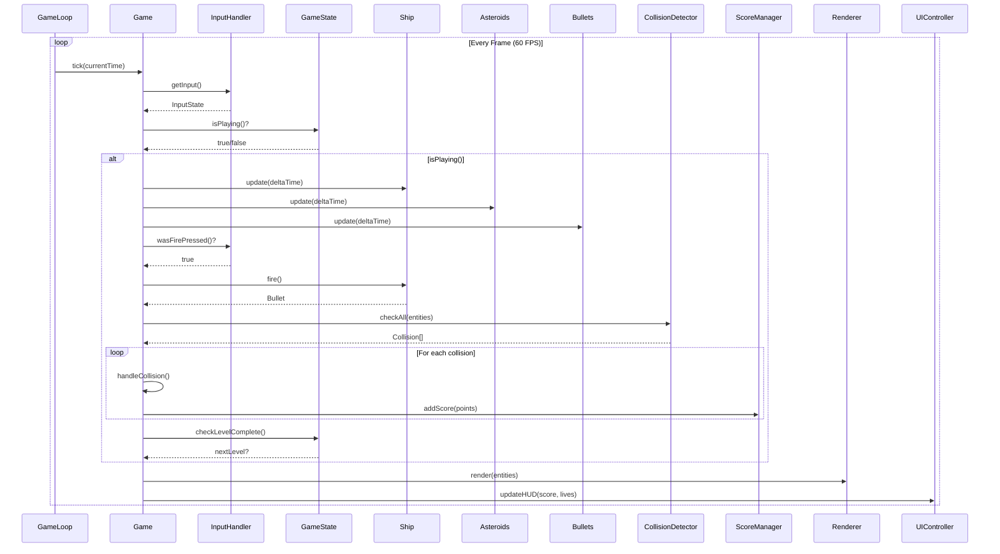

---

## 🔫 Player Fires Bullet Sequence

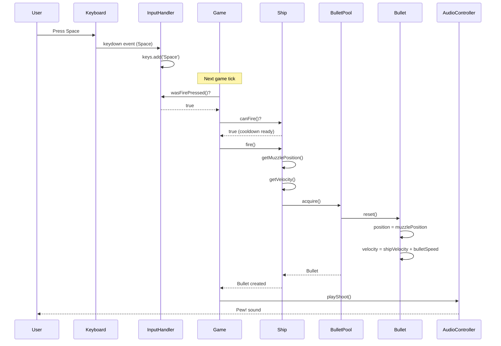

---

## 💥 Asteroid Destruction Sequence

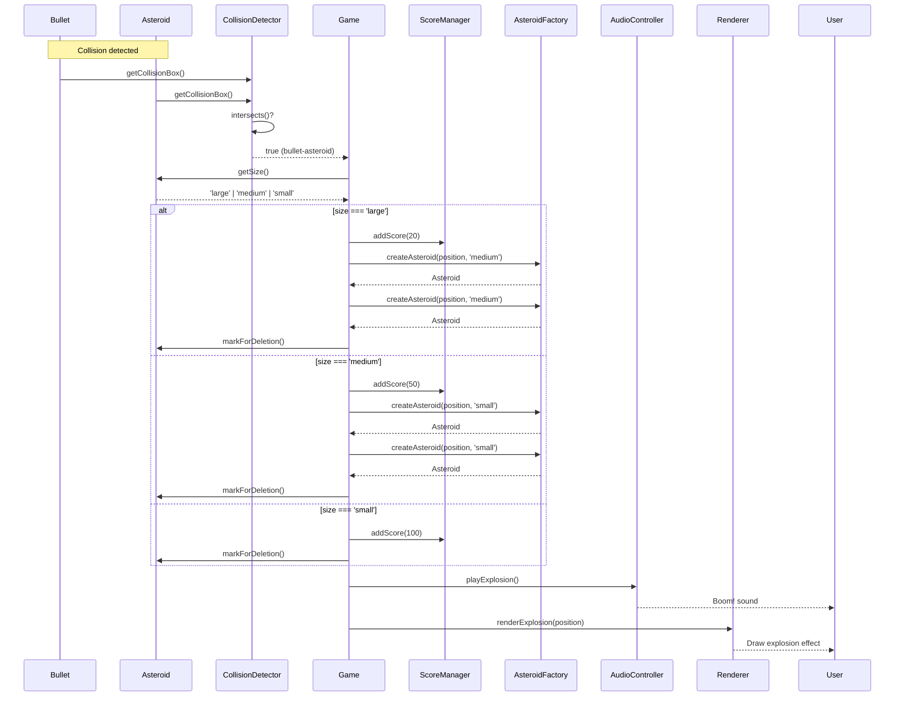

---

## 💀 Ship Death Sequence

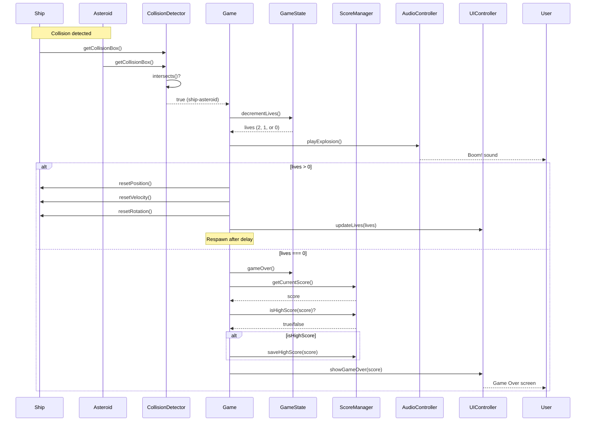

---

## ⏸️ Pause/Resume Sequence

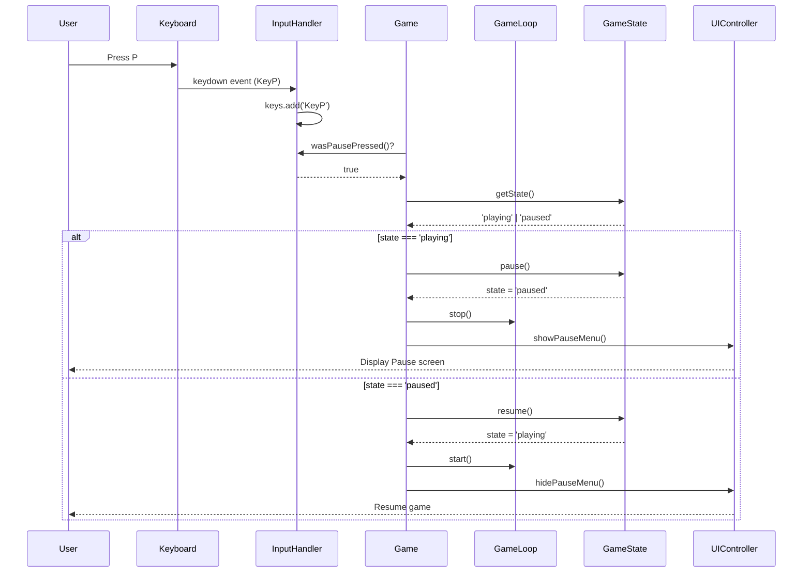

---

## 🏆 High Score Save Sequence

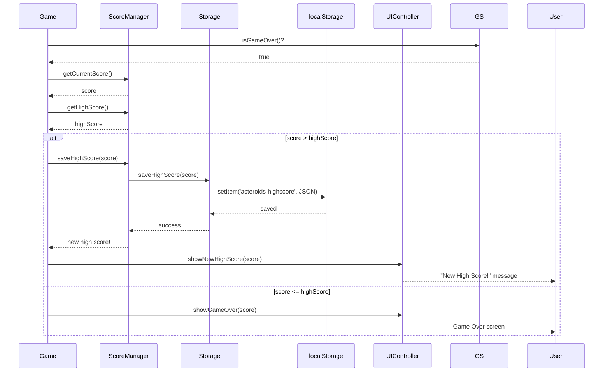

---

## 🎯 Level Complete Sequence

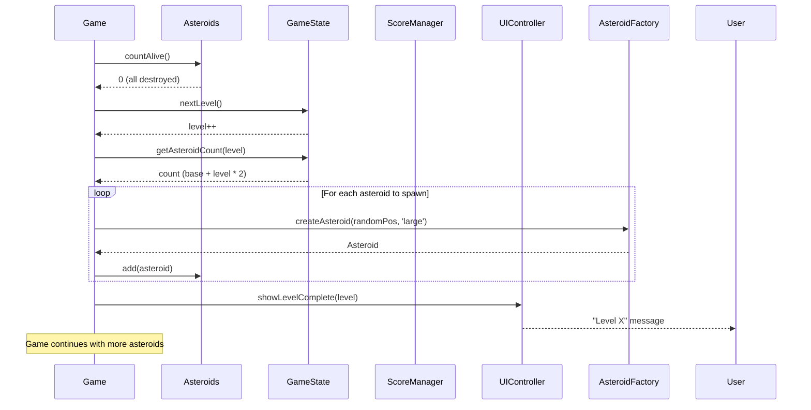

---

## 🌌 Hyperspace Sequence

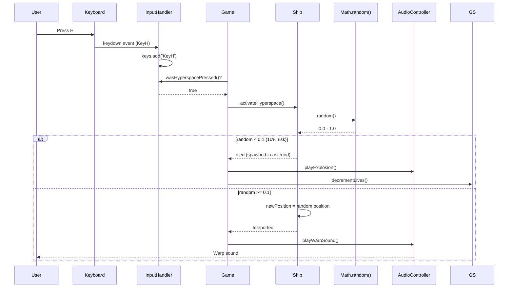

---

## 🎨 Render Sequence (Detailed)

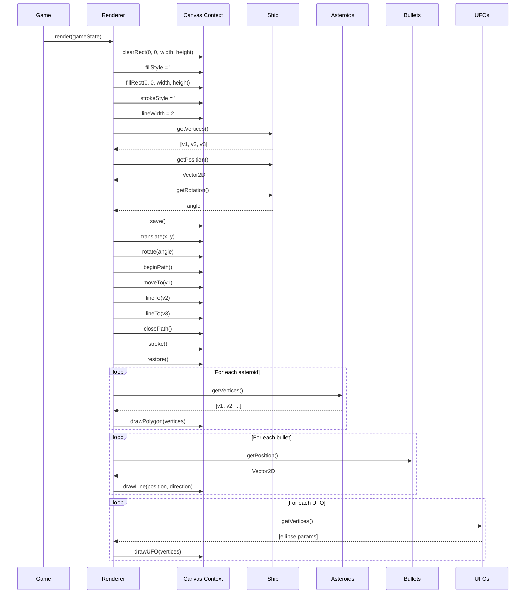

---

## 📥 Input Handling Sequence (Detailed)

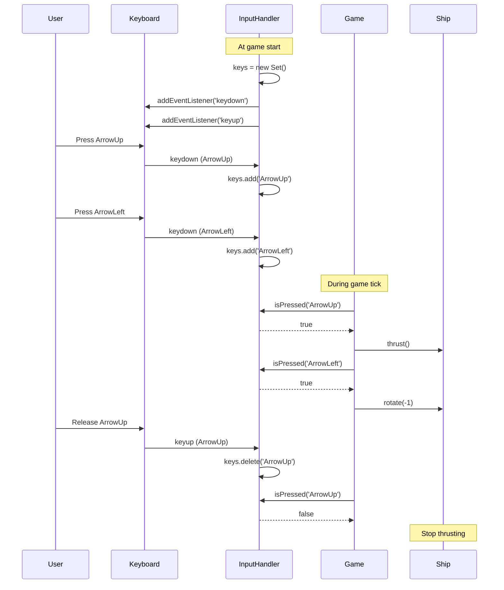

---

## 🔄 Entity Update Sequence (Physics)

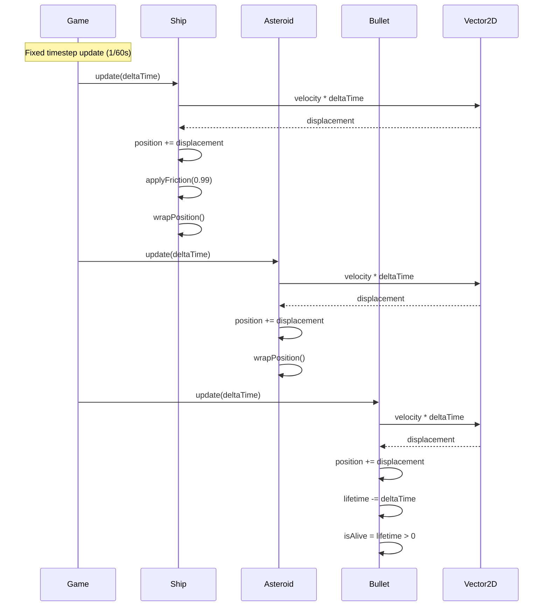

---

**Sequence Diagrams Status:** ✅ Accepted  
**Design Phase:** Complete  
**Next Phase:** Plan (Implementation Planning)  
**Architect Agent:** Complete
