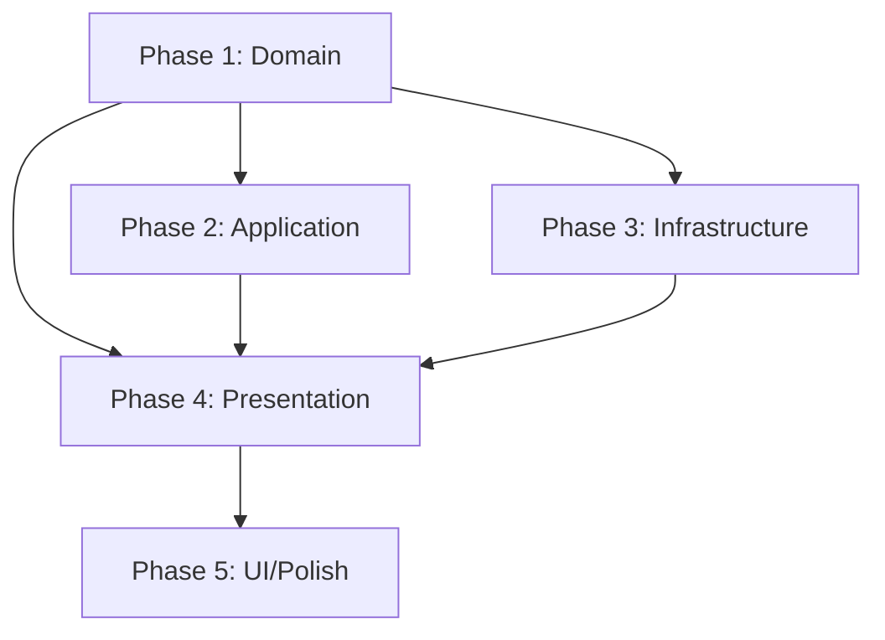

# Implementation Plans: Asteroids Game

**Version:** 2.0  
**Status:** Approved (with changes)  
**Created:** 2026-02-25  
**Based On:** docs/research.md, docs/design/architecture.md

---

## 📋 Overview

План реализации разбит на **5 независимых фаз**, каждая со своим Definition of Done.

| Фаза | Фокус | Длительность | Статус |
|------|-------|--------------|--------|
| **Phase 1** | Domain Layer | 7 дней | ⏳ Pending |
| **Phase 2** | Application Layer | 5 дней | ⏳ Pending |
| **Phase 3** | Infrastructure Layer | 2 дня | ⏳ Pending |
| **Phase 4** | Presentation Layer | 4 дня | ⏳ Pending |
| **Phase 5** | UI/HTML + Polish | 3 дня | ⏳ Pending |

**Общее время:** ~22 рабочих дня

---

## 📁 Phase Documents

| Document | Description |
|----------|-------------|
| [Phase 1: Domain Layer](phase1_domain.md) | Vector2D, CollisionBox, Ship, Bullet, Asteroid, UFO, CollisionDetector |
| [Phase 2: Application Layer](phase2_application.md) | GameState, ScoreManager, GameLoop, Game |
| [Phase 3: Infrastructure Layer](phase3_infrastructure.md) | Storage, AudioController, Test Mocks |
| [Phase 4: Presentation Layer](phase4_presentation.md) | InputHandler, Renderer, UIController |
| [Phase 5: UI/HTML + Polish](phase5_ui_polish.md) | HTML, CSS, package.json, README, Integration |

---

## 🔄 Phase Dependencies



**Критический путь:** Phase 1 → Phase 2 → Phase 4 → Phase 5

---

## ✅ Plan Review Status

**Review Document:** [plan_review.md](plan_review.md)

**Verdict:** ✅ APPROVED with Minor Changes

**Required Changes (внесены):**
1. [x] Добавлена задача 3.3: Test Mocks
2. [x] Добавлена задача 4.5: Integration Tests (в Phase 4)
3. [x] Уточнён AudioController (Web Audio API oscillators)

---

## 📊 Task Summary

### Total Tasks: 22

| Phase | Tasks | Test Files | Source Files |
|-------|-------|------------|--------------|
| Phase 1 | 7 | 7 | 7 |
| Phase 2 | 4 | 4 | 4 |
| Phase 3 | 3 | 2 | 2 + mocks |
| Phase 4 | 3 | 3 | 3 |
| Phase 5 | 7 | 1 (setup) | 6 |

---

## 🎯 Success Metrics

| Metric | Target | Measurement |
|--------|--------|-------------|
| Test Coverage | >80% | `npm run test:coverage` |
| ESLint Errors | 0 | `npm run lint` |
| FPS | 60 | Chrome DevTools |
| Bundle Size | <100 KB | `npm run build` |

---

## 🚀 How to Start

1. **pre_checker:** Валидировать готовность к Phase 1
2. **tdd_writer:** Начать Phase 1, Task 1.1 (Vector2D)
3. **implementer:** Реализовать Vector2D после теста

```bash
# Start Phase 1
vibecraft context --skill implement_skill
```

---

**Plan Status:** Ready to Execute  
**Next:** pre_checker → tdd_writer (Phase 1, Task 1.1)
